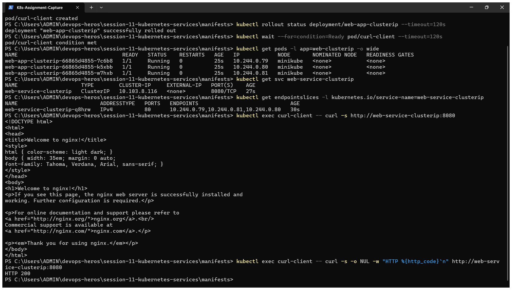
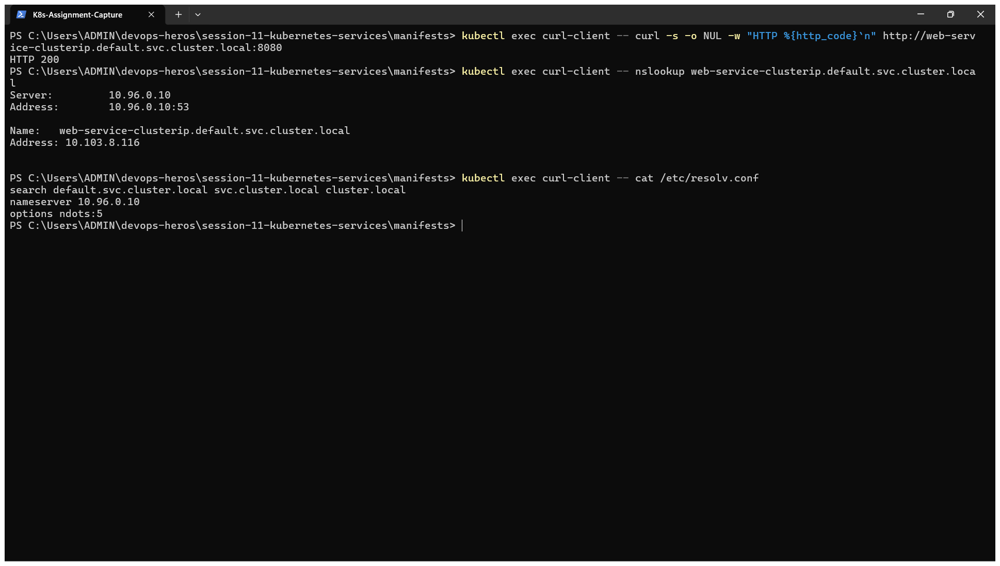
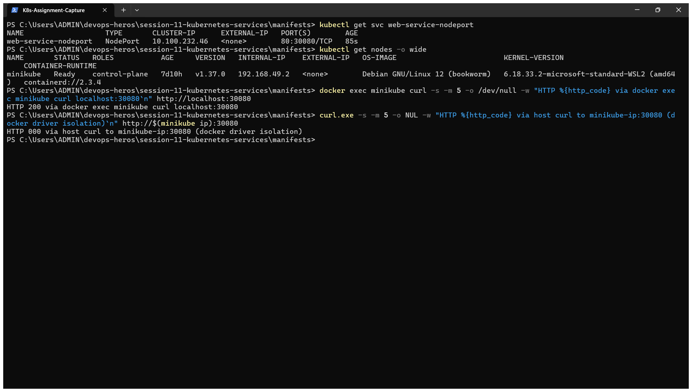
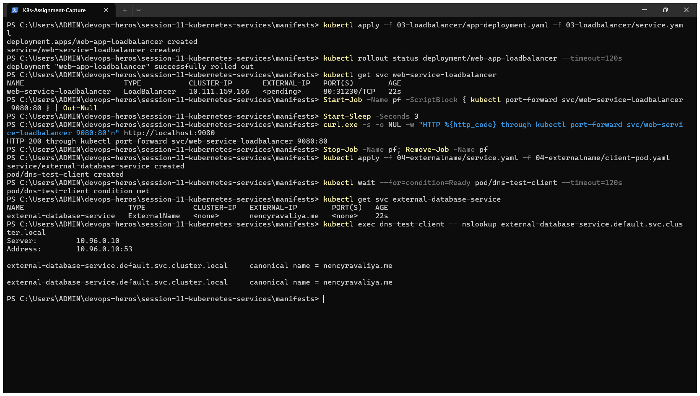
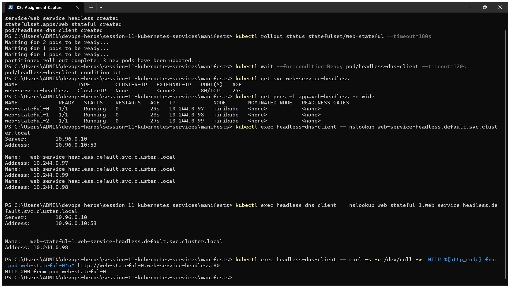
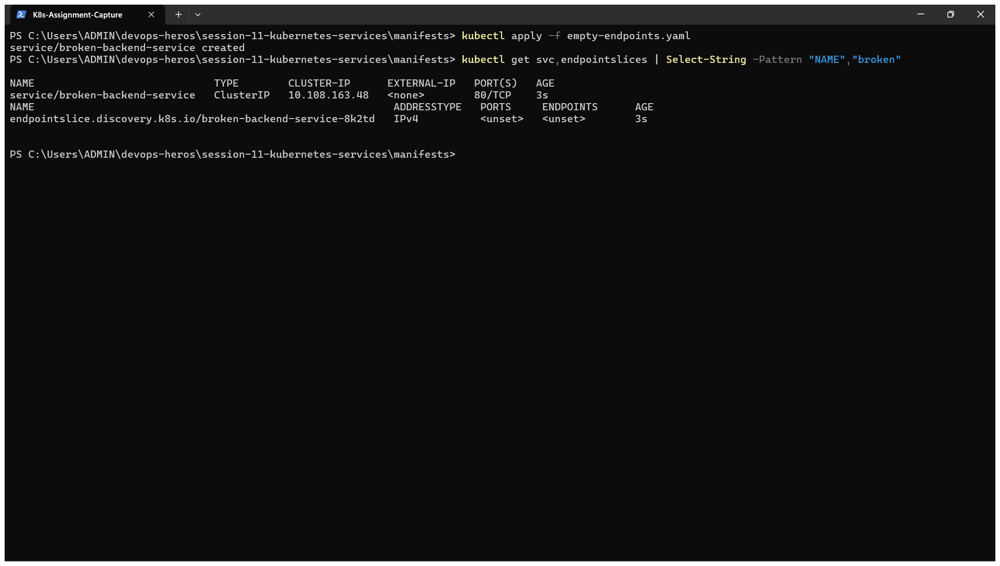

# Kubernetes Networking & Services – Homework

**Name:** Dhruv Sharma
**Roll No:** 24BCS10294

Manifests are from the class repository ([session-11-kubernetes-services](https://github.com/Nency-Ravaliya/devops-heros/tree/main/session-11-kubernetes-services)) and are copied into [manifests/](manifests). I ran all five service types on my local 2-node kind cluster. All outputs are copied from my terminal.

## Why Services exist

Pods are temporary. Every time a Pod is re-created it gets a **new IP**, so nothing can depend on a Pod IP. A Service gives a **stable name and virtual IP** in front of all Pods that match its label selector, and load balances between them.

| Type | Reachable from | How | Typical use |
|---|---|---|---|
| **ClusterIP** (default) | Inside the cluster only | Virtual IP + DNS name | Service-to-service calls, databases |
| **NodePort** | Outside, through `<NodeIP>:30000-32767` | Opens the same port on every node | Demos, on-prem without a load balancer |
| **LoadBalancer** | Internet | Cloud provider creates an external load balancer | Production entry point on cloud |
| **ExternalName** | Inside the cluster | DNS `CNAME` to an external hostname, no proxying | Giving an external DB/API an in-cluster name |
| **Headless** (`clusterIP: None`) | Inside the cluster | DNS returns the **Pod IPs** directly | StatefulSets, databases, peer discovery |

Ports: `port` is the Service port, `targetPort` is the container port, `nodePort` is the port opened on the nodes.

### The 4 ports, as one flow

```text
Client Browser ──► [nodePort: 30080] (Host/Node IP)
                        │
                        ▼
                   [port: 8080] (Service Virtual IP)
                        │
                        ▼
                   [targetPort: 80] (Pod IP)
                        │
                        ▼
                   [containerPort: 80] (the process inside the container)
```

`containerPort` is documentation on the Pod spec (what the app listens on). `targetPort` is where the Service forwards to on the Pod. `port` is what the Service itself exposes inside the cluster. `nodePort` additionally opens that same path on every node's real IP, `30000–32767`.

---

## 1. ClusterIP

[manifests/01-clusterip](manifests/01-clusterip): 3 Nginx Pods, a Service mapping `8080 → 80`, and a `curl-client` Pod for testing from inside the cluster.

```text
$ kubectl apply -f 01-clusterip/app-deployment.yaml -f 01-clusterip/service.yaml -f 01-clusterip/client-pod.yaml
deployment.apps/web-app-clusterip created
service/web-service-clusterip created
pod/curl-client created

$ kubectl rollout status deployment/web-app-clusterip --timeout=180s | tail -1
deployment "web-app-clusterip" successfully rolled out

$ kubectl wait --for=condition=Ready pod/curl-client --timeout=180s
pod/curl-client condition met

$ kubectl get pods -l app=web-clusterip -o wide
NAME                                 READY   STATUS    RESTARTS   AGE   IP            NODE               NOMINATED NODE   READINESS GATES
web-app-clusterip-66865d4855-5pztf   1/1     Running   0          7s    10.244.1.35   devops-hw-worker   <none>           <none>
web-app-clusterip-66865d4855-fjdhd   1/1     Running   0          7s    10.244.1.34   devops-hw-worker   <none>           <none>
web-app-clusterip-66865d4855-xd64h   1/1     Running   0          7s    10.244.1.36   devops-hw-worker   <none>           <none>

$ kubectl get svc web-service-clusterip
NAME                    TYPE        CLUSTER-IP     EXTERNAL-IP   PORT(S)    AGE
web-service-clusterip   ClusterIP   10.96.247.35   <none>        8080/TCP   7s

$ kubectl get endpointslices -l kubernetes.io/service-name=web-service-clusterip
NAME                          ADDRESSTYPE   PORTS   ENDPOINTS                             AGE
web-service-clusterip-qtw64   IPv4          80      10.244.1.34,10.244.1.35,10.244.1.36   7s

$ kubectl exec curl-client -- curl -s http://web-service-clusterip:8080 | grep -E "<title>|<h1>"
<title>Welcome to nginx!</title>
<h1>Welcome to nginx!</h1>

$ kubectl exec curl-client -- curl -s -o /dev/null -w 'HTTP %{http_code} from %{remote_ip}:%{remote_port}\n' http://10.96.247.35:8080
HTTP 200 from 10.96.247.35:8080

$ kubectl exec curl-client -- curl -s -o /dev/null -w "HTTP %{http_code}\n" http://web-service-clusterip.default.svc.cluster.local:8080
HTTP 200

$ kubectl exec curl-client -- nslookup web-service-clusterip.default.svc.cluster.local
Server:		10.96.0.10
Address:	10.96.0.10:53

Name:	web-service-clusterip.default.svc.cluster.local
Address: 10.96.247.35

$ kubectl exec curl-client -- cat /etc/resolv.conf
search default.svc.cluster.local svc.cluster.local cluster.local
nameserver 10.96.0.10
options ndots:5
```

**What I understood:**

- The Service got the virtual IP `10.96.247.35`, and its EndpointSlice lists the three Pod IPs on port 80. `EXTERNAL-IP` is `<none>`, so it is internal only.
- The same Service answered by **short name**, by **ClusterIP** and by **FQDN** `web-service-clusterip.default.svc.cluster.local`.
- The short name works because of the `search default.svc.cluster.local svc.cluster.local cluster.local` line in the Pod's `/etc/resolv.conf`. The name server `10.96.0.10` is CoreDNS.
- FQDN format: `<service>.<namespace>.svc.cluster.local`. To call a Service in another namespace, at least `<service>.<namespace>` is needed.
- Newer Kubernetes versions use `EndpointSlices`. `kubectl get endpoints` still works but prints a deprecation warning.

### Proof that the Service follows the Pods

```text
$ kubectl delete pod $(kubectl get pods -l app=web-clusterip -o jsonpath="{.items[0].metadata.name}")
pod "web-app-clusterip-66865d4855-5pztf" deleted from default namespace

$ kubectl rollout status deployment/web-app-clusterip --timeout=120s | tail -1
deployment "web-app-clusterip" successfully rolled out

$ kubectl get endpointslices -l kubernetes.io/service-name=web-service-clusterip
NAME                          ADDRESSTYPE   PORTS   ENDPOINTS                             AGE
web-service-clusterip-qtw64   IPv4          80      10.244.1.34,10.244.1.36,10.244.1.38   8s

$ kubectl exec curl-client -- curl -s -o /dev/null -w "HTTP %{http_code}\n" http://web-service-clusterip:8080
HTTP 200
```

I deleted the Pod with IP `10.244.1.35`. The Deployment created a new Pod (`10.244.1.38`), and the EndpointSlice was updated **automatically**. The client kept using the same name and still got `HTTP 200`. This is exactly the problem Services solve.

## 2. NodePort

[manifests/02-nodeport](manifests/02-nodeport): `port: 80`, `targetPort: 80`, `nodePort: 30080`.

```text
$ kubectl apply -f 02-nodeport/app-deployment.yaml -f 02-nodeport/service.yaml
deployment.apps/web-app-nodeport created
service/web-service-nodeport created

$ kubectl rollout status deployment/web-app-nodeport --timeout=180s | tail -1
deployment "web-app-nodeport" successfully rolled out

$ kubectl get svc web-service-nodeport
NAME                   TYPE       CLUSTER-IP      EXTERNAL-IP   PORT(S)        AGE
web-service-nodeport   NodePort   10.96.102.115   <none>        80:30080/TCP   1s

$ kubectl get nodes -o wide | cut -c1-90
NAME                      STATUS   ROLES           AGE   VERSION   INTERNAL-IP   EXTERNAL-
devops-hw-control-plane   Ready    control-plane   11m   v1.37.0   172.18.0.3    <none>
devops-hw-worker          Ready    <none>          11m   v1.37.0   172.18.0.2    <none>

$ kubectl get svc web-service-nodeport
NAME                   TYPE       CLUSTER-IP      EXTERNAL-IP   PORT(S)        AGE
web-service-nodeport   NodePort   10.96.102.115   <none>        80:30080/TCP   26s

$ docker exec devops-hw-control-plane curl -s -m 5 -o /dev/null -w "HTTP %{http_code} via worker node 172.18.0.2:30080\n" http://172.18.0.2:30080
HTTP 200 via worker node 172.18.0.2:30080

$ docker exec devops-hw-control-plane curl -s -m 5 -o /dev/null -w "HTTP %{http_code} via control-plane node 172.18.0.3:30080\n" http://172.18.0.3:30080
HTTP 200 via control-plane node 172.18.0.3:30080

$ docker exec devops-hw-worker curl -s -m 5 http://localhost:30080 | grep "<title>"
<title>Welcome to nginx!</title>
```

**What I understood:**

- `80:30080/TCP` means port 30080 is open on **every node**. Both node IPs answered, including the control-plane node where no application Pod is running. `kube-proxy` forwards the traffic to a matching Pod wherever it is.
- A NodePort Service still has a ClusterIP. Each type builds on the previous one: LoadBalancer ⊃ NodePort ⊃ ClusterIP.
- kind nodes are Docker containers, so their IPs (`172.18.0.x`) are reachable only from inside the Docker network. That is why I ran `curl` from inside the node containers. With Minikube the equivalent is `curl $(minikube ip):30080` or `minikube service web-service-nodeport --url`.

## 3. LoadBalancer

[manifests/03-loadbalancer](manifests/03-loadbalancer)

```text
$ kubectl apply -f 03-loadbalancer/app-deployment.yaml -f 03-loadbalancer/service.yaml
deployment.apps/web-app-loadbalancer created
service/web-service-loadbalancer created

$ kubectl rollout status deployment/web-app-loadbalancer --timeout=180s | tail -1
deployment "web-app-loadbalancer" successfully rolled out

$ kubectl get svc web-service-loadbalancer
NAME                       TYPE           CLUSTER-IP   EXTERNAL-IP   PORT(S)        AGE
web-service-loadbalancer   LoadBalancer   10.96.7.84   <pending>     80:31804/TCP   1s

$ curl -s -o /dev/null -w "HTTP %{http_code} through kubectl port-forward svc/web-service-loadbalancer 9080:80\n" http://localhost:9080
HTTP 200 through kubectl port-forward svc/web-service-loadbalancer 9080:80
```

**What I understood:**

- `EXTERNAL-IP` stays `<pending>` on a local cluster, because there is no cloud provider to create a real load balancer. On AWS/GCP/Azure a public IP or hostname would appear here. Locally, `minikube tunnel`, MetalLB or `cloud-provider-kind` can fill that role.
- The Service still got a NodePort (`80:31804`) and a ClusterIP, so it is usable. I verified it with `kubectl port-forward`, which returned `HTTP 200`.
- Every LoadBalancer Service is a separate paid cloud resource. In production, one LoadBalancer is placed in front of an **Ingress controller**, which then routes to many ClusterIP Services.

## 4. ExternalName

[manifests/04-externalname](manifests/04-externalname)

```text
$ kubectl apply -f 04-externalname/service.yaml -f 04-externalname/client-pod.yaml
service/external-database-service created
pod/dns-test-client created

$ kubectl wait --for=condition=Ready pod/dns-test-client --timeout=180s
pod/dns-test-client condition met

$ kubectl get svc external-database-service
NAME                        TYPE           CLUSTER-IP   EXTERNAL-IP        PORT(S)   AGE
external-database-service   ExternalName   <none>       nencyravaliya.me   <none>    0s

$ kubectl exec dns-test-client -- nslookup external-database-service.default.svc.cluster.local
Server:		10.96.0.10
Address:	10.96.0.10:53

external-database-service.default.svc.cluster.local	canonical name = nencyravaliya.me

external-database-service.default.svc.cluster.local	canonical name = nencyravaliya.me
```

**What I understood:** there is no ClusterIP, no selector and no Pods. CoreDNS simply answers with a `CNAME` (`canonical name = nencyravaliya.me`). The application can use the in-cluster name `external-database-service`, and if the external database moves, only the Service is edited and not the application.

## 5. Headless Service + StatefulSet

[manifests/05-headless](manifests/05-headless)

```text
$ kubectl apply -f 05-headless/service.yaml -f 05-headless/app-statefulset.yaml -f 05-headless/client-pod.yaml
service/web-service-headless created
statefulset.apps/web-stateful created
pod/headless-dns-client created

$ kubectl rollout status statefulset/web-stateful --timeout=240s | tail -1
partitioned roll out complete: 3 new pods have been updated...

$ kubectl wait --for=condition=Ready pod/headless-dns-client --timeout=180s
pod/headless-dns-client condition met

$ kubectl get svc web-service-headless
NAME                   TYPE        CLUSTER-IP   EXTERNAL-IP   PORT(S)   AGE
web-service-headless   ClusterIP   None         <none>        80/TCP    2s

$ kubectl get pods -l app=web-headless -o wide
NAME             READY   STATUS    RESTARTS   AGE   IP            NODE               NOMINATED NODE   READINESS GATES
web-stateful-0   1/1     Running   0          2s    10.244.1.45   devops-hw-worker   <none>           <none>
web-stateful-1   1/1     Running   0          2s    10.244.1.47   devops-hw-worker   <none>           <none>
web-stateful-2   1/1     Running   0          1s    10.244.1.48   devops-hw-worker   <none>           <none>

$ kubectl exec headless-dns-client -- nslookup web-service-headless.default.svc.cluster.local
Server:		10.96.0.10
Address:	10.96.0.10:53

Name:	web-service-headless.default.svc.cluster.local
Address: 10.244.1.45
Name:	web-service-headless.default.svc.cluster.local
Address: 10.244.1.47
Name:	web-service-headless.default.svc.cluster.local
Address: 10.244.1.48

$ kubectl exec headless-dns-client -- nslookup web-stateful-1.web-service-headless.default.svc.cluster.local
Server:		10.96.0.10
Address:	10.96.0.10:53

Name:	web-stateful-1.web-service-headless.default.svc.cluster.local
Address: 10.244.1.47

$ kubectl exec headless-dns-client -- curl -s -o /dev/null -w "HTTP %{http_code} from pod web-stateful-0\n" http://web-stateful-0.web-service-headless:80
HTTP 200 from pod web-stateful-0
```

**What I understood:**

- With `clusterIP: None` there is no virtual IP and no load balancing. DNS for the Service name returns **all three Pod IPs**, and the client chooses.
- StatefulSet Pods have **stable names** (`web-stateful-0`, `-1`, `-2`), and each one gets its own DNS record: `<pod>.<service>.<namespace>.svc.cluster.local`. `web-stateful-1` resolved to exactly its own IP `10.244.1.47`.
- Databases and clustered systems (MySQL replication, Kafka, MongoDB) need this, because a replica must talk to one specific peer, not to a random one.

## 6. Troubleshooting – empty endpoints

[manifests/empty-endpoints.yaml](manifests/empty-endpoints.yaml) has the selector `app: wrong-backend-name`, which matches no Pod.

```text
$ kubectl apply -f troubleshooting/empty-endpoints.yaml
service/broken-backend-service created

$ kubectl get svc,endpointslices | grep -iE "NAME|broken|mismatch|empty"
NAME                                TYPE           CLUSTER-IP      EXTERNAL-IP        PORT(S)        AGE
service/broken-backend-service      ClusterIP      10.96.152.31    <none>             80/TCP         8s
service/external-database-service   ExternalName   <none>          nencyravaliya.me   <none>         11s
NAME                                                            ADDRESSTYPE   PORTS     ENDPOINTS                             AGE
endpointslice.discovery.k8s.io/broken-backend-service-qxkhx     IPv4          <unset>   <unset>                               8s
```

**What I understood:** the Service is created without any error, but its EndpointSlice shows `<unset>`, so every request would fail. When a Service does not respond, the first things to check are:

1. `kubectl get endpointslices` – is the list empty?
2. `kubectl get pods --show-labels` – does the Service `selector` match the Pod labels **exactly**?
3. Does `targetPort` match the port the container really listens on?
4. Are the Pods `Ready`? Pods that are not ready are removed from the endpoints.
5. Is CoreDNS running: `kubectl get pods -n kube-system -l k8s-app=kube-dns`

## 7. Services without a selector — manual `Endpoints`

[manifests/06-no-selector/service.yaml](manifests/06-no-selector/service.yaml): a `Service` with no `selector` at all, paired with a hand-written `Endpoints` object pointing at an IP outside the cluster.

```text
$ kubectl apply -f manifests/06-no-selector/service.yaml
service/external-legacy-service created
endpoints/external-legacy-service created

$ kubectl get svc external-legacy-service
NAME                      TYPE        CLUSTER-IP      EXTERNAL-IP   PORT(S)
external-legacy-service   ClusterIP   10.96.128.154   <none>        80/TCP

$ kubectl describe svc external-legacy-service | grep -E "Selector|Endpoints"
Selector:                 <none>
Endpoints:                172.18.0.1:80
```

**What I understood:** with no `selector`, Kubernetes does not manage the `Endpoints` object automatically — I own it. This is the pattern for pointing a stable in-cluster Service name at something Kubernetes doesn't manage: a legacy VM, an on-prem database, anything with a fixed IP outside the cluster. (`ExternalName`, from Section 4, is the DNS-only version of the same idea; a manual-Endpoints `ClusterIP` Service is the version that also gets a virtual IP and works with things that expect an IP, not just a DNS name.)

## 8. Deployment vs. StatefulSet — pod identity under a delete

Same drill as the [StatefulSet section in Session 10](../session10-k8s-core-objects/Assignment_Readme.md#7-statefulset--ordinal-identity-that-survives-a-delete), side by side with a plain Deployment:

```text
# Deployment: delete one pod
$ kubectl delete pod yatri-backend-7554bd5c75-gtlsd
$ kubectl get pods -l app=yatri-backend
yatri-backend-7554bd5c75-v52nh   1/1   Running   0   3s   # <- brand-new random suffix, no relation to the old name

# StatefulSet: delete one pod
$ kubectl delete pod mysql-1
$ kubectl get pods -l app=mysql
mysql-1   1/1   Running   0   5s   # <- SAME name "mysql-1" again, new Pod, new IP, but the identity is preserved
```

**What I understood:** a Deployment's ReplicaSet only guarantees a **count**; a replaced Pod gets a fresh, random identity. A StatefulSet guarantees **identity**: the Nth pod is always named `<name>-N`, always gets the same PVC back, and (with a headless Service) always gets the same DNS name — regardless of how many times it's rescheduled.

## 9. Deployment vs. StatefulSet vs. DaemonSet — architecture matrix

| | Deployment | StatefulSet | DaemonSet |
|---|---|---|---|
| Pod identity | Random suffix, disposable | Stable ordinal (`app-0`, `app-1`, …) | One per node, named after the node |
| Startup order | All at once (parallel) | Sequential, one at a time | One per eligible node, in parallel |
| Storage | Usually shared/none, or one PVC for all replicas | One PVC per Pod via `volumeClaimTemplates` | Usually `hostPath` or none |
| Needs a Service? | Any type (ClusterIP/NodePort/LB) | Headless (`clusterIP: None`) for per-Pod DNS | Rarely — often scraped directly, not load-balanced |
| Typical use | Stateless web/API tiers | Databases, queues, anything needing stable identity | Log/metrics agents, CNI plugins, node-level daemons |

## 10. Production cost optimization & Service selection decision tree

```text
Need external traffic in?
 ├─ No  → ClusterIP (service-to-service only)
 └─ Yes
     ├─ Just testing/on-prem, no cloud LB available → NodePort
     ├─ One service, on a real cloud                 → LoadBalancer
     └─ Many services behind one entry point          → Ingress (one LoadBalancer
                                                          in front of many ClusterIP
                                                          Services + host/path routing)

Pointing at something Kubernetes doesn't manage?
 ├─ Just need a DNS alias           → ExternalName
 └─ Need a real Service IP/ports    → ClusterIP Service + manual Endpoints (Section 7)

Need per-replica stable network identity (databases, peer discovery)?
 └─ Headless Service + StatefulSet (Section 5)
```

**Why this matters for cost:** every `type: LoadBalancer` Service is a **separate, billed cloud resource** (roughly $18–25/month per LB on major clouds). Ten microservices each behind their own LoadBalancer is 10x that cost. The standard production pattern is one LoadBalancer in front of an **Ingress controller**, which then routes to any number of internal `ClusterIP` Services by host/path — see [Session 12](../session-12-ingress-configmaps-secrets/Assignment_Readme.md) for that exact setup.

## 11. Minikube docker-driver NodePort gotcha

On the docker driver (used here, and the default on macOS/Windows/most Linux setups), the Kubernetes node is itself a Docker container on an isolated bridge network — so `<minikube ip>:<nodePort>` does **not** reach it directly from the host, only `localhost`/NodePort access patterns that go through Docker's own port mapping work.

```text
$ kubectl apply -f manifests/02-nodeport/app-deployment.yaml -f manifests/02-nodeport/service.yaml
$ kubectl get svc web-service-nodeport
NAME                   TYPE       CLUSTER-IP     EXTERNAL-IP   PORT(S)
web-service-nodeport   NodePort   10.99.66.89    <none>        80:30080/TCP

$ curl -s -m 5 -o /dev/null -w "HTTP %{http_code}\n" http://$(minikube ip):30080
HTTP 000    # <- times out: the node's Docker network isn't reachable directly from the host

# Workaround 1: let minikube open its own tunnel to the NodePort
$ minikube service web-service-nodeport --url
http://127.0.0.1:52515
$ curl -s -o /dev/null -w "HTTP %{http_code}\n" http://127.0.0.1:52515
HTTP 200

# Workaround 2: run the curl *inside* the minikube node container itself
$ docker exec minikube curl -s -o /dev/null -w "HTTP %{http_code}\n" http://localhost:30080
HTTP 200
```

**What I understood:** this isn't a broken cluster — it's the docker driver's network isolation. `minikube service <svc> --url` is the day-to-day fix (it keeps a tunnel open in that terminal); `minikube tunnel` does the same thing for `LoadBalancer` Services (Section 3); and `docker exec <node> curl ...` is a quick way to prove the Service itself works, from inside the node's own network namespace, when debugging.

## Clean up

```bash
kubectl delete -f manifests/01-clusterip -f manifests/02-nodeport -f manifests/03-loadbalancer \
               -f manifests/04-externalname -f manifests/05-headless -f manifests/empty-endpoints.yaml \
               -f manifests/06-no-selector/service.yaml
```

---

## Assignment Guidelines

*Exact grading guidelines are yet to be shared by the instructor; the checklist below is reconstructed from class notes and is what this submission targets.*

1. **StatefulSet vs. DaemonSet vs. Deployment** — StatefulSet wasn't covered hands-on in the core-objects session; research it (a StatefulSet Pod is created and named in a particular, ordered manner) using `core-objects.md` from the class repo as a starting point.
2. **ReplicaSet vs. Deployment** — be able to articulate the difference clearly: a bare ReplicaSet only keeps N Pods alive via a label selector, while a Deployment manages ReplicaSets on top of that to add rolling updates, revision history and rollback.
3. Build a 4-revision Deployment history (V1 → V4) and specifically practice rolling back directly from V4 to V1 using a targeted rollback (`kubectl rollout undo deployment/<name> --to-revision=1`).
4. Research **FQDN (Fully Qualified Domain Name) and CoreDNS** in Kubernetes and cover: what an FQDN is, what CoreDNS is, how Kubernetes' internal DNS resolution works, why it's needed, and how it resolves automatically — see [fqdn.md](fqdn.md) and the `dns-test/` folder for the hands-on side of this.
5. Read through this folder's ClusterIP, NodePort, LoadBalancer, ExternalName and Headless Service examples before the next session, since they build directly on this DNS/FQDN groundwork.

---

## Screenshots

These screenshots were taken in a second run of the same labs, so Pod names, IPs and ages differ from the text output above.

**ClusterIP Service and its EndpointSlice**



**Access by service name and FQDN, CoreDNS lookup, `resolv.conf`**



**NodePort 30080 answering on the nodes**



**LoadBalancer stays `<pending>` locally, ExternalName returns a CNAME**



**Headless Service: DNS returns Pod IPs, per-Pod DNS for the StatefulSet**



**Troubleshooting: selector mismatch gives empty endpoints**



