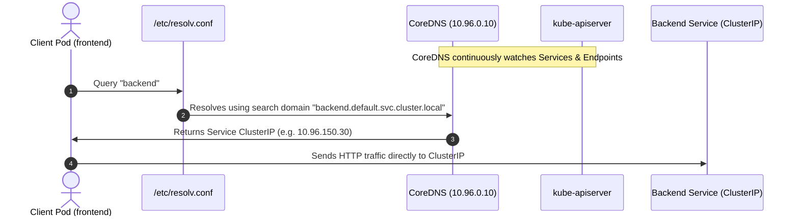

# Task 4: CoreDNS in Kubernetes

## Student Information
- **Name:** Dhruv Sharma
- **Enrollment Number:** 24BCS10294

---

## 1. What is CoreDNS?
**CoreDNS** is a flexible, extensible, and high-performance DNS server written in Go. It is an official Cloud Native Computing Foundation (CNCF) graduated project and serves as the default cluster DNS server in Kubernetes (replacing the legacy `kube-dns` since Kubernetes v1.13).

In Kubernetes, CoreDNS is deployed as a **Deployment** (typically 2 replicas for high availability) inside the `kube-system` namespace, exposed via a `kube-dns` Service with a fixed ClusterIP (usually `.10` of the service CIDR, e.g., `10.96.0.10`).

---

## 2. Why Kubernetes Uses CoreDNS
1. **Dynamic Service Discovery**: As Pods are scheduled, scaled up, killed, and replaced, their IP addresses change constantly. CoreDNS continuously tracks changes to Services and Endpoints via the Kubernetes API server.
2. **Pluggable Architecture**: CoreDNS uses a modular chained-plugin architecture (`kubernetes`, `forward`, `cache`, `errors`, `health`, `prometheus`), making it extremely lightweight and configurable.
3. **Low Memory Footprint**: CoreDNS is single-binary and highly efficient compared to legacy multi-container DNS solutions.
4. **Resilience & Observability**: Exposes native Prometheus metrics for query latency, error counts, and cache hit ratios.

---

## 3. How Service Discovery & DNS Resolution Work



1. **Watch Loop**: The `kubernetes` plugin in CoreDNS watches the Kubernetes API server for additions, updates, or deletions of `Service` and `EndpointSlice` resources.
2. **Client Query**: A Pod sends an A/AAAA record DNS lookup request to the nameserver IP configured in its `/etc/resolv.conf`.
3. **Internal Lookup**: If the query matches the cluster domain (`cluster.local`), CoreDNS resolves the record internally using its in-memory table.
4. **Upstream Forwarding**: If the query is external (e.g., `google.com` or `github.com`), the `forward` plugin sends the query to the node's upstream DNS server (e.g., `8.8.8.8` or corporate DNS).
5. **Caching**: Responses are cached locally according to TTL settings to minimize lookup latency.

---

## 4. CoreDNS Configuration (`Corefile`)
CoreDNS configuration is managed declaratively via a Kubernetes ConfigMap named `coredns` in the `kube-system` namespace:

```text
apiVersion: v1
kind: ConfigMap
metadata:
  name: coredns
  namespace: kube-system
data:
  Corefile: |
    .:53 {
        errors
        health {
           lameduck 5s
        }
        ready
        kubernetes cluster.local in-addr.arpa ip6.arpa {
           pods insecure
           fallthrough in-addr.arpa ip6.arpa
           ttl 30
        }
        prometheus :9153
        forward . /etc/resolv.conf {
           max_concurrent 1000
        }
        cache 30
        loop
        reload
        loadbalance
    }
```

### Key Plugins Explained:
- **`errors`**: Logs errors to standard output.
- **`health`**: Serves health checks on port 8080 (`/health`).
- **`kubernetes`**: Resolves DNS queries based on the Kubernetes API resources for the `cluster.local` domain.
- **`forward . /etc/resolv.conf`**: Forwards any non-cluster queries to host node resolvers.
- **`cache 30`**: Caches DNS responses for up to 30 seconds.
- **`loadbalance`**: Acts as a round-robin DNS load balancer across multiple IP records.

---

## 5. How to Troubleshoot DNS Issues

When a Pod cannot reach a Service by name, follow this systematic troubleshooting checklist:

```bash
# 1. Verify CoreDNS Pods are running
kubectl get pods -n kube-system -l k8s-app=kube-dns

# 2. Check CoreDNS logs for failures or loop crashes
kubectl logs -n kube-system -l k8s-app=kube-dns --tail=50

# 3. Check the kube-dns Service and endpoints
kubectl get svc,endpoints -n kube-system -l k8s-app=kube-dns

# 4. Run an interactive DNS diagnostic Pod (dnsutils / netshoot)
kubectl run dns-test --image=registry.k8s.io/e2e-test-images/jessie-dnsutils:1.3 -it --rm -- bash

# Inside the test container:
# Test cluster-internal resolution
nslookup kubernetes.default
nslookup payment-service.default.svc.cluster.local

# Test external resolution
nslookup google.com

# Inspect local resolver settings
cat /etc/resolv.conf
```

#### 💡 Command Breakdown (cmd-explained):
* `kubectl get pods -n kube-system -l k8s-app=kube-dns`:
  * `-n kube-system`: Targets the administrative namespace where core control plane and DNS pods run.
  * `-l k8s-app=kube-dns`: Filters for CoreDNS pods (historically labeled `kube-dns` for backward compatibility). Verifies both replicas are in `Running` state.
* `kubectl logs -n kube-system -l k8s-app=kube-dns --tail=50`:
  * `logs -l`: Streams logs from all pods matching the label selector simultaneously.
  * `--tail=50`: Limits output to the last 50 lines per container, highlighting recent crashes, loop warnings, or upstream DNS timeout errors.
* `kubectl get svc,endpoints -n kube-system -l k8s-app=kube-dns`:
  * `svc,endpoints`: Queries both Service and Endpoints resources in one command. Verifies that the `kube-dns` virtual IP has live target Pod IPs registered under `ENDPOINTS`. If endpoints are `<none>`, CoreDNS will fail to answer queries.
* `kubectl run dns-test --image=registry.k8s.io/e2e-test-images/jessie-dnsutils:1.3 -it --rm -- bash`:
  * `run dns-test`: Generates and immediately runs a standalone one-off pod named `dns-test`.
  * `--image=.../jessie-dnsutils:1.3`: Uses an image pre-packaged with DNS diagnostic tools (`nslookup`, `dig`, `host`).
  * `-it`: Interactive mode with TTY attached for shell access.
  * `--rm`: Ephemeral pod cleanup flag. Automatically deletes the pod from the cluster as soon as you exit the shell session (`exit`).
* `nslookup <domain>`: Queries the DNS server for IP mappings.
  * `kubernetes.default`: Tests bare two-part resolution to verify search path completion (`kubernetes.default.svc.cluster.local`).
  * `google.com`: Tests the `forward` plugin to ensure cluster pods can resolve external internet domains via upstream host resolvers.
* `cat /etc/resolv.conf`: Reads the Linux DNS client configuration injected by the kubelet. Typically contains:
  * `nameserver 10.96.0.10`: The cluster IP of the `kube-dns` service.
  * `search <namespace>.svc.cluster.local svc.cluster.local cluster.local`: Search domains tried in order for non-fully-qualified queries.
  * `options ndots:5`: Instructs the resolver to append search domains if a queried name contains fewer than 5 dots.

---

### 📚 Tech Jargons Demystified:
* **ndots:5:** A Linux DNS resolver rule injected into Kubernetes pods. If a queried domain name contains fewer than 5 dots (e.g. `api.github.com` has 2 dots), the OS attempts to resolve it against all cluster search domains first before issuing a public query, which can cause excessive DNS query amplification.
* **Corefile:** The configuration file parsed by CoreDNS defining servers, ports, and execution chains of modular plugins (`kubernetes`, `cache`, `forward`, `loadbalance`).
* **Loop Plugin:** A safety plugin in CoreDNS that detects DNS forwarding loops (e.g. CoreDNS forwarding to local host resolver which forwards back to CoreDNS). If a loop is detected, CoreDNS terminates with a fatal loop error to prevent CPU exhaustion.
* **EndpointSlice:** A scalable Kubernetes resource replacing large single `Endpoints` objects by breaking backend Pod IP lists into smaller chunks of 100 endpoints each.
