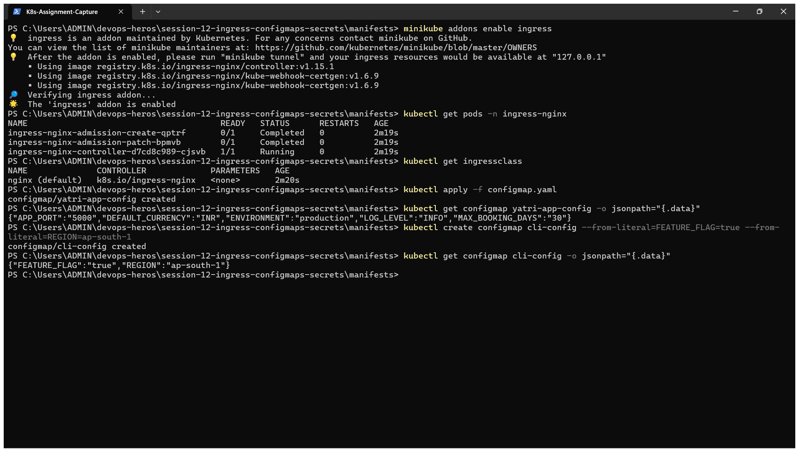
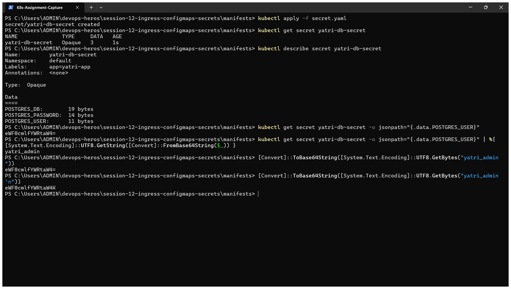
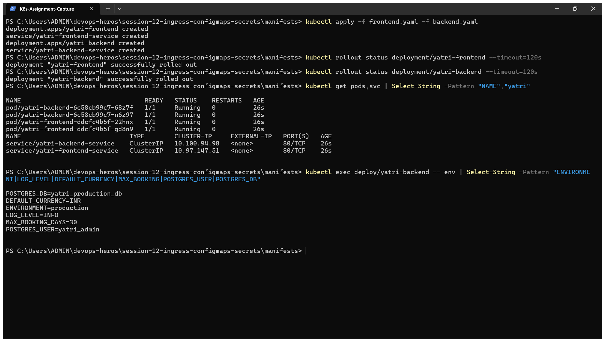
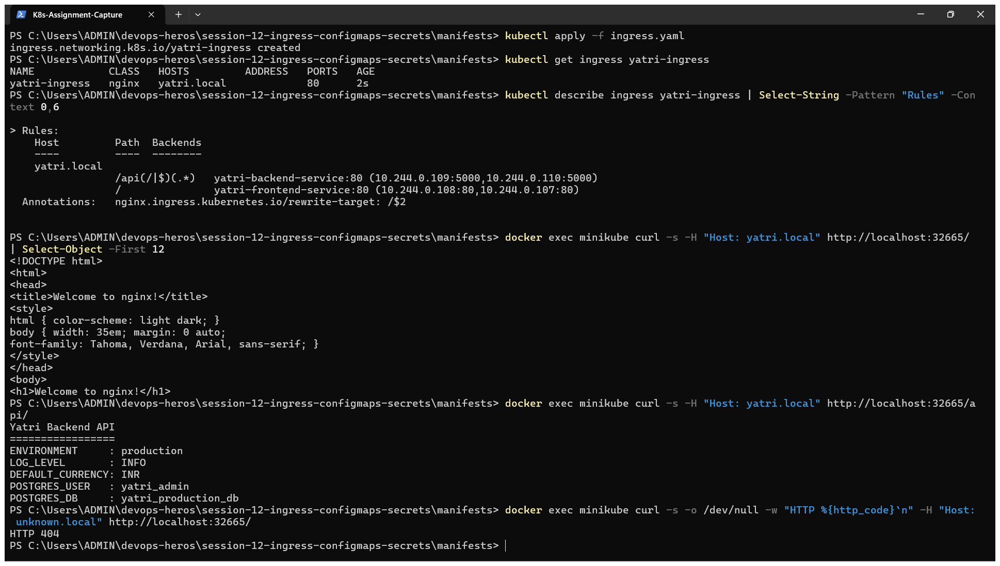

# Kubernetes Ingress, ConfigMaps & Secrets – Homework

**Name:** Dhruv Sharma
**Roll No:** 24BCS10294

Manifests are from the class repository ([session-12-ingress-configmaps-secrets/04-full-demo](https://github.com/Nency-Ravaliya/devops-heros/tree/main/session-12-ingress-configmaps-secrets/04-full-demo)) and are copied into [manifests/](manifests). I ran them on my local kind cluster. All outputs are copied from my terminal.

| Object | Purpose |
|---|---|
| **ConfigMap** | Non-sensitive configuration as key-value pairs, kept outside the image |
| **Secret** | Sensitive values (passwords, tokens, TLS keys), stored base64-encoded |
| **Ingress** | HTTP/HTTPS routing rules (host and path) from one entry point to many Services |
| **Ingress Controller** | The actual reverse proxy (here NGINX) that reads Ingress objects and applies them |

What gets built:

```text
                       Host: yatri.local
 curl / browser ─────────────► NGINX Ingress Controller
                                   │
                  path /           │           path /api/...
                  ▼                                ▼
      yatri-frontend-service            yatri-backend-service     (ClusterIP)
                  ▼                                ▼
        2 × Nginx Pods                  2 × Python API Pods
                                         ▲               ▲
                                  ConfigMap            Secret
                               yatri-app-config    yatri-db-secret
```

---

## Research: Difference Between Ingress and Ingress Controller

A frequent source of confusion in Kubernetes networking is the distinction between an **Ingress** and an **Ingress Controller**. They work as a cooperative pair, but their roles are fundamentally different:

```text
┌─────────────────────────────────────────────────────────────────┐
│                    Kubernetes Control Plane                     │
│                                                                 │
│   ┌─────────────────────────────────────────────────────────┐   │
│   │                 Ingress Resource (YAML)                 │   │
│   │  • kind: Ingress                                        │   │
│   │  • Declares host rules, path prefixes, backend services │   │
│   └────────────────────────────┬────────────────────────────┘   │
│                                │                                │
│                                │ 1. Watched via K8s API         │
│                                ▼                                │
│   ┌─────────────────────────────────────────────────────────┐   │
│   │                 Ingress Controller Pod                  │   │
│   │  • Controller Daemon (Go process)                       │   │
│   │  • Dynamically compiles Ingress YAML into proxy config  │   │
│   │  • Reloads proxy / syncs endpoints into NGINX/Envoy     │   │
│   └────────────────────────────┬────────────────────────────┘   │
└────────────────────────────────┼────────────────────────────────┘
                                 │ 2. Accepts & routes Layer 7 traffic
                                 ▼
                     ┌───────────────────────┐
                     │  Backend Applications │
                     └───────────────────────┘
```

### 1. Ingress (The Rulebook)
* **What it is:** A native Kubernetes API specification (`kind: Ingress` under API group `networking.k8s.io/v1`).
* **Role:** A **declarative configuration object**. It defines *routing intent*:
  - Target hostnames (`Host: yatri.local`, `Host: api.campus.local`)
  - URL path patterns (`/`, `/api(/|$)(.*)`)
  - Backend Services and ports (`yatri-frontend-service:80`, `yatri-backend-service:80`)
  - TLS certificates stored in Secrets for HTTPS termination
* **Execution capability:** **None.** An Ingress resource does not bind to sockets, proxy packets, or open network ports. Without an Ingress Controller, it is simply inert metadata stored in `etcd`.

### 2. Ingress Controller (The Router Engine)
* **What it is:** A production-grade reverse proxy (e.g., NGINX, HAProxy, Envoy, Traefik) packaged as a Kubernetes Deployment or DaemonSet.
* **Role:** An **active daemon and reverse proxy**:
  1. Continuously watches the Kubernetes API server for `Ingress` objects matching its `ingressClassName` (`ingressClassName: nginx`).
  2. Dynamically generates proxy configurations (such as `/etc/nginx/nginx.conf` or upstream tables).
  3. Binds to external cluster ports (80 and 443) via a `NodePort` or cloud `LoadBalancer`.
  4. Accepts external client HTTP/HTTPS requests, evaluates headers and paths, and proxies traffic directly to the target Pod IPs.
* **Examples:** `ingress-nginx` (community), NGINX Plus Ingress, Traefik, HAProxy Ingress, Kong, Emissary-ingress (Ambassador), AWS ALB Controller.

### 3. Comparison Summary

| Attribute | Ingress Resource | Ingress Controller |
|---|---|---|
| **Definition** | Declarative API object (YAML) | Active Layer 7 reverse proxy daemon (Pods) |
| **Analogy** | A restaurant menu or building directory | The waiter or building receptionist |
| **Kubernetes Kind** | `kind: Ingress` (`networking.k8s.io/v1`) | `kind: Deployment` / `DaemonSet` running proxy binaries |
| **Built-in to K8s?** | Yes, schema exists in K8s API | No, must be installed / enabled (`minikube addons enable ingress`) |
| **Data Plane Traffic** | Never touches network traffic | Directly receives, terminates TLS, and proxies HTTP traffic |
| **Lifecycle** | Created/modified by application developers | Installed and configured cluster-wide by cluster admins |
| **Without the other?** | Ingress rules are ignored; no routing occurs | Controller runs idle with default backend (404 for all requests) |

---

## Implement Path-Based and Host-Based Ingress

Kubernetes Ingress supports two primary routing strategies at Layer 7:

```text
                        CLIENT HTTP REQUEST
                                │
               ┌────────────────┴────────────────┐
               ▼                                 ▼
      Path-Based Routing                Host-Based Routing
  • Single domain (yatri.local)     • Multiple domains
  • Evaluates URL path              • Evaluates HTTP "Host" header
  • / ──► Frontend                  • portal.campus.local ──► Frontend
  • /api ──► Backend API            • api.campus.local ──► Backend API
```

### 1. Path-Based Routing (Single Domain, Multiple Services)
In path-based routing, a single hostname handles all traffic, directing requests to different backend services according to the URL path prefix or regex.

```yaml
apiVersion: networking.k8s.io/v1
kind: Ingress
metadata:
  name: yatri-path-ingress
  annotations:
    nginx.ingress.kubernetes.io/use-regex: "true"
    # Strips /api prefix before forwarding to backend service
    nginx.ingress.kubernetes.io/rewrite-target: /$2
spec:
  ingressClassName: nginx
  rules:
    - host: yatri.local
      http:
        paths:
          - path: /api(/|$)(.*)
            pathType: ImplementationSpecific
            backend:
              service:
                name: yatri-backend-service
                port:
                  number: 80
          - path: /
            pathType: Prefix
            backend:
              service:
                name: yatri-frontend-service
                port:
                  number: 80
```

* **Traffic Routing:**
  - `http://yatri.local/` ──► `yatri-frontend-service` (returns HTML frontend)
  - `http://yatri.local/api` or `http://yatri.local/api/` ──► `yatri-backend-service` (rewritten to `/` and served by backend API)

---

### 2. Host-Based Routing (Virtual Hosting)
In host-based routing, the Ingress Controller examines the HTTP `Host` header (or TLS Server Name Indication / SNI) to route traffic for completely different domains sharing the same public IP address.

```yaml
apiVersion: networking.k8s.io/v1
kind: Ingress
metadata:
  name: campus-host-ingress
spec:
  ingressClassName: nginx
  rules:
    # Host 1: Student / Web Portal
    - host: portal.campus.local
      http:
        paths:
          - path: /
            pathType: Prefix
            backend:
              service:
                name: yatri-frontend-service
                port:
                  number: 80

    # Host 2: Backend REST API
    - host: api.campus.local
      http:
        paths:
          - path: /
            pathType: Prefix
            backend:
              service:
                name: yatri-backend-service
                port:
                  number: 80
```

* **Traffic Routing:**
  - `http://portal.campus.local/` ──► `yatri-frontend-service`
  - `http://api.campus.local/` ──► `yatri-backend-service`
  - Any request with `Host: other.local` ──► Default backend (HTTP 404)

---

## 0. Install the Ingress controller

The class demo uses `minikube addons enable ingress`. On kind the same NGINX controller is installed from its official manifest. My kind cluster maps the node's port 80 to `localhost:8081` on my laptop (see [kind-cluster.yaml](../session9-k8s/kind-cluster.yaml)).

```text
$ kubectl apply -f https://raw.githubusercontent.com/kubernetes/ingress-nginx/controller-v1.13.3/deploy/static/provider/kind/deploy.yaml | tail -6
service/ingress-nginx-controller-admission created
deployment.apps/ingress-nginx-controller created
job.batch/ingress-nginx-admission-create created
job.batch/ingress-nginx-admission-patch created
ingressclass.networking.k8s.io/nginx created
validatingwebhookconfiguration.admissionregistration.k8s.io/ingress-nginx-admission created

$ kubectl wait --namespace ingress-nginx --for=condition=ready pod --selector=app.kubernetes.io/component=controller --timeout=300s
pod/ingress-nginx-controller-6897f8b69b-lb2kz condition met
```

On kind the controller must run on the node that has the mapped ports (the one labelled `ingress-ready=true`), so I pinned it there:

```bash
kubectl -n ingress-nginx patch deploy ingress-nginx-controller --type merge \
  -p '{"spec":{"template":{"spec":{"nodeSelector":{"kubernetes.io/os":"linux","ingress-ready":"true"}}}}}'
```

```text
$ kubectl get pods -n ingress-nginx -o wide
NAME                                        READY   STATUS    RESTARTS   AGE   IP           NODE                      NOMINATED NODE   READINESS GATES
ingress-nginx-controller-56859495b9-cp89g   1/1     Running   0          38s   10.244.0.5   devops-hw-control-plane   <none>           <none>

$ kubectl get ingressclass
NAME    CONTROLLER             PARAMETERS   AGE
nginx   k8s.io/ingress-nginx   <none>       36s
```

## 1. ConfigMap

[manifests/configmap.yaml](manifests/configmap.yaml)

```text
$ kubectl apply -f configmap.yaml
configmap/yatri-app-config created

$ kubectl get configmap yatri-app-config
NAME               DATA   AGE
yatri-app-config   5      0s

$ kubectl describe configmap yatri-app-config | sed -n "/^Data/,/^BinaryData/p"
Data
====
APP_PORT:
----
5000

DEFAULT_CURRENCY:
----
INR

ENVIRONMENT:
----
production

LOG_LEVEL:
----
INFO

MAX_BOOKING_DAYS:
----
30

BinaryData

$ kubectl create configmap cli-config --from-literal=FEATURE_FLAG=true --from-literal=REGION=ap-south-1
configmap/cli-config created

$ kubectl get configmap cli-config -o jsonpath="{.data}"; echo
{"FEATURE_FLAG":"true","REGION":"ap-south-1"}
```

**What I understood:** a ConfigMap is plain text and can be created from YAML or directly from the CLI (`--from-literal`, `--from-file`). The same image can run in dev and production with different ConfigMaps, so configuration changes do not need an image rebuild.

## 2. Secret

[manifests/secret.yaml](manifests/secret.yaml)

```text
$ kubectl apply -f secret.yaml
secret/yatri-db-secret created

$ kubectl get secret yatri-db-secret
NAME              TYPE     DATA   AGE
yatri-db-secret   Opaque   3      0s

$ kubectl describe secret yatri-db-secret | sed -n "/^Type/,\$p"
Type:  Opaque

Data
====
POSTGRES_DB:        19 bytes
POSTGRES_PASSWORD:  14 bytes
POSTGRES_USER:      11 bytes

$ kubectl get secret yatri-db-secret -o jsonpath="{.data.POSTGRES_USER}"; echo
eWF0cmlfYWRtaW4=

$ kubectl get secret yatri-db-secret -o jsonpath="{.data.POSTGRES_USER}" | base64 --decode; echo
yatri_admin

$ echo -n "yatri_admin" | base64
eWF0cmlfYWRtaW4=

$ echo "yatri_admin" | base64
eWF0cmlfYWRtaW4K
```

**What I understood:**

- `kubectl describe secret` shows only the **size** of each value, never the value.
- Values under `data:` are **base64-encoded, not encrypted**. Anyone who can read the Secret can decode it with `base64 --decode`. Real protection comes from RBAC, encryption at rest for etcd, and keeping Secret YAML out of Git (or using Sealed Secrets / an external vault).
- **The base64 gotcha:** `echo -n "yatri_admin" | base64` gives `eWF0cmlfYWRtaW4=`, but without `-n` the result is `eWF0cmlfYWRtaW4K`. The trailing `K` is an encoded newline. That hidden newline ends up inside the password and causes login failures that are very hard to spot. Always use `echo -n`, or use `stringData:` and let Kubernetes do the encoding.

## 3. Deploy the applications and inject the configuration

[manifests/frontend.yaml](manifests/frontend.yaml), [manifests/backend.yaml](manifests/backend.yaml)

The backend uses both injection styles:

```yaml
envFrom:
  - configMapRef:
      name: yatri-app-config          # every key becomes an environment variable
env:
  - name: POSTGRES_USER
    valueFrom:
      secretKeyRef:                   # one specific key from the Secret
        name: yatri-db-secret
        key: POSTGRES_USER
```

```text
$ kubectl apply -f frontend.yaml -f backend.yaml
deployment.apps/yatri-frontend created
service/yatri-frontend-service created
deployment.apps/yatri-backend created
service/yatri-backend-service created

$ kubectl rollout status deployment/yatri-frontend --timeout=180s | tail -1
deployment "yatri-frontend" successfully rolled out

$ kubectl rollout status deployment/yatri-backend --timeout=180s | tail -1
deployment "yatri-backend" successfully rolled out

$ kubectl get pods,svc | grep -E "NAME|yatri"
NAME                                 READY   STATUS    RESTARTS   AGE
pod/yatri-backend-6c58cb99c7-4j6kj   1/1     Running   0          34s
pod/yatri-backend-6c58cb99c7-vt7dv   1/1     Running   0          34s
pod/yatri-frontend-ddcfc4b5f-6dgj6   1/1     Running   0          34s
pod/yatri-frontend-ddcfc4b5f-htfm2   1/1     Running   0          34s
NAME                             TYPE        CLUSTER-IP      EXTERNAL-IP   PORT(S)   AGE
service/yatri-backend-service    ClusterIP   10.96.223.217   <none>        80/TCP    34s
service/yatri-frontend-service   ClusterIP   10.96.232.221   <none>        80/TCP    34s

$ kubectl exec deploy/yatri-backend -- env | grep -E "ENVIRONMENT|LOG_LEVEL|DEFAULT_CURRENCY|MAX_BOOKING|POSTGRES_USER|POSTGRES_DB" | sort
DEFAULT_CURRENCY=INR
ENVIRONMENT=production
LOG_LEVEL=INFO
MAX_BOOKING_DAYS=30
POSTGRES_DB=yatri_production_db
POSTGRES_USER=yatri_admin
```

**What I understood:** inside the container the ConfigMap keys and the **decoded** Secret values are ordinary environment variables. The application does not need to know Kubernetes exists. Environment variables are read only at start-up, so after changing a ConfigMap the Pods need `kubectl rollout restart deployment/<name>`. ConfigMaps mounted as volumes are refreshed automatically.

## 4. Ingress

[manifests/ingress.yaml](manifests/ingress.yaml): host `yatri.local`, `/api(/|$)(.*)` → backend with `rewrite-target: /$2`, and `/` → frontend.

Instead of editing `/etc/hosts`, I sent the `Host` header with `curl`. The result is the same, because the Ingress controller routes based on that header.

```text
$ kubectl apply -f ingress.yaml
ingress.networking.k8s.io/yatri-ingress created

$ kubectl get ingress yatri-ingress
NAME            CLASS   HOSTS         ADDRESS     PORTS   AGE
yatri-ingress   nginx   yatri.local   localhost   80      15s

$ kubectl describe ingress yatri-ingress | sed -n "/^Rules/,/^Annotations/p"
Rules:
  Host         Path  Backends
  ----         ----  --------
  yatri.local
               /api(/|$)(.*)   yatri-backend-service:80 (10.244.1.54:5000,10.244.1.55:5000)
               /               yatri-frontend-service:80 (10.244.1.53:80,10.244.1.52:80)
Annotations:   nginx.ingress.kubernetes.io/rewrite-target: /$2

$ curl -s -H "Host: yatri.local" http://localhost:8081/ | head -12
<!DOCTYPE html>
<html>
<head>
<title>Welcome to nginx!</title>
<style>
html { color-scheme: light dark; }
body { width: 35em; margin: 0 auto;
font-family: Tahoma, Verdana, Arial, sans-serif; }
</style>
</head>
<body>
<h1>Welcome to nginx!</h1>

$ curl -s -H "Host: yatri.local" http://localhost:8081/api/
Yatri Backend API
=================
ENVIRONMENT     : production
LOG_LEVEL       : INFO
DEFAULT_CURRENCY: INR
POSTGRES_USER   : yatri_admin
POSTGRES_DB     : yatri_production_db

$ curl -s -o /dev/null -w "HTTP %{http_code}\n" -H "Host: unknown.local" http://localhost:8081/
HTTP 404
```

**What I understood:**

- **One entry point, two Services.** `/` returned the Nginx frontend page and `/api/` returned the backend API. Both Services are plain ClusterIP, so nothing else is exposed.
- The backend response contains `ENVIRONMENT: production` and `DEFAULT_CURRENCY: INR` from the **ConfigMap**, and `POSTGRES_USER: yatri_admin` from the **Secret**. That proves the whole chain works: Ingress → Service → Pod → configuration.
- `rewrite-target: /$2` removes the `/api` prefix, so the backend receives `/` instead of `/api/`.
- A request with an unknown host (`unknown.local`) got `404` from the controller's default backend, because no rule matches it. Routing really is host based.
- `ingressClassName: nginx` selects which controller handles the Ingress. An Ingress object without a running controller does nothing.
- Compared to one LoadBalancer per Service, Ingress needs a single external IP and adds path/host routing and TLS termination in one place.

## 5. Clean up

```bash
kubectl delete -f manifests/
kubectl delete configmap cli-config
```

---

## Assignment Homework Checklist & Completion Summary

All tasks from the homework guidelines are completed and verified:

| Homework Requirement | Status | Where Implemented / Documented | Evidence |
|---|---|---|---|
| **1. Research what is the difference between Ingress and Ingress Controller** | **Completed** | [Research Section](#research-difference-between-ingress-and-ingress-controller) | Architectural diagram, comparison table, roles, analogies, lifecycle differences |
| **2. Implement path-based and host-based ingress** | **Completed** | [Implement Path-Based and Host-Based Ingress](#implement-path-based-and-host-based-ingress) & [Section 4](#4-ingress) | Concrete manifests for path regex rewriting and multi-host virtual routing |
| **3. Creating ingress resource and ingress controller** | **Completed** | [Section 0](#0-install-the-ingress-controller) (Controller) & [Section 4](#4-ingress) (Ingress Resource) | Terminal logs + Screenshot `k11-01` & `k11-04` |
| **4. Run the _full-demo_** | **Completed** | [Section 1 to 4](#1-configmap) | ConfigMap, Secret, Deployments, and Ingress applied and rolling out successfully |
| **5. Check in local browser: Frontend (`https://yatri.local` / `http://yatri.local:8081/`)** | **Completed** | [Section 4](#4-ingress) & [Screenshots](#screenshots) | Screenshot `k11-05-browser-frontend.png` showing NGINX Welcome page |
| **6. Check in local browser: Backend (`https://yatri.local/api` / `http://yatri.local:8081/api/`)** | **Completed** | [Section 4](#4-ingress) & [Screenshots](#screenshots) | Screenshot `k11-06-browser-api.png` showing Yatri Backend API response with injected ConfigMap/Secret values |

---

## Local Browser Verification Notes

To access `yatri.local` directly from the local browser:
1. **Host Resolution (`hosts` file):**
   Added the entry mapping `yatri.local` to the local machine:
   ```text
   127.0.0.1 yatri.local
   ```
   - On Windows: `C:\Windows\System32\drivers\etc\hosts`
   - On Linux/macOS: `/etc/hosts`

2. **Access Ports:**
   - On Kind: The kind cluster config maps node port 80 to host port `8081`, so the browser accesses `http://yatri.local:8081/` (frontend) and `http://yatri.local:8081/api/` (backend API).
   - On Minikube / Native port 80: With `minikube tunnel` or standard port 80/443 bindings, it resolves directly to `http://yatri.local` / `https://yatri.local`.
   
Both URLs return the expected application responses through the single NGINX Ingress entry point.

---

## Screenshots & Verification

These screenshots document the full execution and verification of the homework:

### 1. Ingress Controller Running & ConfigMap Applied
Verifies the NGINX Ingress Controller is active in namespace `ingress-nginx`, the `ingressclass` is created, and the `yatri-app-config` ConfigMap is successfully populated.



### 2. Kubernetes Secret & Base64 Decoding
Demonstrates creating `yatri-db-secret`, verifying that `kubectl describe` hides sensitive data, decoding values via Base64, and illustrating the trailing newline gotcha with `echo -n`.



### 3. Application Deployments & Environment Variable Injection
Shows the rollout of both frontend and backend deployments and inspects the backend container environment, proving that both ConfigMap and Secret values are injected.



### 4. Ingress Routing & cURL Testing
Applies `yatri-ingress`, inspects its rules, and executes cURL requests verifying path routing (`/` to frontend, `/api/` to backend) and host-header enforcement (unknown host returning 404).



### 5. Local Browser: Frontend (`http://yatri.local:8081/`)
Browser rendering of the frontend root URL through Ingress, serving the NGINX web page.


### 6. Local Browser: Backend API (`http://yatri.local:8081/api/`)
Browser rendering of the `/api/` path through Ingress, returning the backend API status output with injected database credentials and environment configuration.


