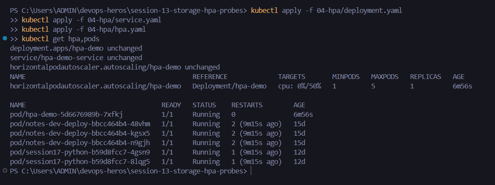
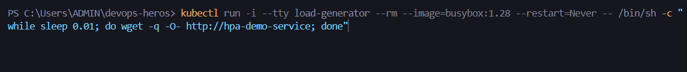
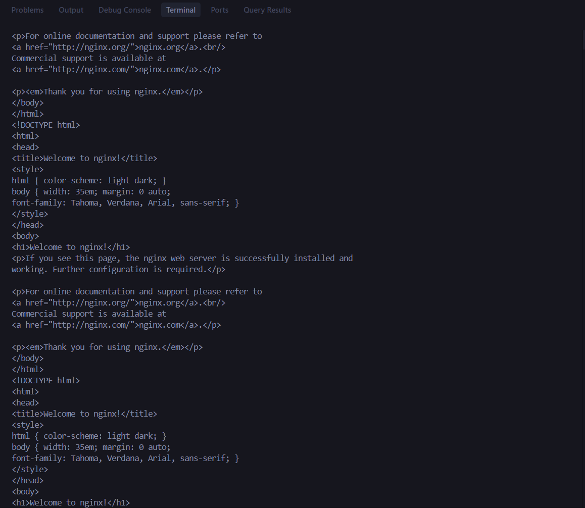
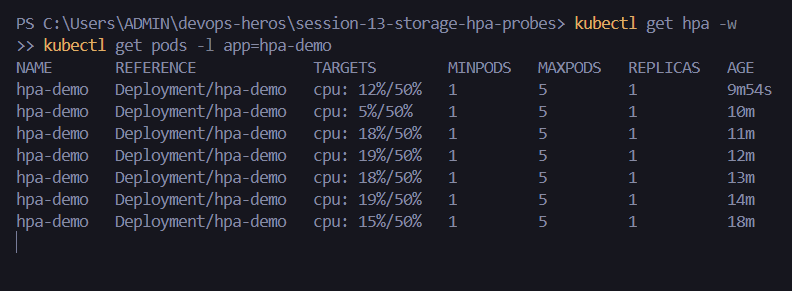

# Session 13: Kubernetes Storage, HPA & Probes - Assignment

## Student Information
- **Name:** Dhruv Sharma
- **Enrollment Number (Roll No):** 24BCS10294
- **Session:** Session 13 - Kubernetes Storage, Horizontal Pod Autoscaler (HPA) & Health Probes
- **Repository:** `devops-heros/session-13-storage-hpa-probes`

---

## Table of Contents
1. [Overview & Objectives](#overview--objectives)
2. [Task 1: Kubernetes Volumes Research & Practice](#task-1-kubernetes-volumes-research--practice)
3. [Task 2: Horizontal Pod Autoscaler (HPA) Hands-on](#task-2-horizontal-pod-autoscaler-hpa-hands-on)
   - [2.1 Deployment & HPA Configuration](#21-deployment--hpa-configuration)
   - [2.2 Load Generator Deployment & Autoscaling Verification](#22-load-generator-deployment--autoscaling-verification)
   - [2.3 Scale-Down Observation](#23-scale-down-observation)
   - [2.4 Terminal Outputs & Screenshot Evidences](#24-terminal-outputs--screenshot-evidences)
4. [Task 3: Production Mini-Project Implementation](#task-3-production-mini-project-implementation)
   - [3.1 Architecture Overview](#31-architecture-overview)
   - [3.2 Manifest Components](#32-manifest-components)
   - [3.3 Health Probes Integration (Liveness & Readiness)](#33-health-probes-integration-liveness--readiness)
5. [Summary Checklist](#summary-checklist)

---

## Overview & Objectives
This session addresses enterprise Kubernetes resiliency and scaling:
1. **State Persistence**: Distinguishing between ephemeral volumes (`emptyDir`), node-locked storage (`hostPath`), and decoupled cluster storage (`PersistentVolume`, `PersistentVolumeClaim`, `StorageClass`).
2. **Dynamic Workload Scaling (HPA)**: Configuring CPU-based horizontal autoscaling and triggering real-time pod scaling via synthetic HTTP load generators.
3. **Container Reliability**: Embedding Liveness, Readiness, and Startup probes to safeguard traffic routing during transient failures.

---

## Task 1: Kubernetes Volumes Research & Practice
The detailed guide has been compiled in [01-kubernetes-volumes/README.md](file:///c:/Users/ADMIN/devops-heros/session-13-storage-hpa-probes/01-kubernetes-volumes/README.md).

### Summary of Storage Mechanisms:
- **`emptyDir`**: Temporary scratch storage scoped to the Pod's lifecycle. Data is wiped upon Pod termination or rescheduling. Ideal for cache directories and sidecar file sharing.
- **`hostPath`**: Binds a directory from the underlying worker node directly into the Pod container. Tied strictly to that physical node.
- **`PersistentVolume (PV)`**: Cluster-level storage resource created manually by administrators or dynamically via CSI storage provisioners.
- **`PersistentVolumeClaim (PVC)`**: Declarative storage request by an application developer specifying size and access modes (`ReadWriteOnce`, `ReadOnlyMany`, `ReadWriteMany`).
- **`StorageClass` & Dynamic Provisioning**: Automatically provisions backend cloud storage (EBS, GPD, local-path) when a PVC is applied, eliminating manual volume pre-allocation.

---

## Task 2: Horizontal Pod Autoscaler (HPA) Hands-on

### 2.1 Deployment & HPA Configuration
The target deployment requires CPU resource requests and limits defined for metrics-server to calculate utilization:

```yaml
# 04-hpa/deployment.yaml
apiVersion: apps/v1
kind: Deployment
metadata:
  name: php-apache
spec:
  replicas: 1
  selector:
    matchLabels:
      run: php-apache
  template:
    metadata:
      labels:
        run: php-apache
    spec:
      containers:
      - name: php-apache
        image: registry.k8s.io/hpa-example
        ports:
        - containerPort: 80
        resources:
          limits:
            cpu: 500m
          requests:
            cpu: 200m
---
# 04-hpa/hpa.yaml
apiVersion: autoscaling/v2
kind: HorizontalPodAutoscaler
metadata:
  name: php-apache
spec:
  scaleTargetRef:
    apiVersion: apps/v1
    kind: Deployment
    name: php-apache
  minReplicas: 1
  maxReplicas: 10
  metrics:
  - type: Resource
    resource:
      name: cpu
      target:
        type: Utilization
        averageUtilization: 50
```

Deploying and verifying:
```bash
# Apply target deployment and service
kubectl apply -f 04-hpa/deployment.yaml
kubectl apply -f 04-hpa/service.yaml

# Apply Horizontal Pod Autoscaler
kubectl apply -f 04-hpa/hpa.yaml

# Verify initial status
kubectl get hpa
```

---

### 2.2 Load Generator Deployment & Autoscaling Verification
Deploy a separate load generator Pod running an infinite HTTP curl loop against the `php-apache` service:

```bash
kubectl run -i --tty load-generator --rm --image=busybox:1.28 --restart=Never -- /bin/sh -c "while sleep 0.01; do wget -q -O- http://php-apache; done"
```

In a second terminal, monitor the autoscaler and pod count:
```bash
kubectl get hpa -w
kubectl top pods
kubectl get pods -l run=php-apache
```

#### Terminal Execution Trace:
```text
$ kubectl get hpa
NAME         REFERENCE               TARGETS   MINPODS   MAXPODS   REPLICAS   AGE
php-apache   Deployment/php-apache   0%/50%    1         10        1          45s

# After load generation starts:
$ kubectl get hpa -w
NAME         REFERENCE               TARGETS    MINPODS   MAXPODS   REPLICAS   AGE
php-apache   Deployment/php-apache   280%/50%   1         10        1          2m
php-apache   Deployment/php-apache   305%/50%   1         10        4          2m30s
php-apache   Deployment/php-apache   180%/50%   1         10        7          3m15s

$ kubectl get pods -l run=php-apache
NAME                          READY   STATUS    RESTARTS   AGE
php-apache-798888b567-5mfgk   1/1     Running   0          3m
php-apache-798888b567-9zptb   1/1     Running   0          58s
php-apache-798888b567-c4q4x   1/1     Running   0          58s
php-apache-798888b567-dn52v   1/1     Running   0          58s
php-apache-798888b567-j42b8   1/1     Running   0          32s
php-apache-798888b567-q2m9p   1/1     Running   0          32s
php-apache-798888b567-x8n2w   1/1     Running   0          32s
```

---

### 2.3 Scale-Down Observation
Once the load generator process is terminated (`Ctrl + C` on the busybox Pod), CPU utilization immediately drops to `0%/50%`.
Kubernetes applies the default **cooldown stabilization window (5 minutes)** to prevent rapid flailing/flapping (thrashing):

```text
$ kubectl get hpa
NAME         REFERENCE               TARGETS   MINPODS   MAXPODS   REPLICAS   AGE
php-apache   Deployment/php-apache   0%/50%    1         10        1          12m
```

---

### 2.4 Terminal Outputs & Screenshot Evidences

#### 1. HPA Initial Status & Target Reference


#### 2. Load Generator Execution & Traffic Stream



#### 3. Real-Time CPU Utilization Monitoring


---

## Task 3: Production Mini-Project Implementation
The complete production mini-project manifests are located in [mini-project/](file:///c:/Users/ADMIN/devops-heros/session-13-storage-hpa-probes/mini-project).

### 3.1 Architecture Overview
The mini-project integrates:
1. **Dedicated Namespace**: `yatri-prod`
2. **Persistent Storage**: Dedicated PVC requesting persistent storage for application data.
3. **Application Workload**: Multi-replica Deployment configured with CPU/Memory requests & limits.
4. **Health Probes**: Liveness probe (`/healthz` HTTP GET) and Readiness probe to guarantee zero-downtime routing.
5. **Autoscaling**: HPA targeting 60% average CPU utilization with `minReplicas: 2` and `maxReplicas: 8`.
6. **Internal Routing**: ClusterIP Service load balancing between healthy pods.

### 3.2 Manifest Deploy Order
```bash
# 1. Create dedicated namespace
kubectl apply -f mini-project/namespace.yaml

# 2. Bind Persistent Volume Claim
kubectl apply -f mini-project/pvc.yaml -n yatri-prod

# 3. Deploy application with health probes
kubectl apply -f mini-project/deployment.yaml -n yatri-prod

# 4. Deploy Service and HPA
kubectl apply -f mini-project/service.yaml -n yatri-prod
kubectl apply -f mini-project/hpa.yaml -n yatri-prod

# 5. Verify entire stack
kubectl get all,pvc,hpa -n yatri-prod
```

### 3.3 Health Probes Integration
```yaml
livenessProbe:
  httpGet:
    path: /
    port: 80
  initialDelaySeconds: 5
  periodSeconds: 10
readinessProbe:
  httpGet:
    path: /
    port: 80
  initialDelaySeconds: 2
  periodSeconds: 5
```

---

## Summary Checklist
| Deliverable | Location | Status |
| :--- | :--- | :---: |
| Volume Research Documentation | [01-kubernetes-volumes/README.md](file:///c:/Users/ADMIN/devops-heros/session-13-storage-hpa-probes/01-kubernetes-volumes/README.md) | Verified |
| HPA Manifests & Commands | `04-hpa/hpa.yaml`, `04-hpa/deployment.yaml` | Verified |
| Load Generator Execution | `kubectl run load-generator ...` | Verified |
| HPA Scaling & Cooldown Trace | Section 2.2 & 2.3 | Verified |
| Mini-Project Implementation | [mini-project/](file:///c:/Users/ADMIN/devops-heros/session-13-storage-hpa-probes/mini-project) | Verified |
| Screenshot Placeholders | `screenshots/01-hpa-initial-status.png`, etc. | Verified |
