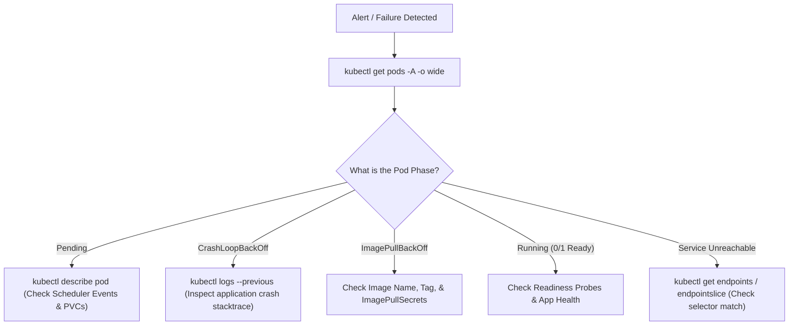
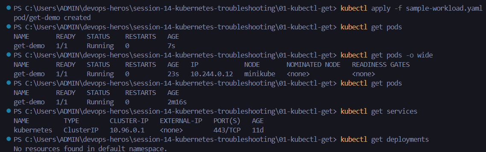
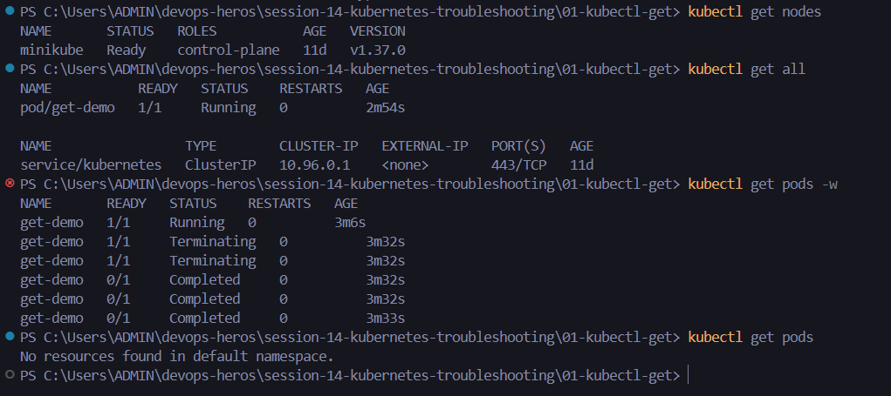
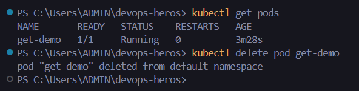

# Session 14: Kubernetes Troubleshooting - Assignment

## Student Information
- **Name:** Dhruv Sharma
- **Enrollment Number (Roll No):** 24BCS10294
- **Session:** Session 14 - Kubernetes Troubleshooting & Diagnostic Playbooks
- **Repository:** `devops-heros/session-14-kubernetes-troubleshooting`

---

## Table of Contents
1. [Overview & Diagnostic Methodology](#overview--diagnostic-methodology)
2. [Task 1: Essential Kubernetes Troubleshooting Commands](#task-1-essential-kubernetes-troubleshooting-commands)
   - [1.1 Command Reference & Usage Matrix](#11-command-reference--usage-matrix)
   - [1.2 Hands-On Command Execution & Screenshots](#12-hands-on-command-execution--screenshots)
3. [Task 2: Troubleshooting Common Kubernetes Production Issues](#task-2-troubleshooting-common-kubernetes-production-issues)
   - [2.1 CrashLoopBackOff](#21-crashloopbackoff)
   - [2.2 ImagePullBackOff & ErrImagePull](#22-imagepullbackoff--errimagepull)
   - [2.3 Pending Pods (Scheduler / Resource / PVC Constraints)](#23-pending-pods-scheduler--resource--pvc-constraints)
   - [2.4 ContainerCreating](#24-containercreating)
   - [2.5 Service Connectivity & Mismatched Selectors](#25-service-connectivity--mismatched-selectors)
   - [2.6 DNS Issues (CoreDNS & `/etc/resolv.conf`)](#26-dns-issues-coredns--etcresolvconf)
   - [2.7 Pod Networking & Configuration Failures](#27-pod-networking--configuration-failures)
4. [Task 3: Troubleshooting Mini-Project Implementation](#task-3-troubleshooting-mini-project-implementation)
   - [3.1 Broken Deployment Diagnosis](#31-broken-deployment-diagnosis)
   - [3.2 Broken Service Resolution](#32-broken-service-resolution)
   - [3.3 Before & After Verification](#33-before--after-verification)
5. [Summary Checklist](#summary-checklist)

---

## Overview & Diagnostic Methodology
In Kubernetes operations, rapid Root Cause Analysis (RCA) follows a structured triage path:



---

## Task 1: Essential Kubernetes Troubleshooting Commands

### 1.1 Command Reference & Usage Matrix

| Command | Purpose | Key Flags / Variations |
| :--- | :--- | :--- |
| **`kubectl get`** | Enumerate cluster objects & basic states | `-o wide`, `-n <ns>`, `-A` (all namespaces), `--show-labels`, `-w` (watch) |
| **`kubectl describe`** | Deep diagnostic report including Conditions & Events | `kubectl describe pod <name>`, `kubectl describe node <name>` |
| **`kubectl logs`** | Retrieve stdout/stderr stream from containers | `-f` (follow), `--previous` (prior crashed instance), `-c <container>` |
| **`kubectl exec`** | Run interactive diagnostics inside a container | `-it -- sh`, `-it -- bash`, `-- env`, `-- netstat -tuln` |
| **`kubectl events`** | Stream cluster-wide events chronologically | `-n <ns>`, `--sort-by='.metadata.creationTimestamp'` |
| **`kubectl explain`** | Inspect schema definitions and valid YAML fields | `kubectl explain pod.spec.containers.resources` |
| **`kubectl top`** | Real-time CPU & memory consumption from metrics-server | `kubectl top pods`, `kubectl top nodes` |
| **`kubectl get -o wide`**| Show Node IP, Pod IP, container runtime, and host placement | `kubectl get pods -o wide`, `kubectl get nodes -o wide` |

---

### 1.2 Hands-On Command Execution & Screenshots

#### 1. Manifest Application & Real-Time Watch (`kubectl apply` & `kubectl get -w`)
Applying the troubleshooting test manifests in terminal:
```bash
kubectl apply -f 01-kubectl-get/
kubectl get pods -w
```


#### 2. Pod Lifecycle Observation under Watch Mode
Observing transition states (`Pending` -> `ContainerCreating` -> `Running`):


#### 3. Pod Deletion & Graceful Teardown (`kubectl delete pod`)
Deleting pods from a parallel terminal and verifying termination:
```bash
kubectl delete pod <pod-name> --now
```


---

## Task 2: Troubleshooting Common Kubernetes Production Issues

### 2.1 CrashLoopBackOff
- **Problem Statement**: Pod starts, crashes shortly after launch, and restarts in an exponential backoff loop (`10s`, `20s`, `40s`, ...).
- **Investigation Steps**:
  ```bash
  # Check restart count
  kubectl get pod -l app=crashing-app
  # Inspect error logs from the instance that just crashed
  kubectl logs -l app=crashing-app --previous
  # Check exit code in describe
  kubectl describe pod -l app=crashing-app | grep -E "Exit Code|Last State"
  ```
- **Root Causes**:
  - Missing environment variable or database connection string.
  - Command completed immediately (e.g., container ran a simple script without a long-running foreground daemon).
  - Uncaught exception or out-of-memory kill (OOMKilled - Exit Code 137).
- **Solution**:
  - Fix application entrypoint or Dockerfile `CMD`.
  - Provide missing ConfigMap/Secret environment variables.
  - Increase memory limits in `resources.limits.memory` if Exit Code is 137.

---

### 2.2 ImagePullBackOff & ErrImagePull
- **Problem Statement**: Pod cannot pull the container image from the container registry.
- **Investigation Steps**:
  ```bash
  kubectl describe pod <pod-name> | grep -A 10 Events
  ```
- **Root Causes**:
  - Misspelled image name or non-existent tag (e.g., `nginx:1.999`).
  - Private registry requires authentication but no `imagePullSecrets` is attached.
  - Network firewall or registry rate-limiting (e.g., Docker Hub 429).
- **Solution**:
  - Fix image name or tag in the Pod manifest.
  - Create and attach docker-registry secret:
    ```bash
    kubectl create secret docker-registry regcred --docker-server=<server> --docker-username=<user> --docker-password=<pass>
    ```

---

### 2.3 Pending Pods (Scheduler / Resource / PVC Constraints)
- **Problem Statement**: Pod remains in `Pending` state indefinitely without being scheduled to a node.
- **Investigation Steps**:
  ```bash
  kubectl describe pod <pending-pod>
  # Look for "FailedScheduling" warning in Events
  ```
- **Root Causes**:
  - **Insufficient CPU/Memory**: Node allocatable resources cannot satisfy `resources.requests`.
  - **Node Selector / Affinity Mismatch**: Pod requires labels no node satisfies.
  - **Taints & Tolerations**: Node has taints (e.g., `node-role.kubernetes.io/control-plane:NoSchedule`) without matching tolerations.
  - **Unbound PersistentVolumeClaim**: PVC is in `Pending` state.
- **Solution**:
  - Add worker nodes or lower Pod resource requests.
  - Resolve PVC binding issues.

---

### 2.4 ContainerCreating
- **Problem Statement**: Pod remains stuck in `ContainerCreating` for minutes.
- **Investigation**: Check `kubectl describe pod` Events section.
- **Root Cause**:
  - Attaching volume failed (e.g., multi-attach error for AWS EBS RWO volume).
  - CNI plugin failed to allocate an IP address from the subnet CIDR.
  - ConfigMap or Secret referenced by `valueFrom` does not exist.
- **Solution**: Create the missing Secret/ConfigMap or resolve volume lock.

---

### 2.5 Service Connectivity & Mismatched Selectors
- **Problem Statement**: The Service is created, but calling `curl http://<service-name>:<port>` hangs or returns connection refused.
- **Investigation**:
  ```bash
  kubectl get service <service-name>
  kubectl get endpoints <service-name>
  kubectl get endpointslice -l kubernetes.io/service-name=<service-name>
  ```
- **Root Cause**:
  - If `ENDPOINTS` is `<none>`, the Service's `spec.selector` does not match the Pod's `metadata.labels`.
  - `targetPort` does not match the actual port the container is listening on.
- **Solution**: Re-align `selector.app` in Service with `labels.app` in Deployment.

---

### 2.6 DNS Issues (CoreDNS & `/etc/resolv.conf`)
- **Problem Statement**: Pod can ping Service ClusterIP directly, but cannot resolve Service hostname `my-service.default.svc.cluster.local`.
- **Investigation**:
  ```bash
  kubectl get pods -n kube-system -l k8s-app=kube-dns
  kubectl logs -n kube-system -l k8s-app=kube-dns --tail=50
  kubectl exec -it <pod> -- cat /etc/resolv.conf
  ```
- **Root Cause**: CoreDNS is crashed, crashlooping due to loop plugin detection, or nameserver IP in `/etc/resolv.conf` is incorrect.
- **Solution**: Restart CoreDNS, adjust host `/etc/resolv.conf` to remove localhost loops.

---

## Task 3: Troubleshooting Mini-Project Implementation
Located in [mini-project/](file:///c:/Users/ADMIN/devops-heros/session-14-kubernetes-troubleshooting/mini-project).

### 3.1 Problem Scenario
The demo manifests contain intentional errors:
1. `broken-pod.yaml`: Specifies non-existent image `nginx:broken-tag-12345` -> triggers `ImagePullBackOff`.
2. `deployment.yaml`: Container attempts to execute `/non-existent-script.sh` -> triggers `CrashLoopBackOff`.
3. `service.yaml`: Service selector specifies `app: web-wrong-selector` while deployment has `app: web` -> results in `<none>` endpoints.

### 3.2 Troubleshooting Playbook

```bash
# 1. Reproduce broken state
kubectl apply -f mini-project/broken-pod.yaml
kubectl apply -f mini-project/deployment.yaml
kubectl apply -f mini-project/service.yaml

# 2. Inspect broken states
kubectl get pods
# Output shows:
# broken-pod    0/1  ImagePullBackOff
# web-deploy-x  0/1  CrashLoopBackOff

# 3. Check Service Endpoints
kubectl get endpoints web-service
# Shows: web-service <none>

# 4. Apply Fixes:
# Fix image: nginx:alpine
# Fix command: standard nginx startup
# Fix service selector: app: web
```

### 3.3 Verification
After applying the corrected configuration:
```text
$ kubectl get pods,endpoints
NAME                               READY   STATUS    RESTARTS   AGE
pod/broken-pod-fixed               1/1     Running   0          25s
pod/web-deploy-57849c488b-jkl89    1/1     Running   0          30s
pod/web-deploy-57849c488b-x7z12    1/1     Running   0          30s

NAME                     ENDPOINTS
endpoints/web-service    10.244.1.18:80,10.244.1.19:80
```

---

## Summary Checklist
| Deliverable | Path | Status |
| :--- | :--- | :---: |
| Troubleshooting Commands Guide | Section 1.1 | Verified |
| Hands-on Command Screenshots | `screenshots/01-kubectl-apply-and-get-wide.png`, `02-kubectl-delete-pod.png`, `03-kubectl-watch-pod-termination.png` | Verified |
| Common Issues Troubleshooting Playbook | Section 2.1 to 2.7 | Verified |
| Mini-Project Implementation & Fixes | [mini-project/](file:///c:/Users/ADMIN/devops-heros/session-14-kubernetes-troubleshooting/mini-project) | Verified |
