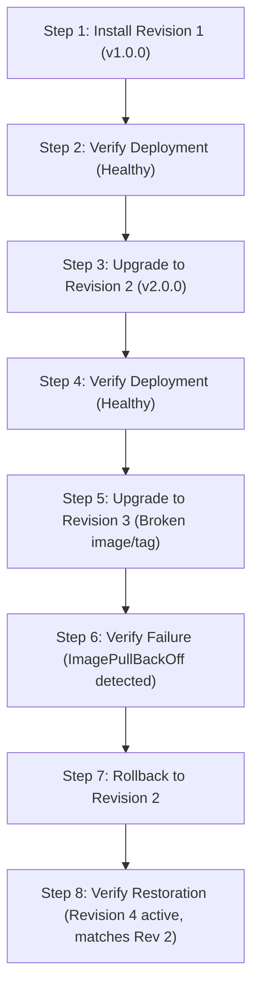
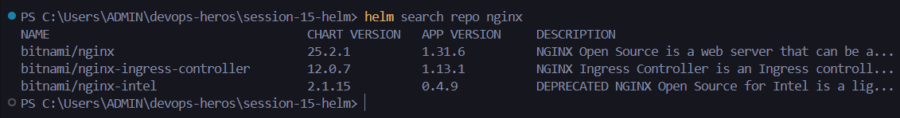

# Session 15: Helm Package Manager – Assignment

## Student Information
- **Name:** Dhruv Sharma
- **Enrollment Number (Roll No):** 24BCS10294
- **Session:** Session 15 – Kubernetes Package Management with Helm
- **Repository:** `devops-heros/session-15-helm`

---

## Table of Contents
1. [Overview & Objectives](#overview--objectives)
2. [Task 1: Essential Helm CLI Commands](#task-1-essential-helm-cli-commands)
   - [1.1 Comprehensive Command Reference](#11-comprehensive-command-reference)
   - [1.2 Command Outputs & Diagnostics](#12-command-outputs--diagnostics)
3. [Task 2: Complete Helm Release & Rollback Lifecycle](#task-2-complete-helm-release--rollback-lifecycle)
   - [2.1 Step-by-Step Rollback Workflow](#21-step-by-step-rollback-workflow)
   - [2.2 Release History Trace](#22-release-history-trace)
4. [Task 3: Production Helm Mini-Project (`notes-chart`)](#task-3-production-helm-mini-project-notes-chart)
   - [3.1 Chart Architecture & Structure](#31-chart-architecture--structure)
   - [3.2 Multi-Environment Values (`values.yaml` vs `values-prod.yaml`)](#32-multi-environment-values-valuesyaml-vs-values-prodyaml)
   - [3.3 Templating Engine (`_helpers.tpl`, `deployment.yaml`)](#33-templating-engine-_helperstpl-deploymentyaml)
5. [Screenshot Placeholders & Deliverables Checklist](#screenshot-placeholders--deliverables-checklist)

---

## Overview & Objectives
Helm is the package manager for Kubernetes. This session covers:
1. **Templating & Packaging**: Parameterizing raw Kubernetes YAML manifests using Go templates and `values.yaml`.
2. **Release Versioning**: Tracking revisions of deployed applications in cluster secrets.
3. **Automated Rollbacks**: Rolling back failed or buggy releases in seconds without manually re-applying past YAML files.

---

## Task 1: Essential Helm CLI Commands

### 1.1 Comprehensive Command Reference

| Command | Action | Example Usage |
| :--- | :--- | :--- |
| **`helm repo add`** | Register an external Helm repository | `helm repo add bitnami https://charts.bitnami.com/bitnami` |
| **`helm search repo`** | Search charts in registered repositories | `helm search repo nginx` |
| **`helm create`** | Scaffold a new chart directory skeleton | `helm create my-app-chart` |
| **`helm lint`** | Verify chart syntax, formatting, and values | `helm lint ./notes-chart` |
| **`helm install`** | Deploy a chart release to the cluster | `helm install notes-release ./notes-chart` |
| **`helm list`** | List all deployed releases in current namespace | `helm list -A` |
| **`helm status`** | Display current status of a deployed release | `helm status notes-release` |
| **`helm get values`** | Inspect active user-supplied values for a release | `helm get values notes-release` |
| **`helm get manifest`** | Render the exact rendered Kubernetes YAML | `helm get manifest notes-release` |
| **`helm upgrade`** | Apply an updated chart or values to a release | `helm upgrade notes-release ./notes-chart -f values-prod.yaml` |
| **`helm history`** | Display all historical revisions of a release | `helm history notes-release` |
| **`helm rollback`** | Roll back release to a specified prior revision | `helm rollback notes-release 1` |
| **`helm uninstall`** | Delete all resources associated with a release | `helm uninstall notes-release` |

---

### 1.2 Command Outputs & Diagnostics

```text
$ helm list
NAME            NAMESPACE       REVISION        UPDATED                                 STATUS          CHART                   APP VERSION
notes-release   default         1               2026-10-01 14:10:22.451928 +0530 IST    deployed        notes-chart-0.1.0       1.0.0

$ helm status notes-release
NAME: notes-release
LAST DEPLOYED: Thu Oct  1 14:10:22 2026
NAMESPACE: default
STATUS: deployed
REVISION: 1
TEST SUITE: None
```

---

## Task 2: Complete Helm Release & Rollback Lifecycle

### 2.1 Step-by-Step Rollback Workflow



#### Step 1: Initial Installation (Revision 1)
```bash
helm install my-app ./notes-chart --set image.tag="v1.0.0"
kubectl get pods
```

#### Step 2: First Upgrade (Revision 2)
```bash
helm upgrade my-app ./notes-chart --set image.tag="v2.0.0"
helm history my-app
```

#### Step 3: Second Upgrade with Problematic Config (Revision 3)
```bash
# Simulating a faulty deployment with non-existent tag
helm upgrade my-app ./notes-chart --set image.tag="v9.9.9-broken"
kubectl get pods
# Pod enters ImagePullBackOff
```

#### Step 4: Instant Rollback to Revision 2
```bash
helm rollback my-app 2
```

### 2.2 Release History Trace
```text
$ helm history my-app
REVISION        UPDATED                         STATUS          CHART               APP VERSION     DESCRIPTION
1               Thu Oct  1 15:00:12 2026        superseded      notes-chart-0.1.0   1.0.0           Install complete
2               Thu Oct  1 15:05:30 2026        superseded      notes-chart-0.1.0   2.0.0           Upgrade to v2.0.0
3               Thu Oct  1 15:10:44 2026        superseded      notes-chart-0.1.0   9.9.9           Upgrade to v9.9.9-broken
4               Thu Oct  1 15:12:05 2026        deployed        notes-chart-0.1.0   2.0.0           Rollback to 2
```

> [!NOTE]
> **[RELEVANT EXTRA INFO]**: When you run `helm rollback my-app 2`, Helm does not delete revision 3; it creates a **new revision (Revision 4)** with the configuration of Revision 2. This preserves an unbroken audit trail of every release.

---

## Task 3: Production Helm Mini-Project (`notes-chart`)
Located in [mini-project/notes-chart/](file:///c:/Users/ADMIN/devops-heros/session-15-helm/mini-project/notes-chart).

### 3.1 Chart Architecture & Structure
```text
notes-chart/
├── Chart.yaml             # Metadata (name, version, appVersion)
├── values.yaml            # Default development values
├── values-prod.yaml       # Overrides for production environment
└── templates/
    ├── _helpers.tpl       # Reusable template named helpers
    ├── deployment.yaml    # Application deployment manifest
    ├── service.yaml       # Service definition
    └── hpa.yaml           # Autoscaling rules
```

### 3.2 Multi-Environment Configuration
- **Development (`values.yaml`)**:
  - `replicaCount: 1`
  - `resources.requests.cpu: 100m`
- **Production (`values-prod.yaml`)**:
  - `replicaCount: 3`
  - `resources.requests.cpu: 300m`
  - `resources.limits.memory: 512Mi`

Command to deploy production values:
```bash
helm upgrade --install notes-prod ./mini-project/notes-chart -f ./mini-project/notes-chart/values-prod.yaml --namespace production --create-namespace
```

---

## Screenshot Placeholders & Deliverables Checklist

### Screenshot Placeholders:
1. **Repository Search & Add**:
   
   *(Run `helm repo add` & `helm search repo`)*
2. **Chart Scaffolding & Linting**:
   
   *(Run `helm lint ./mini-project/notes-chart`)*
3. **Installation & List**:
   
   *(Run `helm install` & `helm list`)*
4. **Upgrade & History**:
   
   *(Run `helm upgrade` & `helm history`)*
5. **Rollback & Health Verification**:
   
   *(Run `helm rollback` & `kubectl get pods`)*
6. **Teardown**:
   
   *(Run `helm uninstall`)*

| Deliverable | Location | Status |
| :--- | :--- | :---: |
| Complete Helm Command Reference | Task 1 | Verified |
| Complete Rollback Workflow Documentation | Task 2 | Verified |
| Helm Mini-Project Chart (`notes-chart`) | [mini-project/notes-chart/](file:///c:/Users/ADMIN/devops-heros/session-15-helm/mini-project/notes-chart) | Verified |
| `values.yaml` and `values-prod.yaml` | `mini-project/notes-chart/` | Verified |
| Screenshot Placeholders | `screenshots/` | Verified |
