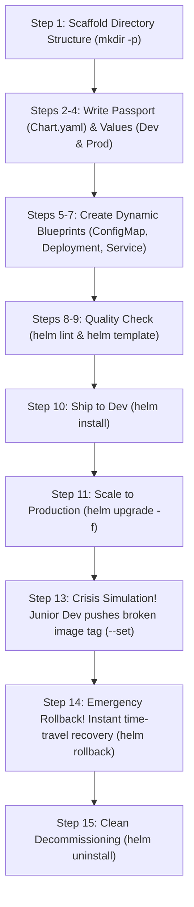

# Mini Project: Package and Deploy the Notes App with Helm (Comprehensive Explainer)

---

## The Story: Why Are We Doing This?

Imagine you are a DevOps engineer at a fast-growing tech startup. Your developers have built a web application called the **Notes App**.

### The Problem: The "YAML Sprawl" Nightmare
Without Helm, deploying this application across different environments (**Development**, **Staging**, and **Production**) means creating multiple static Kubernetes YAML files:
- `deployment-dev.yaml`, `deployment-prod.yaml`
- `service-dev.yaml`, `service-prod.yaml`
- `configmap-dev.yaml`, `configmap-prod.yaml`

If the development team changes a port or adds an environment variable, you have to manually find, edit, and sync all those files. A single typo in production could bring down the entire system.

### The Solution: Helm to the Rescue
**Helm** acts as a **package manager and template engine** for Kubernetes (just like `apt` for Ubuntu, `brew` for macOS, or `npm` for Node.js). 

Instead of hardcoded files, we create a single **Chart** (a dynamic blueprint). We leave placeholders (`{{ .Values... }}`) for things that change between environments—such as the number of replicas, image versions, and environment tags. Then, we simply supply different **Values files** (`values.yaml` for Dev, `values-prod.yaml` for Prod).

### The Journey We Will Take


---

## Jargon Buster: Kubernetes & Helm Terms in Plain English

Before running any commands, let's demystify every technical term you will encounter:

| Term | Plain English Analogy | Technical Definition |
| :--- | :--- | :--- |
| **Kubernetes (K8s)** | The orchestra conductor | An open-source system for automating deployment, scaling, and management of containerized applications. |
| **Pod** | A single musician in the orchestra | The smallest deployable computing unit in Kubernetes. Runs one or more tightly coupled containers sharing network and storage. |
| **Deployment** | The band manager | A controller that ensures a specified number of identical Pods are running, handles rolling updates, and automatically replaces dead Pods. |
| **Service** | The venue reception desk / phone number | A stable internal or external network endpoint (IP address and port) that distributes traffic across dynamic Pods. |
| **NodePort** | An external doorway with a reserved number | A Service type that exposes an open port on every worker node (between 30000-32767) so traffic outside the cluster can reach the app. |
| **ConfigMap** | A settings notebook | A Kubernetes configuration object used to store non-confidential key-value pairs outside the application container code. |
| **Helm** | The App Store / Package Manager | The official package manager for Kubernetes that packages, configures, and manages K8s applications. |
| **Chart** | The cooking recipe / blueprint | A collection of parameterized YAML templates and configuration metadata packaged together. |
| **Release** | The cooked meal served on a table | A specific, running instance of a Chart deployed inside a Kubernetes cluster. |
| **Revision** | The undo/redo history log | An incremental version number (1, 2, 3...) assigned to every install, upgrade, or rollback of a release. |
| **values.yaml** | The default ingredient list | The default values file providing variables to substitute into template placeholders. |
| **Go Templating** | Fill-in-the-blank placeholders | The double-curly-brace syntax (`{{ .Values.something }}`) evaluated by Helm to inject values into YAML manifests. |
| **Linting** | Grammar and spell check | Automated static analysis that inspects your Chart for structural errors, missing keys, and bad syntax. |
| **Rendering** | Printing the finished document | The process of evaluating templates and values to produce pure, cluster-ready Kubernetes YAML. |
| **ImagePullBackOff** | "Delivery truck couldn't find the item" | A Pod status meaning Kubernetes tried to pull a container image from a registry, failed (bad tag, private repo, or nonexistent image), and is waiting before trying again. |
| **Rollback** | Time-machine undo | Reverting a release back to a previous known-healthy revision. |

---

## Chart Architecture & File Structure

Here is the directory structure we will build:

```text
notes-chart/
  ├── Chart.yaml              # Chart metadata (name, version, description)
  ├── values.yaml             # Default values (Development settings)
  ├── values-prod.yaml        # Override values for Production
  └── templates/              # Dynamic Kubernetes manifest templates
      ├── configmap.yaml      # Dynamic ConfigMap template
      ├── deployment.yaml     # Dynamic Deployment template
      └── service.yaml        # Dynamic Service (NodePort) template
```

---

## Step 1: Create the Chart Directory Structure

### The Story
We need a clean workspace for our Chart. Helm requires all Kubernetes manifest templates to live inside a folder named `templates/` inside the root chart directory.

### The Command
```bash
mkdir -p notes-chart/templates
```

### Deep Dive: Command & Flags
- `mkdir`: Stands for **"make directory"**. It creates one or more new folders on your file system.
- `-p` (or `--parents`): **Crucial flag!** Tells `mkdir` to:
  1. Create parent directories if they do not already exist. Here, `notes-chart` does not exist yet. Without `-p`, running `mkdir notes-chart/templates` fails with an error: `No such file or directory` because the parent folder is missing. With `-p`, it creates `notes-chart` first, and then creates `templates` inside it.
  2. Do not throw an error if the directory already exists (idempotent behavior).

---

## Step 2: Define Chart Metadata (`Chart.yaml`)

### The Story
Every Helm chart requires a `Chart.yaml` file at its root. Think of this as the chart's passport or `package.json` file. It tells Helm the name of the chart, what version this package is, and what version of the app it deploys.

### Create File: `notes-chart/Chart.yaml`
```yaml
apiVersion: v2
name: notes-chart
description: A simple Notes application Helm chart
type: application
version: 0.1.0
appVersion: "1.0"
```

### Deep Dive: YAML Line by Line
- `apiVersion: v2`: Specifies the Helm chart API version. `v2` is standard for **Helm 3**. (Helm 2 used `v1`).
- `name: notes-chart`: The unique identifier for this chart package.
- `description`: A brief, human-friendly summary of what the chart does.
- `type: application`: Distinguishes this deployable chart (`application`) from reusable library charts (`library`) that only provide helper templates.
- `version: 0.1.0`: The semantic version (**SemVer**) of the **Helm Chart itself** (the recipe). If you modify your templates or values, you bump this version.
- `appVersion: "1.0"`: The version of the **underlying application** running inside the container (e.g., your web app code). 
  > **Note the difference:** `version` tracks changes to the Kubernetes deployment logic; `appVersion` tracks the code release.

---

## Step 3: Define Default Values for Development (`values.yaml`)

### The Story
In a software team, developers need a lean setup that doesn't consume excessive cloud resources. In `values.yaml`, we define safe, minimal defaults: 1 replica, Nginx 1.24, and development branding.

### Create File: `notes-chart/values.yaml`
```yaml
replicaCount: 1

image:
  repository: nginx
  tag: "1.24"

service:
  port: 80
  nodePort: 30090

app:
  name: notes-app
  environment: development
```

### Deep Dive: Configuration Keys
- `replicaCount: 1`: For development, running a single Pod saves CPU and memory.
- `image.repository: nginx` & `image.tag: "1.24"`: Specifies which container image to pull from Docker Hub.
- `service.port: 80`: The port on which the service will listen inside the cluster.
- `service.nodePort: 30090`: A fixed port on the host node so we can access our app directly via `http://<NodeIP>:30090`.
- `app.name` & `app.environment`: Custom metadata values that our application code or ConfigMap can read.

---

## Step 4: Define Production Overrides (`values-prod.yaml`)

### The Story
Production is high-stakes. If one pod crashes, users shouldn't experience downtime. We need high availability (3 replicas), a newer image version (Nginx 1.25), and production configuration. Instead of editing `values.yaml`, we create a separate override file.

### Create File: `notes-chart/values-prod.yaml`
```yaml
replicaCount: 3

image:
  repository: nginx
  tag: "1.25"

service:
  port: 80
  nodePort: 30090

app:
  name: notes-app
  environment: production
```

### Deep Dive: How Helm Values Merging Works
When you pass `-f notes-chart/values-prod.yaml`, Helm performs a **deep merge**:
- Any key defined in `values-prod.yaml` overwrites the corresponding key in `values.yaml`.
- Any key present in `values.yaml` but omitted from `values-prod.yaml` retains its default value.

---

## Step 5: Create the ConfigMap Template (`templates/configmap.yaml`)

### The Story
Applications should not hardcode their environment settings. We create a Kubernetes ConfigMap that injects environment variables dynamically into our application.

### Create File: `notes-chart/templates/configmap.yaml`
```yaml
apiVersion: v1
kind: ConfigMap
metadata:
  name: {{ .Release.Name }}-config
data:
  APP_NAME: {{ .Values.app.name | quote }}
  ENVIRONMENT: {{ .Values.app.environment | quote }}
```

### Deep Dive: Go Template Syntax
- `{{ .Release.Name }}-config`: 
  - `.Release.Name` is a built-in Helm variable representing the name you give when installing (e.g., `notes-dev`).
  - Result: If the release is named `notes-dev`, the ConfigMap will be named `notes-dev-config`. This prevents naming collisions if you install multiple releases into the same namespace!
- `{{ .Values.app.name | quote }}`:
  - `.Values.app.name` navigates our `values.yaml` hierarchy (`app -> name`).
  - `| quote`: A **template filter / pipeline**. It takes whatever string comes out and wraps it in quotation marks (`"notes-app"`). This prevents YAML errors if the value contains special characters or numbers.

---

## Step 6: Create the Deployment Template (`templates/deployment.yaml`)

### The Story
The Deployment is the core engine of our application. It tells Kubernetes which Docker container to run, how many copies (replicas) to keep alive, and binds our ConfigMap to the container environment.

### Create File: `notes-chart/templates/deployment.yaml`
```yaml
apiVersion: apps/v1
kind: Deployment
metadata:
  name: {{ .Release.Name }}-deploy
  labels:
    app: {{ .Release.Name }}
    environment: {{ .Values.app.environment }}
spec:
  replicas: {{ .Values.replicaCount }}
  selector:
    matchLabels:
      app: {{ .Release.Name }}
  template:
    metadata:
      labels:
        app: {{ .Release.Name }}
    spec:
      containers:
        - name: notes
          image: "{{ .Values.image.repository }}:{{ .Values.image.tag }}"
          ports:
            - containerPort: {{ .Values.service.port }}
          envFrom:
            - configMapRef:
                name: {{ .Release.Name }}-config
```

### Deep Dive: Key Template Connections
- `spec.replicas: {{ .Values.replicaCount }}`: Automatically scales between 1 (Dev) and 3 (Prod).
- `selector.matchLabels` and `template.metadata.labels`: Must match exactly. The Deployment controller monitors any Pod carrying the label `app: {{ .Release.Name }}`.
- `image: "{{ .Values.image.repository }}:{{ .Values.image.tag }}"`: Combines repository and tag into a standard container reference (e.g., `nginx:1.24`).
- `envFrom.configMapRef.name: {{ .Release.Name }}-config`: Injects all keys (`APP_NAME`, `ENVIRONMENT`) from the ConfigMap directly into the container as environment variables.

---

## Step 7: Create the Service Template (`templates/service.yaml`)

### The Story
Pods in Kubernetes are ephemeral—they get deleted and replaced with new dynamic IP addresses. A **Service** provides a permanent IP and port that routes incoming traffic to whichever Pods are alive and healthy.

### Create File: `notes-chart/templates/service.yaml`
```yaml
apiVersion: v1
kind: Service
metadata:
  name: {{ .Release.Name }}-svc
spec:
  type: NodePort
  selector:
    app: {{ .Release.Name }}
  ports:
    - port: {{ .Values.service.port }}
      targetPort: {{ .Values.service.port }}
      nodePort: {{ .Values.service.nodePort }}
```

### Deep Dive: Port Mapping Demystified
- `type: NodePort`: Exposes the service on each node's IP at a static port (`nodePort`).
- `selector.app: {{ .Release.Name }}`: Tells the Service which Pods to forward traffic to.
- `port`: The internal port inside the cluster (`80`).
- `targetPort`: The port on the container itself where Nginx is listening (`80`).
- `nodePort`: The external port accessible from outside the cluster (`30090`).

---

## Step 8: Validate the Chart (`helm lint`)

### The Story
Before applying changes to a live Kubernetes cluster, always run a sanity check. `helm lint` acts as your compiler/linter, checking for YAML syntax errors, missing mandatory fields, and broken references.

### The Command
```bash
helm lint notes-chart
```

### Deep Dive: Command & Flags
- `helm lint`: Command to run static analysis on a chart directory.
- `notes-chart`: The relative path to the chart folder to inspect.

### Expected Output
```text
==> Linting notes-chart
1 chart(s) linted, 0 chart(s) failed
```
> If you see errors, Helm will pinpoint the exact line number and YAML indentation mistake.

---

## Step 9: Render and Preview Templates Locally (`helm template`)

### The Story
What will the final Kubernetes YAML look like once all `{{ .Values }}` placeholders are replaced? Rather than guessing or pushing blindly to the cluster, `helm template` generates the exact YAML output in your terminal. **No Kubernetes cluster connection is required for this step!**

### The Command
```bash
helm template notes-dev notes-chart
```

### Deep Dive: Command & Arguments
- `helm template`: Renders chart templates locally and prints the evaluated manifests to standard output.
- `notes-dev`: A simulated release name. This replaces all instances of `{{ .Release.Name }}`.
- `notes-chart`: The path to our chart directory.

### What to Check in the Output
Scroll through the generated YAML. Ensure:
- `name: notes-dev-deploy`
- `replicas: 1`
- `image: "nginx:1.24"`
- No unprocessed `{{ ... }}` tags remain.

---

## Step 10: Install the Chart in Development (`helm install`)

### The Story
Our chart is verified and clean. Now we ship it! We deploy our first live release named `notes-dev` to the Kubernetes cluster using our default development values.

### The Command
```bash
helm install notes-dev notes-chart
```

### Deep Dive: Command & Arguments
- `helm install`: Packages and deploys a Helm chart to the Kubernetes cluster.
- `notes-dev`: The **Release Name** you assign to this installation. You can deploy the same chart multiple times under different release names (e.g., `notes-dev`, `notes-qa`).
- `notes-chart`: The path to the chart directory.

### Expected Output
```text
NAME: notes-dev
LAST DEPLOYED: Tue Sep 22 13:15:00 2026
NAMESPACE: default
STATUS: deployed
REVISION: 1
TEST SUITE: None
```

### Verification Commands
Verify that Kubernetes has scheduled and started the objects:

```bash
kubectl get pods
kubectl get services
kubectl get configmaps
```

- `kubectl get pods`: Lists all running pods. You should see 1 pod in `Running` state:
  ```text
  NAME                            READY   STATUS    RESTARTS   AGE
  notes-dev-deploy-xxxx           1/1     Running   0          30s
  ```
- `kubectl get services`: You should see `notes-dev-svc` mapping port `80:30090/TCP`.
- `kubectl get configmaps`: You should see `notes-dev-config` with 2 keys.

---

## Step 11: Upgrade to Production Values (`helm upgrade -f`)

### The Story
The development testing was a success! Now management wants this running in production mode: 3 replicas for high availability and updated Nginx 1.25. We execute an in-place zero-downtime rolling upgrade.

### The Command
```bash
helm upgrade notes-dev notes-chart -f notes-chart/values-prod.yaml
```

### Deep Dive: Command & Flags
- `helm upgrade`: Upgrades an existing release in the cluster to a new configuration or new chart version.
- `notes-dev`: The target release name to update.
- `notes-chart`: The chart path.
- `-f` (or `--values`): **Specifies an external values YAML file**. Here, it injects `values-prod.yaml`, overriding `replicaCount: 3`, `image.tag: "1.25"`, and `environment: production`.

### Expected Output
```text
Release "notes-dev" has been upgraded. Happy Helming!
NAME: notes-dev
LAST DEPLOYED: Tue Sep 22 13:17:12 2026
NAMESPACE: default
STATUS: deployed
REVISION: 2
TEST SUITE: None
```

### Verify Production Scaling
Check that Kubernetes has automatically scaled out to 3 healthy pods:
```bash
kubectl get pods
```

Expected output:
```text
NAME                            READY   STATUS    RESTARTS   AGE
notes-dev-deploy-aaaa           1/1     Running   0          45s
notes-dev-deploy-bbbb           1/1     Running   0          10s
notes-dev-deploy-cccc           1/1     Running   0          10s
```

---

## Step 12: Inspect Release Revision History (`helm history`)

### The Story
Helm acts as an audit trail. Every time you install, upgrade, or rollback, Helm increments the **Revision** number and saves the state as a secret inside Kubernetes. Let's inspect our deployment history.

### The Command
```bash
helm history notes-dev
```

### Deep Dive: Output Breakdown
```text
REVISION   UPDATED                  STATUS      CHART              APP VERSION   DESCRIPTION
1          Tue Sep 22 13:15:00 2026  superseded  notes-chart-0.1.0  1.0           Install complete
2          Tue Sep 22 13:17:12 2026  deployed    notes-chart-0.1.0  1.0           Upgrade complete
```
- `REVISION 1`: Marked as `superseded` (replaced by a newer version).
- `REVISION 2`: Marked as `deployed` (the currently running configuration).

---

## Step 13: Simulate a Production Disaster (`--set` with a Bad Image)

### The Story
Disaster strikes! A junior developer runs an upgrade and specifies an image tag that does not exist in Docker Hub (`broken-tag-does-not-exist`). We will simulate this mistake and observe how Kubernetes and Helm react.

### The Command
```bash
helm upgrade notes-dev notes-chart --set image.tag=broken-tag-does-not-exist
```

### Deep Dive: Command & Flags
- `--set`: **Sets or overrides individual values on the command line** without editing any file. Syntax: `key=value`. Multiple values can be separated by commas (e.g. `--set foo=bar,baz=qux`).
- `image.tag=broken-tag-does-not-exist`: Temporarily overrides the image tag to a bogus version.

### Inspect the Broken Pods
```bash
kubectl get pods
```

Expected output:
```text
NAME                            READY   STATUS             RESTARTS   AGE
notes-dev-deploy-xxxx           0/1     ImagePullBackOff   0          25s
```

### Jargon Explanation: What is `ImagePullBackOff`?
Kubernetes worker nodes contacted the container registry to download `nginx:broken-tag-does-not-exist`. The registry returned a 404 (Not Found). Kubernetes failed to start the container and went into a **BackOff** state (waiting exponentially longer before retrying). The application is partially or fully degraded!

---

## Step 14: Recover Instantly with Rollback (`helm rollback`)

### The Story
Pagers are going off! Instead of troubleshooting code under pressure or manually writing YAML hotfixes, Helm gives us an instant time machine. We roll back to **Revision 2**, which was our stable production release.

### The Command
```bash
helm rollback notes-dev 2
```

### Deep Dive: Command & Arguments
- `helm rollback`: Reverts the target release back to a previous revision.
- `notes-dev`: The name of the release to roll back.
- `2`: The revision number to restore (obtained from `helm history`).
  > **Note:** If you do not specify a revision number, Helm defaults to rolling back to the immediately preceding revision (`N - 1`).

### Expected Output
```text
Rollback was a success! Happy Helming!
```

### Verify Application Health Restored
```bash
kubectl get pods
```

Expected output:
```text
NAME                            READY   STATUS    RESTARTS   AGE
notes-dev-deploy-aaaa           1/1     Running   0          5m
notes-dev-deploy-bbbb           1/1     Running   0          5m
notes-dev-deploy-cccc           1/1     Running   0          5m
```
All 3 production pods are back in `Running` state! Crisis averted in seconds.

### Inspect History After Rollback
```bash
helm history notes-dev
```
You will notice **Revision 4** is now created and deployed with the description `Rollback to 2`. Helm never deletes history; it appends a new revision with the restored state!

---

## Step 15: Clean Up All Resources (`helm uninstall`)

### The Story
The project demo is complete. In raw Kubernetes, deleting a multi-component application requires remembering every individual file: `kubectl delete -f ...`. With Helm, deleting the release cleanly removes the Deployment, Service, ConfigMap, and Pods in one single command.

### The Command
```bash
helm uninstall notes-dev
```

### Deep Dive: Command & Arguments
- `helm uninstall` (previously `helm delete` in Helm 2): Completely uninstalls the release and removes all associated Kubernetes resources.
- `notes-dev`: The release to destroy.

### Confirm Everything is Gone
```bash
kubectl get pods
kubectl get services
kubectl get configmaps
```
No orphan pods, services, or configmaps remain. The cluster is completely clean.

---

## Summary: What You Learned & Practiced

```text
[PASS] Created a structured Helm chart from scratch (mkdir -p, Chart.yaml)
[PASS] Separated environment configurations (values.yaml vs values-prod.yaml)
[PASS] Wrote parameterized Go templates for ConfigMap, Deployment, and Service
[PASS] Linted charts for errors before deployment (helm lint)
[PASS] Rendered templates locally without touching the cluster (helm template)
[PASS] Deployed release to development (helm install)
[PASS] Executed zero-downtime production upgrade with value overrides (helm upgrade -f)
[PASS] Tracked deployment auditing and revisions (helm history)
[PASS] Overrode values on the fly and simulated failure (helm upgrade --set)
[PASS] Recovered application health via one-command rollback (helm rollback)
[PASS] Cleaned up all resources atomically (helm uninstall)
```

---

## Command Quick-Reference Cheatsheet

| Task | Command | What the Flags / Arguments Mean |
| :--- | :--- | :--- |
| **Make chart folders** | `mkdir -p notes-chart/templates` | `-p`: Make parent folder if missing, avoid errors if existing |
| **Lint chart** | `helm lint notes-chart` | Validates syntax and structure of `notes-chart` |
| **Preview rendered YAML** | `helm template notes-dev notes-chart` | Renders templates locally using release name `notes-dev` |
| **Install chart** | `helm install notes-dev notes-chart` | Deploys release `notes-dev` to Kubernetes cluster |
| **Upgrade with file** | `helm upgrade notes-dev notes-chart -f values-prod.yaml` | `-f`: Merges & overrides values from `values-prod.yaml` |
| **Upgrade with inline value** | `helm upgrade notes-dev notes-chart --set key=value` | `--set`: Overrides a specific parameter on the fly |
| **Check revisions** | `helm history notes-dev` | Displays revision history and deployment status |
| **Rollback release** | `helm rollback notes-dev 2` | Reverts `notes-dev` to the exact state of Revision 2 |
| **Uninstall release** | `helm uninstall notes-dev` | Atomically deletes all resources belonging to `notes-dev` |

---

## Official References
* **Helm Documentation:** https://helm.sh/docs/
* **Helm Chart Template Guide:** https://helm.sh/docs/chart_template_guide/
* **Helm Best Practices:** https://helm.sh/docs/chart_best_practices/
* **Helm CLI Reference:** https://helm.sh/docs/helm/
