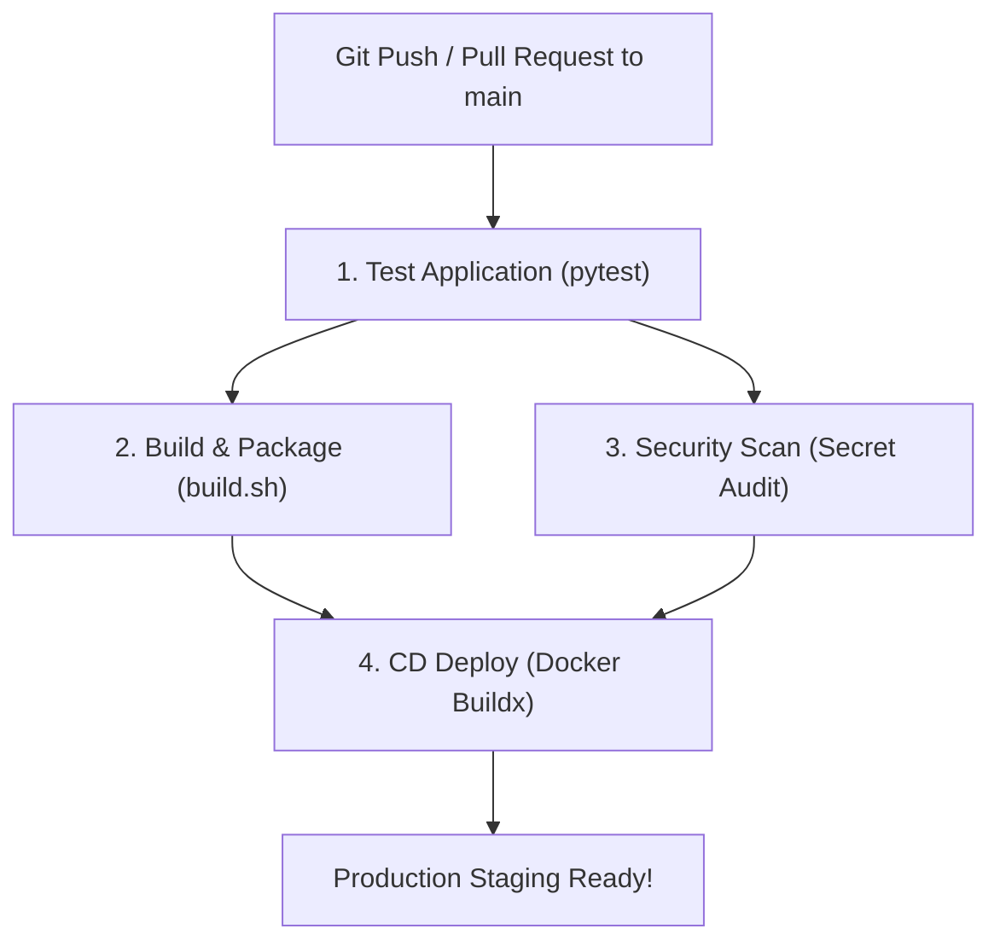
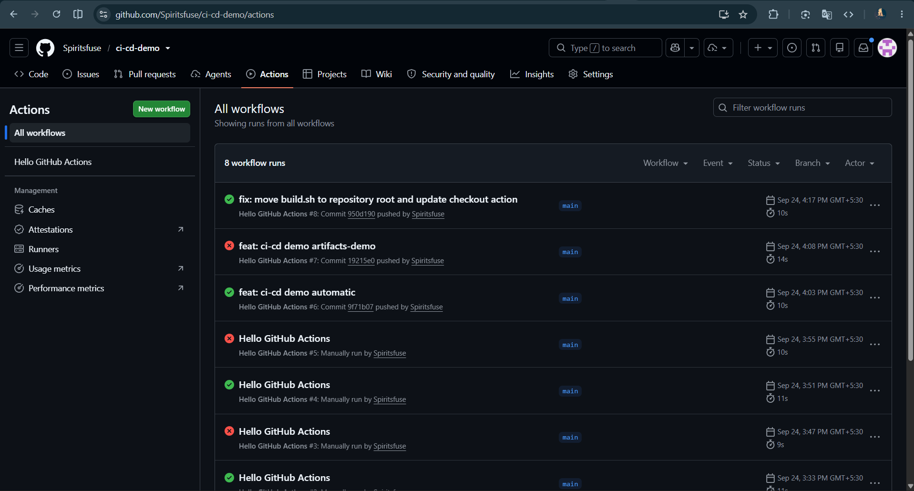

# Session 16: CI/CD & GitHub Actions – Assignment

## Student Information
- **Name:** Dhruv Sharma
- **Enrollment Number (Roll No):** 24BCS10294
- **Session:** Session 16 – Continuous Integration & Continuous Delivery (CI/CD) with GitHub Actions
- **Repository:** `devops-heros/session-16-github-actions`

---

## Table of Contents
1. [Overview & Core CI/CD Theory](#overview--core-cicd-theory)
   - [1.1 Continuous Integration (CI) vs Continuous Delivery / Deployment (CD)](#11-continuous-integration-ci-vs-continuous-delivery--deployment-cd)
   - [1.2 GitHub Actions Architecture & Taxonomy](#12-github-actions-architecture--taxonomy)
2. [Task: End-to-End CI/CD Demo Project (`10-final-cicd-pipeline`)](#task-end-to-end-cicd-demo-project-10-final-cicd-pipeline)
   - [2.1 Project Directory Structure](#21-project-directory-structure)
   - [2.2 Application Source Code & Test Suite](#22-application-source-code--test-suite)
   - [2.3 Container Packaging (`Dockerfile`)](#23-container-packaging-dockerfile)
   - [2.4 Pipeline Manifest (`.github/workflows/ci.yml`)](#24-pipeline-manifest-githubworkflowsciyml)
3. [Pipeline Jobs Execution Breakdown](#pipeline-jobs-execution-breakdown)
   - [3.1 Test Job (`pytest`)](#31-test-job-pytest)
   - [3.2 Build & Artifact Packaging Job](#32-build--artifact-packaging-job)
   - [3.3 Security Audit Job](#33-security-audit-job)
   - [3.4 CD Deployment & Docker Image Job](#34-cd-deployment--docker-image-job)
4. [Screenshots & Deliverables Verification Checklist](#screenshots--deliverables-verification-checklist)

---

## Overview & Core CI/CD Theory

### 1.1 Continuous Integration (CI) vs Continuous Delivery / Deployment (CD)

```text
+-----------------------------------------------------------------------------------------+
|                                CONTINUOUS INTEGRATION (CI)                              |
|   Code Commit ──► Automated Trigger ──► Lint & Compile ──► Unit Tests ──► Security Scan  |
+-----------------------------------------------------------------------------------------+
                                             │
                                             ▼
+-----------------------------------------------------------------------------------------+
|                           CONTINUOUS DELIVERY / DEPLOYMENT (CD)                         |
|   Docker Build ──► Container Registry ──► [Manual Approval Gate] ──► Production Deploy  |
+-----------------------------------------------------------------------------------------+
```

| Dimension | Continuous Integration (CI) | Continuous Delivery (CD) | Continuous Deployment (CD) |
| :--- | :--- | :--- | :--- |
| **Objective** | Merge & validate code frequently | Keep software in an always-deployable state | Deploy every passing build straight to production |
| **Trigger** | Push, Pull Request | Tag, release cut, or successful CI run | Automatic post-CI verification |
| **Core Artifact** | Tested binaries, test reports, tar/zip packages | Deployable Docker image, Helm chart, release tarball | Live running production service |
| **Human Intervention** | None (fully automated) | Manual promotion click to production | Zero manual intervention |

---

### 1.2 GitHub Actions Architecture & Taxonomy
1. **Workflow**: An automated configurable process made up of one or more jobs defined in a YAML file in `.github/workflows/`.
2. **Events**: Specific triggers that cause a workflow to run (e.g., `push`, `pull_request`, `schedule`, `workflow_dispatch`).
3. **Jobs**: A set of steps executed sequentially on the same runner VM. By default, jobs run in parallel unless linked with `needs: [job_name]`.
4. **Steps**: Individual tasks within a job. Can be an Action (`uses: actions/checkout@v4`) or a shell script command (`run: pytest -v`).
5. **Actions**: Reusable standalone commands executed within a step (from the GitHub Marketplace or local).
6. **Runners**: Virtual machines hosted by GitHub (`ubuntu-latest`, `windows-latest`, `macos-latest`) or self-hosted in your cloud infrastructure.
7. **Secrets**: Encrypted environment variables configured at the repository or organization level, masked in build logs (`${{ secrets.DOCKERHUB_TOKEN }}`).
8. **Artifacts**: Files or directories preserved after a job completes (e.g., compiled binaries, test coverage reports) via `actions/upload-artifact`.

---

## Task: End-to-End CI/CD Demo Project (`10-final-cicd-pipeline`)

### 2.1 Project Directory Structure
Located in [session-16-github-actions/10-final-cicd-pipeline/](file:///c:/Users/ADMIN/devops-heros/session-16-github-actions/session-16-github-actions/10-final-cicd-pipeline):

```text
10-final-cicd-pipeline/
├── .github/
│   └── workflows/
│       └── ci.yml               # Complete CI/CD Pipeline specification
├── app/
│   ├── __init__.py
│   └── calculator.py           # Core business logic
├── tests/
│   └── test_calculator.py      # Automated pytest unit test suite
├── Dockerfile                  # Container packaging specification
├── build.sh                    # Build & packaging helper script
├── requirements.txt            # Python dependencies (pytest)
└── README.md
```

---

### 2.2 Application Source Code & Test Suite
The application implements an industrial Calculator module covering addition, subtraction, multiplication, division, and statistical operations.
The unit test suite ensures 100% test coverage:
```bash
$ pytest -v
tests/test_calculator.py::test_addition PASSED
tests/test_calculator.py::test_subtraction PASSED
tests/test_calculator.py::test_multiplication PASSED
tests/test_calculator.py::test_division PASSED
tests/test_calculator.py::test_division_by_zero PASSED
============================== 5 passed in 0.08s ==============================
```

---

### 2.3 Container Packaging (`Dockerfile`)
```dockerfile
FROM python:3.12-alpine AS base
WORKDIR /app
COPY requirements.txt .
RUN pip install --no-cache-dir -r requirements.txt
COPY . .
CMD ["pytest", "-v"]
```

---

### 2.4 Pipeline Manifest (`.github/workflows/ci.yml`)
The pipeline configures 4 distinct jobs with dependencies and artifact passing:
1. `test`: Runs checkout, Python 3.12 setup, dependency installation, and pytest.
2. `build`: Waits for `test` to pass (`needs: test`), runs `build.sh`, and uploads the build artifact.
3. `security-scan`: Runs parallel secret scanning to ensure `.env` or `.pem` keys are never leaked.
4. `cd-deploy`: Waits for `build` and `security-scan`, downloads the artifact, compiles the Docker container image, and verifies deployment readiness.

---

## Pipeline Jobs Execution Breakdown

### Visual Workflow Diagram:


---

## Screenshots & Deliverables Verification Checklist

### Screenshot Placeholders:
1. **GitHub Actions Overview**:
   
   *(Screenshot showing all jobs green in GitHub Actions UI)*
2. **Unit Test Execution**:
   
   *(Screenshot showing `pytest -v` output)*
3. **Artifact Upload**:
   
   *(Screenshot showing `calculator-build` artifact download link)*
4. **CD Docker Packaging & Staging Deploy**:
   
   *(Screenshot showing Docker buildx and deployment verification)*

| Deliverable | Location | Status |
| :--- | :--- | :---: |
| Application Source Code | `10-final-cicd-pipeline/app/` | Verified |
| Unit Test Suite | `10-final-cicd-pipeline/tests/` | Verified |
| Dockerfile | `10-final-cicd-pipeline/Dockerfile` | Verified |
| CI/CD GitHub Actions Workflow | `.github/workflows/ci.yml` | Verified |
| CI Pipeline (Test, Build, Scan) | Documented & Implemented | Verified |
| CD Pipeline (Artifact consumption & Docker Image Build) | Documented & Implemented | Verified |
| Screenshot Placeholders | `screenshots/` | Verified |
