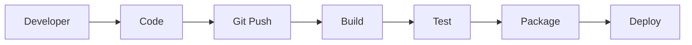
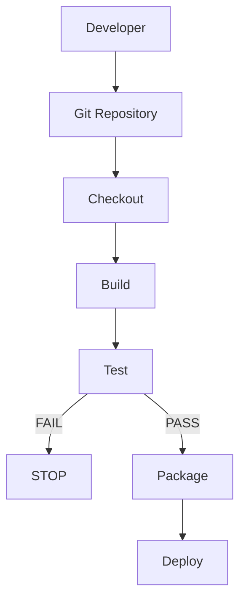
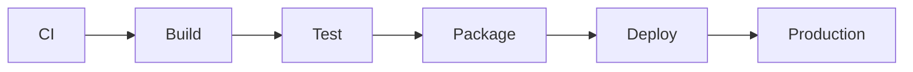

# 02 - CI/CD Pipeline

## 1. What is a Pipeline?

A pipeline is a sequence of automated steps.

### Example:



---

## 2. Typical CI/CD Pipeline



---

## 3. Pipeline Stages

### Stage 1: Checkout
Get source code from Git.

```bash
git checkout
```

In GitHub Actions:
```yaml
uses: actions/checkout@v6
```

#### 💡 Command Breakdown (cmd-explained):
- `git checkout`: In Git, switches branches or restores working tree files.
- `uses: actions/checkout@v4` (or `@v6`): The standard GitHub action that downloads (clones) your repository's code onto the runner's workspace so subsequent steps can access files.

---

### Stage 2: Build
Convert source code into a buildable application.

```bash
./build.sh
```

#### 💡 Command Breakdown (cmd-explained):
- `./build.sh`: Executes a custom shell script in the local directory that compiles code, bundles modules, or packages binary assets.

---

### Stage 3: Test
Run automated tests.

```bash
pytest
```

#### 💡 Command Breakdown (cmd-explained):
- `pytest`: Python test runner framework that auto-discovers files named `test_*.py` or `*_test.py`, runs test functions, and returns exit code 0 on pass or non-zero on failure.

---

### Stage 4: Package
Create a deployable package.

```text
build/
├── calculator.py
└── build-info.txt
```

---

### Stage 5: Deploy
Send the application to an environment.



---

## 4. Why Do We Need CI/CD?

### Without automation:
**Developer** → **Manual Build** → **Manual Test** → **Manual Package** → **Manual Deployment**

### With CI/CD:
**Developer** → **git push** → **Automation** → **Build** → **Test** → **Package** → **Deploy**

---

### 💡 Key Takeaway
A CI/CD pipeline automates the journey:
> **Code** → **Build** → **Test** → **Package** → **Deploy**

---

### 📚 Tech Jargons Demystified:
- **Pipeline Stage:** A major milestone in the pipeline (e.g. Build, Test, Security, Deploy). Stages often depend sequentially on previous stages succeeding.
- **Fail-Fast:** A DevOps principle where if an early step (like Lint or Unit Test) fails, the entire pipeline immediately terminates to save computing resources and alert the developer instantly.
- **Packaging:** Bundling raw application source files, dependencies, and metadata into a standardized distribution artifact (such as a `.tar.gz`, `.whl`, or Docker container image).
- **Automated Gatekeeper:** The pipeline itself acts as a gatekeeper protecting production, ensuring unreviewed, untested, or broken code can never be shipped.

