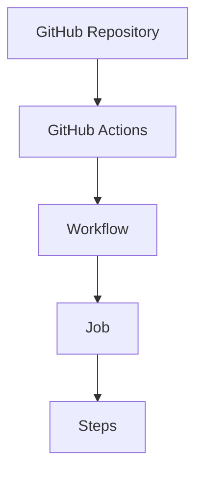

# 03 - GitHub Actions

## 1. What is GitHub Actions?

GitHub Actions is an automation platform built into GitHub.

It can automatically:
* Build code
* Test code
* Run scripts
* Create packages
* Upload artifacts
* Deploy applications

---

## 2. Workflow File

Our workflow is located at:

```text
.github/workflows/hello-actions.yml
```

---

## 3. Workflow Code

```yaml
name: Hello GitHub Actions
on:
  workflow_dispatch:
jobs:
  hello:
    runs-on: ubuntu-latest
    steps:
      - name: Print message
        run: echo "Hello from GitHub Actions!"
      - name: Show date
        run: date
      - name: Show operating system
        run: uname -a
```

#### 💡 Command Breakdown (cmd-explained):
- `echo "Hello from GitHub Actions!"`: Standard shell command printing a string message to the runner terminal logs.
- `date`: Prints the current UTC timestamp of the runner environment.
- `uname -a`: Prints all Linux system information (`-a` for all), including kernel version, runner hostname, architecture (`x86_64`), and operating system release.
- `workflow_dispatch`: GitHub Actions trigger allowing manual execution with a button from the GitHub Web UI or via `gh workflow run`.

---

## 4. Run the Workflow

Push the repository to GitHub.

1. Open **GitHub Repository**
2. Go to **Actions**
3. Select **Hello GitHub Actions**
4. Click **Run workflow**

---

## 5. Expected Output

* **The Print message step:**
  ```text
  Hello from GitHub Actions!
  ```

* **The date step:**
  ```text
  Wed Sep 23 ...
  ```
  *(The exact date and time will be different.)*

* **The OS step:** Displays Linux runner information.

---

## 6. Important Concepts



---

### 💡 Key Takeaway
> GitHub Actions allows us to automate tasks directly from GitHub.

---

### 📚 Tech Jargons Demystified:
- **`workflow_dispatch`:** A manual trigger event that lets users kick off a pipeline directly from GitHub's UI without needing a git push or pull request.
- **`runs-on:`:** The runner specification keyword that selects which operating system pool (e.g. `ubuntu-latest`, `windows-latest`, `macos-latest`) GitHub allocates to run the job.
- **`steps:`:** An ordered list of sequential tasks inside a job. Steps share the same workspace filesystem on that runner.
- **Pre-installed Tooling:** GitHub runners come pre-baked with hundreds of developer tools (Docker, Python, Git, Node, AWS/Azure CLIs, build-essentials) ready out of the box.

