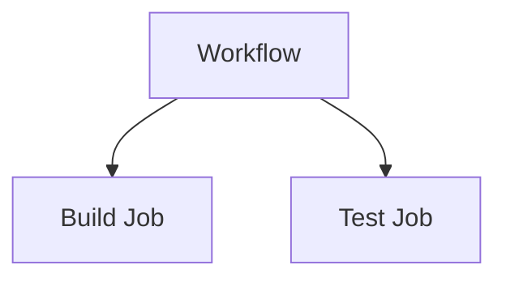
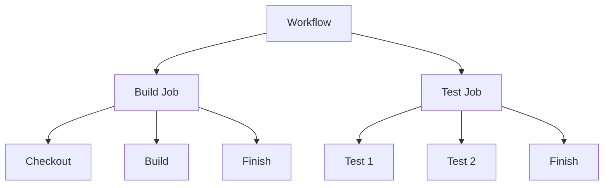
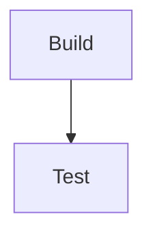

# 05 - Jobs and Steps

## 1. Jobs

A workflow can contain multiple jobs.

**Example:**
```yaml
jobs:
  build:
    ...
  test:
    ...
```

Our workflow has:



---

## 2. Steps

Each job contains multiple steps.

**Example:**
```yaml
steps:
  - name: Build
    run: echo "Building..."
  - name: Test
    run: echo "Testing..."
```

---

## 3. Job vs Step

| **Job** | **Step** |
|:---|:---|
| Larger unit | Smaller unit |
| Contains steps | Executes one task |
| Has its own runner | Runs inside job |
| Can depend on another job | Executes in order |

---

## 4. Our Pipeline



---

## 5. Expected Output

**Build:**
```text
Building application...
Build successful!
```

**Test:**
```text
Running test 1
Running test 2
All tests passed!
```

---

## 6. Important Point

Steps inside one job execute **sequentially**.

Jobs can run independently (in parallel) by default unless dependencies are defined.

To make one job wait for another:
```yaml
needs: build
```

**Example:**
```yaml
test:
  needs: build
```

#### 💡 Command Breakdown (cmd-explained):
- `needs: build`: Establishes a strict dependency DAG (Directed Acyclic Graph) between jobs. The `test` job will be held in waiting until the `build` job completes with status `success`. If `build` fails, `test` is automatically skipped.
- `run: echo "..."`: Executes shell commands directly inside the runner operating system shell (bash by default on Ubuntu/macOS, PowerShell on Windows).

**Then:**


---

### 💡 Key Takeaway

> **Workflow** → **Jobs** → **Steps**

---

### 📚 Tech Jargons Demystified:
- **`needs:` Dependency:** Keyword defining explicit prerequisites between jobs. Multiple dependencies can be provided as a list (e.g. `needs: [lint, test]`).
- **Parallel vs Sequential Execution:** By default, independent jobs in GitHub Actions run concurrently on separate runner machines to minimize overall pipeline completion time. Steps inside a single job always run sequentially.
- **DAG (Directed Acyclic Graph):** The internal execution tree generated by GitHub Actions based on `needs:` keywords, determining the exact order in which jobs execute.
- **Runner Allocation:** Each individual job triggers GitHub to provision a fresh runner VM instance from the runner pool.

