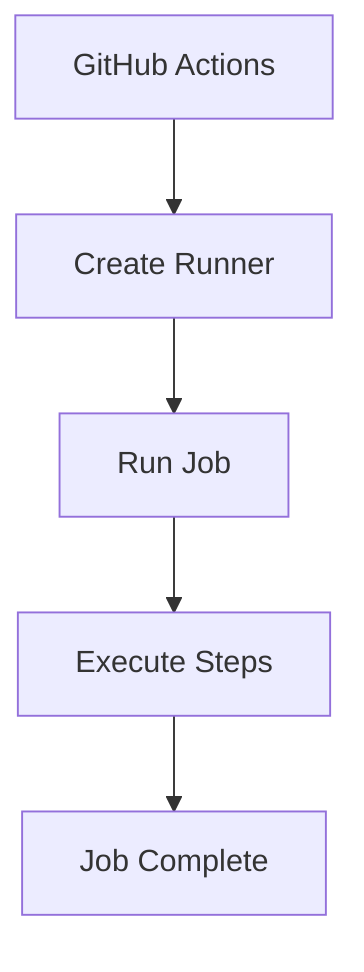

# 06 - Runners

## 1. What is a Runner?

A runner is the machine that executes your GitHub Actions job.

**Example:**
```yaml
runs-on: ubuntu-latest
```

GitHub provides an Ubuntu environment to execute the job.

---

## 2. Runner Flow



---

## 3. Our Runner

We use:
```yaml
runs-on: ubuntu-latest
```

---

## 4. Check Runner

The workflow runs:
```bash
hostname
uname -a
pwd
ls -la
python --version
```

#### 💡 Command Breakdown (cmd-explained):
- `hostname`: Prints the computer system name assigned dynamically by GitHub to this ephemeral runner VM (e.g. `fv-az123-456`).
- `uname -a`: Prints full Linux kernel and hardware architecture details (`x86_64`).
- `pwd`: Prints the current working directory path where the repository was checked out (typically `/home/runner/work/<repo-name>/<repo-name>`).
- `ls -la`: Lists all directory entries including hidden files (`-a` for all, e.g. `.git`, `.github`) with file permissions, ownership, and sizes (`-l` for long listing format).
- `python --version`: Inspects the default pre-installed Python interpreter version on the runner.

---

## 5. Expected Output

**Example:**
```text
runner-xxxx
Linux runner-xxxx ...
/home/runner/work/...
```

**Python:**
```text
Python 3.x.x
```

*(Exact values can differ between runs.)*

---

## 6. Why Do We Need Runners?

GitHub Actions needs a machine to execute:
* Shell commands
* Python
* Node.js
* Docker
* Tests
* Builds
* Deployment commands

The runner provides that execution environment.

---

### 💡 Key Takeaway

> **Workflow** → **Job** → **Runner** → **Steps execute**

---

### 📚 Tech Jargons Demystified:
- **Ephemeral Runner:** A temporary virtual machine spun up specifically for a single job and destroyed immediately afterward, guaranteeing zero cross-contamination between runs.
- **Self-Hosted Runner:** A dedicated server, VM, or local workstation you manage and connect to GitHub Actions to execute workloads (common when accessing private corporate LANs or GPU hardware).
- **GitHub-Hosted Runner Pool:** Cloud VMs maintained and secured by GitHub with standard OS images (Ubuntu, Windows Server, macOS).
- **Workspace Directory (`GITHUB_WORKSPACE`):** The isolated disk location on the runner where actions/checkout places repository code.

