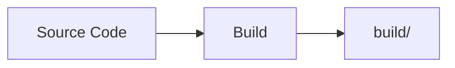
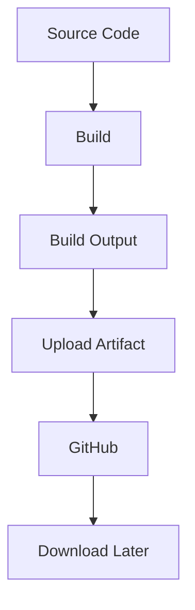

# 08 - Artifacts

## 1. What is an Artifact?

An artifact is a file or collection of files produced during a workflow run that we want to store and access after the job completes.

**Example:**



```text
build/
├── app.txt
├── version.txt
└── build-info.txt
```

The `build/` directory becomes an artifact.

---

## 2. Build Locally

Run:
```bash
chmod +x build.sh
./build.sh
```

#### 💡 Command Breakdown (cmd-explained):
- `chmod +x build.sh`: Changes file permissions on `build.sh` by adding execution permission (`+x`) for the user. Without this, attempting to run `./build.sh` produces `Permission denied`.
- `./build.sh`: Runs the build script in the current working directory (`./`) which creates the `build/` directory and writes application output files.

Check:
```bash
ls -la build
```

#### 💡 Command Breakdown (cmd-explained):
- `ls -la build`: Lists all files in the newly generated `build` directory in long listing format (`-l`) including hidden dotfiles (`-a`).

**Expected:**
```text
app.txt
version.txt
build-info.txt
```

---

## 3. Upload Artifact

The workflow uses:
```yaml
uses: actions/upload-artifact@v4
```

**Configuration:**
```yaml
with:
  name: session16-build
  path: build/
```

#### 💡 Command Breakdown (cmd-explained):
- `uses: actions/upload-artifact@v4`: Official GitHub Action that takes files from the runner's local disk and uploads them securely to GitHub's managed artifact storage.
- `with.name: session16-build`: The label/zip name given to the downloaded artifact.
- `with.path: build/`: Path on the runner's disk containing the files or directory to archive.

---

## 4. Run Workflow

Go to:
**GitHub** → **Actions** → **Artifact Demo** → **Run workflow**

---

## 5. Expected Output

```text
Build output:
app.txt
version.txt
build-info.txt
```

The workflow should finish with:
`✓ Upload artifact`

---

## 6. Download Artifact

1. Open the successful workflow run.
2. Go to: **Summary** → **Artifacts** → **session16-build**
3. Download it.

---

## 7. Artifact Flow



---

### 💡 Key Takeaway
> **Git** stores source code.
> **Artifacts** store important output generated by a workflow.

---

### 📚 Tech Jargons Demystified:
- **Build Artifact:** Any compiled binary, distribution archive, test coverage report, or container image generated during a CI job that needs to be preserved or deployed.
- **Cross-Job Sharing:** Because GitHub runner VMs are destroyed after job completion, one job uploads an artifact via `actions/upload-artifact@v4` and a subsequent dependent job retrieves it using `actions/download-artifact@v4`.
- **Retention Period:** The number of days (default 90 days for public repos) GitHub retains uploaded artifacts before automatically garbage-collecting them to conserve storage.
- **Artifact Immutability:** Once an artifact zip is uploaded under a specific run, its contents are fixed and cannot be modified in place.

