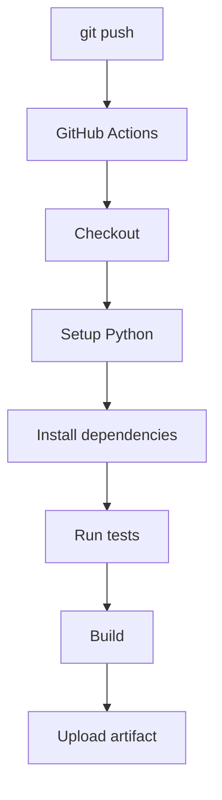

# 09 - Build & Test Pipeline

## 1. Project Structure

```text
09-build-and-test/
│
├── app/
│   ├── __init__.py
│   └── calculator.py
│
├── tests/
│   └── test_calculator.py
│
├── requirements.txt
├── build.sh
│
└── .github/
    └── workflows/
        └── ci.yml
```

---

## 2. Run Application

```bash
python3 app/calculator.py
```

#### 💡 Command Breakdown (cmd-explained):
- `python3`: Invokes the Python 3 interpreter.
- `app/calculator.py`: Path to the Python script to execute directly in the console.

**Expected:**
```text
Calculator Application
----------------------
10 + 5 = 15
10 - 5 = 5
10 * 5 = 50
10 / 5 = 2.0
```

---

## 3. Install Dependencies

```bash
python3 -m pip install -r requirements.txt
```

#### 💡 Command Breakdown (cmd-explained):
- `python3 -m pip`: Runs the `pip` package manager module using the specific `python3` binary in PATH to avoid global environment mix-ups.
- `install`: Subcommand to download and install packages.
- `-r requirements.txt`: Specifies the requirements manifest file containing pinned library versions (e.g. `pytest>=7.0.0`).

---

## 4. Run Tests

```bash
pytest -v
```

#### 💡 Command Breakdown (cmd-explained):
- `pytest`: Python testing framework and test runner.
- `-v` (or `--verbose`): Verbose mode. Lists each individual test function name and file along with its execution result (`PASSED` / `FAILED`) instead of a single dot.

**Expected:**
```text
tests/test_calculator.py::test_add PASSED
tests/test_calculator.py::test_subtract PASSED
tests/test_calculator.py::test_multiply PASSED
tests/test_calculator.py::test_divide PASSED
tests/test_calculator.py::test_divide_by_zero PASSED
5 passed
```

---

## 5. Run Build

```bash
chmod +x build.sh
./build.sh
```

#### 💡 Command Breakdown (cmd-explained):
- `chmod +x build.sh`: Grants execution permission on the shell build script.
- `./build.sh`: Runs the build script in the current directory to create deployable bundle assets.

**Expected:**
```text
Starting build...
Build completed successfully.
```

---

## 6. GitHub Actions

The workflow automatically runs when code is pushed to `main`.



---

## 7. Expected GitHub Output

```text
✓ Checkout source code
✓ Setup Python
✓ Show Python version
✓ Install dependencies
✓ Run tests
✓ Build application
✓ Show build output
✓ Upload artifact
```

---

## 8. Failure Test

Change:
```python
def add(a, b):
    return a + b
```
to:
```python
def add(a, b):
    return a + b + 1
```

Run:
```bash
pytest
```

**Expected:**
```text
FAILED tests/test_calculator.py::test_add
```

Push:
```bash
git add .
git commit -m "Test pipeline failure"
git push
```

GitHub Actions should show:
```text
✓ Checkout
✓ Setup Python
✓ Install dependencies
✗ Run tests
```
*The pipeline stops because the test failed.*

---

## 9. Fix the Code

Change it back:
```python
def add(a, b):
    return a + b
```

Then:
```bash
git add .
git commit -m "Fix calculator"
git push
```

**Expected:**
```text
✓ Run tests
✓ Build application
✓ Upload artifact
```

---

### 💡 Key Takeaway
A CI pipeline automatically validates code before it moves forward.

> **Code** → **Build** → **Test** → **Artifact**

---

### 📚 Tech Jargons Demystified:
- **Unit Testing:** Automated tests that verify individual units of source code (such as isolated functions or methods in `calculator.py`) in complete isolation.
- **Assertion:** A boolean statement inside a test function asserting that expected output equals actual output; an assertion failure halts execution and flags the test as FAILED.
- **Exit Code:** A numeric status returned by a program upon termination (0 for success, non-zero e.g. 1 for failure). CI tools like GitHub Actions rely exclusively on exit codes to determine pass or fail.
- **Continuous Integration Pipeline:** An automated series of steps combining code checkout, runtime setup, dependency resolution, test execution, and artifact packaging.

