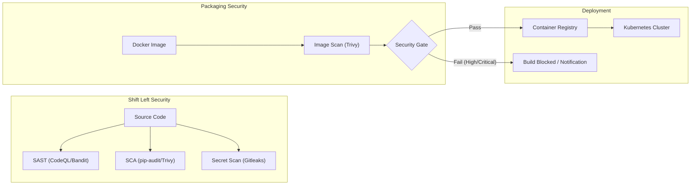
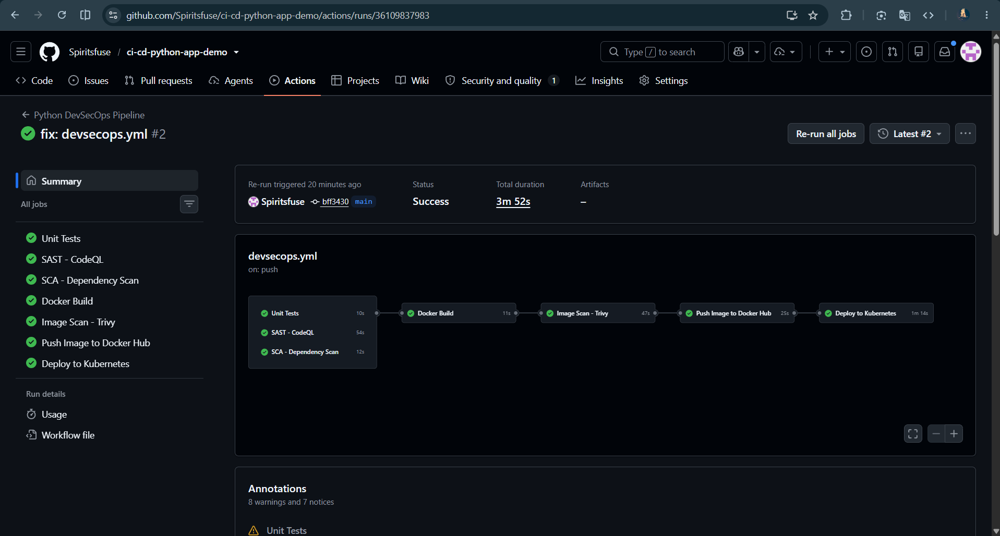
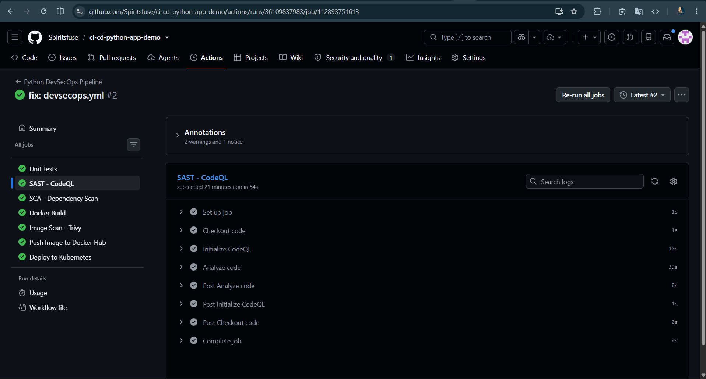

# Session 17: Complete CI/CD & DevSecOps – Assignment

## Student Information
- **Name:** Dhruv Sharma
- **Enrollment Number (Roll No):** 24BCS10294
- **Session:** Session 17 – DevSecOps: Security Scanning, Compliance & Secure CI/CD Automation
- **Repository:** `devops-heros/session-17-devsecops`

---

## Table of Contents
1. [Overview & DevSecOps Philosophy](#overview--devsecops-philosophy)
2. [Security Pillars & Scanning Taxonomy](#security-pillars--scanning-taxonomy)
   - [2.1 Static Application Security Testing (SAST)](#21-static-application-security-testing-sast)
   - [2.2 Software Composition Analysis (SCA)](#22-software-composition-analysis-sca)
   - [2.3 Secret Scanning](#23-secret-scanning)
   - [2.4 Container Image Scanning](#24-container-image-scanning)
   - [2.5 Security Gates & Policy Enforcement](#25-security-gates--policy-enforcement)
3. [Expected DevSecOps Execution Flow](#expected-devsecops-execution-flow)
4. [Demo Project Implementation (`demo/`)](#demo-project-implementation-demo)
   - [4.1 Architecture & Components](#41-architecture--components)
   - [4.2 Workflow Specification (`.github/workflows/devsecops.yml`)](#42-workflow-specification-githubworkflowsdevsecopsyml)
   - [4.3 Kubernetes Deployment Manifests](#43-kubernetes-deployment-manifests)
5. [Screenshot Placeholders & Deliverables Checklist](#screenshot-placeholders--deliverables-checklist)

---

## Overview & DevSecOps Philosophy
**DevSecOps** introduces security practices into the DevOps delivery pipeline from the earliest stages of software development (**"Shift-Left Security"**). Rather than treating security as an isolated audit phase prior to production releases, automated security gates validate source code, third-party libraries, container images, and infrastructure configurations during every commit.

---

## Security Pillars & Scanning Taxonomy



### 2.1 Static Application Security Testing (SAST)
- **Role**: Analyzes application source code at rest without executing the program.
- **Detections**: SQL injections, command injections, insecure cryptographic algorithms, path traversals, cross-site scripting (XSS).
- **Tools**: GitHub CodeQL, SonarQube, Bandit (Python), Semgrep.

### 2.2 Software Composition Analysis (SCA)
- **Role**: Identifies open-source third-party dependencies and checks them against national vulnerability databases (CVEs).
- **Detections**: Outdated libraries, known security exploits, license compliance risks.
- **Tools**: Snyk, pip-audit, OWASP Dependency-Check, Trivy.

### 2.3 Secret Scanning
- **Role**: Scans commits, branch history, and files for accidentally committed credentials, API tokens, and private keys.
- **Detections**: AWS Access Keys, GitHub PATs, private SSH keys, Slack webhooks, database connection strings.
- **Tools**: Gitleaks, TruffleHog, GitHub Secret Scanning.

### 2.4 Container Image Scanning
- **Role**: Analyzes container base images, OS packages (Alpine/Debian), and installed runtimes for unpatched vulnerabilities.
- **Detections**: OS package CVEs, glibc vulnerabilities, misconfigured root users.
- **Tools**: Aqua Trivy, Clair, Docker Scout, Grype.

### 2.5 Security Gates & Policy Enforcement
- **Role**: Automated CI checkpoints that block the pipeline if detected vulnerabilities exceed predefined severity thresholds:
  ```bash
  trivy image --exit-code 1 --severity HIGH,CRITICAL my-app:latest
  ```
  If any `HIGH` or `CRITICAL` vulnerability is found, the build exits with a non-zero code, preventing deployment to production.

---

## Expected DevSecOps Execution Flow
1. **Code Commit & Push**: Developer pushes to `main` or opens a Pull Request.
2. **Build & Unit Tests**: Automated unit tests execute to verify business logic.
3. **SAST Scan**: CodeQL scans Python code for flaws.
4. **SCA Scan**: Dependencies in `requirements.txt` scanned for vulnerable versions.
5. **Secret Scan**: Gitleaks validates commit diffs.
6. **Docker Build**: Container image compiled.
7. **Container Image Scan**: Trivy audits image layers.
8. **Security Gate**: Fails workflow if critical CVEs exist.
9. **Image Push**: Push image to Docker Hub / GHCR / ECR.
10. **Kubernetes Deployment**: Updates deployment manifest in the target cluster.

---

## Demo Project Implementation (`demo/`)
Located in [session-17-devsecops/demo/](file:///c:/Users/ADMIN/devops-heros/session-17-devsecops/demo).

### 4.1 Application & Container Definition
- Application: Fast, tested Python microservice.
- Dockerfile:
  ```dockerfile
  FROM python:3.12-alpine
  WORKDIR /app
  COPY requirements.txt .
  RUN pip install --no-cache-dir -r requirements.txt
  COPY . .
  EXPOSE 8000
  CMD ["python", "app/main.py"]
  ```

### 4.2 Security Workflow (`.github/workflows/devsecops.yml`)
The workflow executes:
- `test`: Unit tests and code coverage (`pytest --cov=app`)
- `sast`: GitHub CodeQL analysis action
- `sca`: `pip-audit` verifying zero vulnerable packages
- `secrets`: Gitleaks action scanning git history
- `container-scan`: Trivy scanning image with `--exit-code 1 --severity CRITICAL`
- `deploy`: `kubectl apply -f k8s/` deploying service and deployment.

---

## Screenshot Placeholders & Deliverables Checklist

### Screenshot Placeholders:
1. **Pipeline Execution Overview**:
   
   *(Screenshot of all jobs running in GitHub Actions)*
2. **SAST CodeQL Scan**:
   
   *(Screenshot showing CodeQL security findings or clean scan)*
3. **SCA Dependency Audit**:
   
   *(Screenshot showing pip-audit / Trivy filesystem scan)*
4. **Secret Scanning**:
   
   *(Screenshot showing Gitleaks verification)*
5. **Container Image Scan & Security Gate**:
   
   *(Screenshot showing Trivy container analysis)*
6. **Kubernetes Rollout**:
   
   *(Screenshot showing `kubectl rollout status deployment/python-app`)*

| Deliverable | Location | Status |
| :--- | :--- | :---: |
| Application Source Code | `demo/app/` | Verified |
| Dockerfile | `demo/Dockerfile` | Verified |
| GitHub Actions DevSecOps Workflow | `demo/.github/workflows/devsecops.yml` | Verified |
| Security Scanning Tools Configuration | SAST, SCA, Secrets, Trivy configured in workflow | Verified |
| Kubernetes Manifests | `demo/k8s/deployment.yaml`, `demo/k8s/service.yaml` | Verified |
| Screenshot Placeholders | `screenshots/` | Verified |
