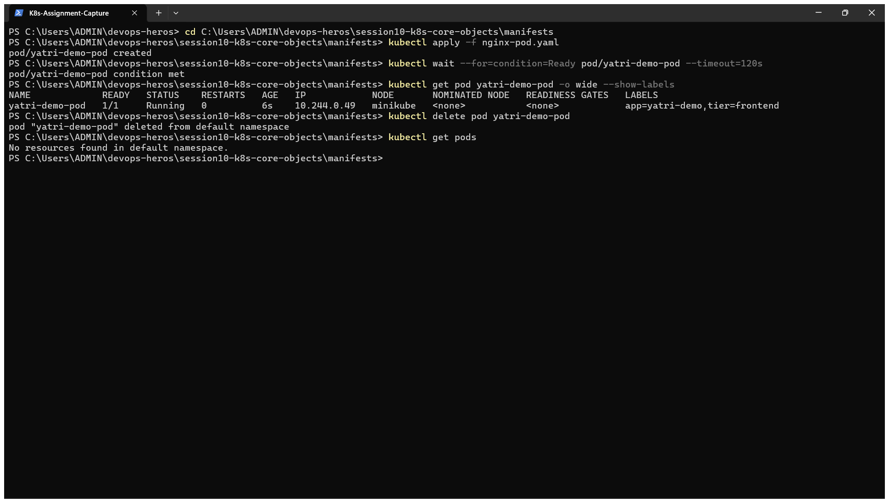
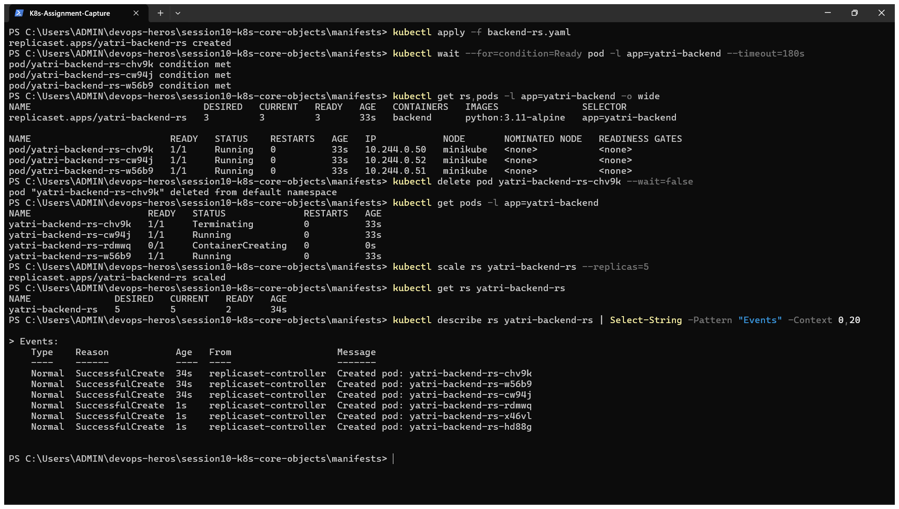
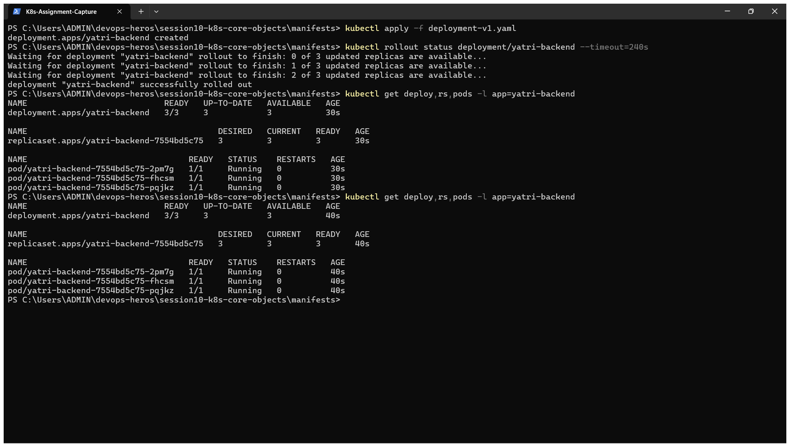
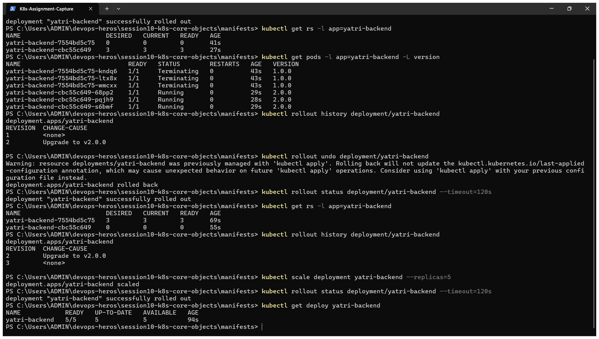
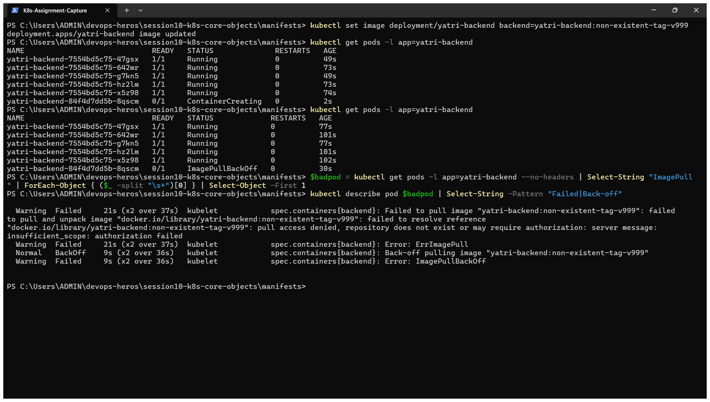
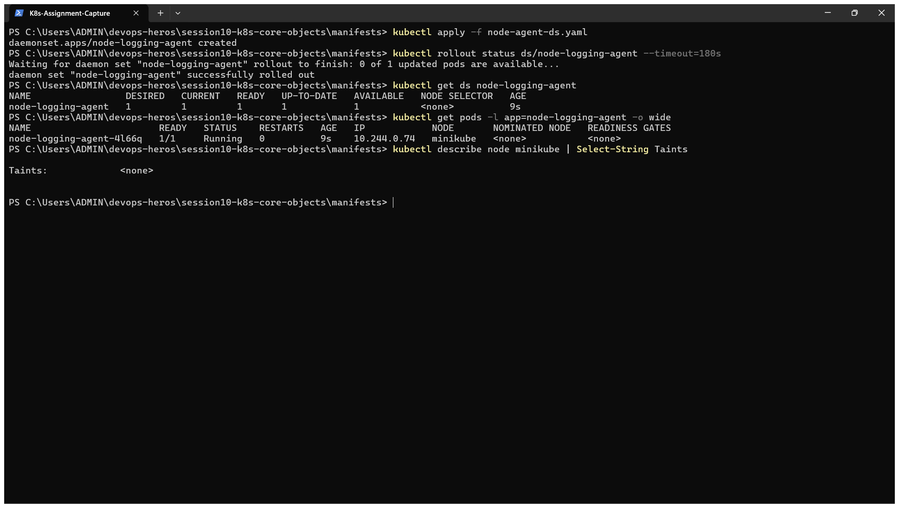

# Kubernetes Pods, ReplicaSets & Deployments – Homework

**Name:** Dhruv Sharma
**Roll No:** 24BCS10294

Manifests are from the class repository ([session10-k8s-core-objects](https://github.com/Nency-Ravaliya/devops-heros/tree/main/session10-k8s-core-objects)) and are copied into [manifests/](manifests). I ran them on my local 2-node kind cluster. All outputs are copied from my terminal.

| Object | What it adds |
|---|---|
| **Pod** | Smallest unit: one or more containers sharing an IP and volumes. If it dies, nothing brings it back |
| **ReplicaSet** | Keeps N copies of a Pod running at all times (self-healing, scaling) |
| **Deployment** | Manages ReplicaSets to give rolling updates, history and rollback |
| **DaemonSet** | Runs exactly one Pod on every (eligible) node |

---

## 1. Pod

[manifests/nginx-pod.yaml](manifests/nginx-pod.yaml)

```text
$ kubectl apply -f pod/nginx-pod.yaml
pod/yatri-demo-pod created

$ kubectl wait --for=condition=Ready pod/yatri-demo-pod --timeout=120s
pod/yatri-demo-pod condition met

$ kubectl get pod yatri-demo-pod -o wide --show-labels
NAME             READY   STATUS    RESTARTS   AGE   IP           NODE               NOMINATED NODE   READINESS GATES   LABELS
yatri-demo-pod   1/1     Running   0          0s    10.244.1.3   devops-hw-worker   <none>           <none>            app=yatri-demo,tier=frontend

$ kubectl delete pod yatri-demo-pod
pod "yatri-demo-pod" deleted from default namespace

$ kubectl get pods
No resources found in default namespace.
```

**What I understood:** a bare Pod is not protected. After `kubectl delete pod` there were **no resources** left, nobody re-created it. That is why Pods are almost never created directly in production.

## 2. ReplicaSet – self-healing and scaling

[manifests/backend-rs.yaml](manifests/backend-rs.yaml) asks for `replicas: 3` with the selector `app=yatri-backend`.

```text
$ kubectl apply -f replicaset/backend-rs.yaml
replicaset.apps/yatri-backend-rs created

$ kubectl wait --for=condition=Ready pod -l app=yatri-backend --timeout=180s
pod/yatri-backend-rs-gtlsd condition met
pod/yatri-backend-rs-h7qnx condition met
pod/yatri-backend-rs-t856t condition met

$ kubectl get rs,pods -l app=yatri-backend -o wide
NAME                               DESIRED   CURRENT   READY   AGE   CONTAINERS   IMAGES               SELECTOR
replicaset.apps/yatri-backend-rs   3         3         3       13s   backend      python:3.11-alpine   app=yatri-backend

NAME                         READY   STATUS    RESTARTS   AGE   IP           NODE               NOMINATED NODE   READINESS GATES
pod/yatri-backend-rs-gtlsd   1/1     Running   0          13s   10.244.1.6   devops-hw-worker   <none>           <none>
pod/yatri-backend-rs-h7qnx   1/1     Running   0          13s   10.244.1.5   devops-hw-worker   <none>           <none>
pod/yatri-backend-rs-t856t   1/1     Running   0          13s   10.244.1.4   devops-hw-worker   <none>           <none>

$ kubectl delete pod yatri-backend-rs-gtlsd --wait=false
pod "yatri-backend-rs-gtlsd" deleted from default namespace

$ kubectl get pods -l app=yatri-backend
NAME                     READY   STATUS        RESTARTS   AGE
yatri-backend-rs-gtlsd   1/1     Terminating   0          16s
yatri-backend-rs-h7qnx   1/1     Running       0          16s
yatri-backend-rs-t856t   1/1     Running       0          16s
yatri-backend-rs-v52nh   1/1     Running       0          3s

$ kubectl scale rs yatri-backend-rs --replicas=5
replicaset.apps/yatri-backend-rs scaled

$ kubectl get rs yatri-backend-rs
NAME               DESIRED   CURRENT   READY   AGE
yatri-backend-rs   5         5         5       21s

$ kubectl describe rs yatri-backend-rs | sed -n "/^Events/,\$p"
Events:
  Type    Reason            Age   From                   Message
  ----    ------            ----  ----                   -------
  Normal  SuccessfulCreate  21s   replicaset-controller  Created pod: yatri-backend-rs-t856t
  Normal  SuccessfulCreate  21s   replicaset-controller  Created pod: yatri-backend-rs-h7qnx
  Normal  SuccessfulCreate  21s   replicaset-controller  Created pod: yatri-backend-rs-gtlsd
  Normal  SuccessfulCreate  8s    replicaset-controller  Created pod: yatri-backend-rs-v52nh
  Normal  SuccessfulCreate  5s    replicaset-controller  Created pod: yatri-backend-rs-vl7sp
  Normal  SuccessfulCreate  5s    replicaset-controller  Created pod: yatri-backend-rs-jk2sd

$ kubectl delete rs yatri-backend-rs
replicaset.apps "yatri-backend-rs" deleted from default namespace
```

**What I understood:**

- I deleted the Pod `yatri-backend-rs-gtlsd`. Within 3 seconds the ReplicaSet had already created a replacement (`yatri-backend-rs-v52nh`) while the old one was still terminating. The count never stays below 3.
- The ReplicaSet finds its Pods only through the **label selector**, and Pod names get a random suffix.
- `kubectl scale --replicas=5` created 2 more Pods. The `Events` list shows every `SuccessfulCreate`.
- A ReplicaSet cannot do a controlled image update. That is the job of a Deployment.

## 3. Deployment – rolling update, history, rollback

[manifests/deployment-v1.yaml](manifests/deployment-v1.yaml) → [manifests/deployment-v2.yaml](manifests/deployment-v2.yaml)

```text
$ kubectl apply -f deployment/deployment-v1.yaml
deployment.apps/yatri-backend created

$ kubectl rollout status deployment/yatri-backend --timeout=240s
Waiting for deployment "yatri-backend" rollout to finish: 0 of 3 updated replicas are available...
Waiting for deployment "yatri-backend" rollout to finish: 1 of 3 updated replicas are available...
Waiting for deployment "yatri-backend" rollout to finish: 2 of 3 updated replicas are available...
deployment "yatri-backend" successfully rolled out

$ kubectl get deploy,rs,pods -l app=yatri-backend
NAME                            READY   UP-TO-DATE   AVAILABLE   AGE
deployment.apps/yatri-backend   3/3     3            3           0s

NAME                                       DESIRED   CURRENT   READY   AGE
replicaset.apps/yatri-backend-7554bd5c75   3         3         3       0s

NAME                                 READY   STATUS    RESTARTS   AGE
pod/yatri-backend-7554bd5c75-nkgv9   1/1     Running   0          0s
pod/yatri-backend-7554bd5c75-qpgbl   1/1     Running   0          0s
pod/yatri-backend-7554bd5c75-zws4v   1/1     Running   0          0s

$ kubectl apply -f deployment/deployment-v2.yaml
deployment.apps/yatri-backend configured

$ kubectl annotate deployment/yatri-backend kubernetes.io/change-cause="Upgrade to v2.0.0" --overwrite
deployment.apps/yatri-backend annotated

$ kubectl rollout status deployment/yatri-backend --timeout=240s
Waiting for deployment "yatri-backend" rollout to finish: 1 out of 3 new replicas have been updated...
Waiting for deployment "yatri-backend" rollout to finish: 1 out of 3 new replicas have been updated...
Waiting for deployment "yatri-backend" rollout to finish: 1 out of 3 new replicas have been updated...
Waiting for deployment "yatri-backend" rollout to finish: 2 out of 3 new replicas have been updated...
Waiting for deployment "yatri-backend" rollout to finish: 2 out of 3 new replicas have been updated...
Waiting for deployment "yatri-backend" rollout to finish: 2 out of 3 new replicas have been updated...
Waiting for deployment "yatri-backend" rollout to finish: 1 old replicas are pending termination...
Waiting for deployment "yatri-backend" rollout to finish: 1 old replicas are pending termination...
deployment "yatri-backend" successfully rolled out

$ kubectl get rs -l app=yatri-backend
NAME                       DESIRED   CURRENT   READY   AGE
yatri-backend-7554bd5c75   0         0         0       2s
yatri-backend-cbc55c649    3         3         3       2s

$ kubectl get pods -l app=yatri-backend -L version
NAME                             READY   STATUS        RESTARTS   AGE   VERSION
yatri-backend-7554bd5c75-nkgv9   1/1     Terminating   0          2s    1.0.0
yatri-backend-7554bd5c75-qpgbl   1/1     Terminating   0          2s    1.0.0
yatri-backend-7554bd5c75-zws4v   1/1     Terminating   0          2s    1.0.0
yatri-backend-cbc55c649-54xz2    1/1     Running       0          1s    2.0.0
yatri-backend-cbc55c649-5p627    1/1     Running       0          2s    2.0.0
yatri-backend-cbc55c649-t2zll    1/1     Running       0          1s    2.0.0

$ kubectl rollout history deployment/yatri-backend
deployment.apps/yatri-backend
REVISION  CHANGE-CAUSE
1         <none>
2         Upgrade to v2.0.0

$ kubectl rollout undo deployment/yatri-backend
deployment.apps/yatri-backend rolled back

$ kubectl rollout status deployment/yatri-backend --timeout=240s | tail -1
deployment "yatri-backend" successfully rolled out

$ kubectl get rs -l app=yatri-backend
NAME                       DESIRED   CURRENT   READY   AGE
yatri-backend-7554bd5c75   3         3         3       3s
yatri-backend-cbc55c649    0         0         0       3s

$ kubectl rollout history deployment/yatri-backend
deployment.apps/yatri-backend
REVISION  CHANGE-CAUSE
2         Upgrade to v2.0.0
3         <none>

$ kubectl scale deployment yatri-backend --replicas=5
deployment.apps/yatri-backend scaled

$ kubectl rollout status deployment/yatri-backend --timeout=240s | tail -1
deployment "yatri-backend" successfully rolled out

$ kubectl get deploy yatri-backend
NAME            READY   UP-TO-DATE   AVAILABLE   AGE
yatri-backend   5/5     5            5           4s
```

**What I understood:**

- The chain is **Deployment → ReplicaSet → Pods**. The Pod name shows it: `yatri-backend` + ReplicaSet hash `7554bd5c75` + Pod suffix.
- Applying v2 created a **new ReplicaSet** (`cbc55c649`) and scaled it up while the old one (`7554bd5c75`) was scaled down to 0. `rollout status` shows it happening one replica at a time. With `maxSurge: 1` and `maxUnavailable: 0`, a new Pod must be ready before an old one is removed, so there is no downtime.
- The old ReplicaSet is kept with 0 replicas. That is what makes rollback instant: `kubectl rollout undo` simply scaled `7554bd5c75` back to 3.
- After the undo, revision 1 became revision 3 in `rollout history`. A rollback is recorded as a new revision.
- The `kubernetes.io/change-cause` annotation fills the `CHANGE-CAUSE` column, which is useful to know why a release was made.

## 4. Troubleshooting – a broken image

I pushed a wrong image tag on purpose, the same error as in `troubleshooting/broken-image.yaml`.

```text
$ kubectl set image deployment/yatri-backend backend=yatri-backend:non-existent-tag-v999
deployment.apps/yatri-backend image updated

$ kubectl get pods -l app=yatri-backend
NAME                             READY   STATUS             RESTARTS   AGE
yatri-backend-7554bd5c75-488vp   1/1     Running            0          27s
yatri-backend-7554bd5c75-kwpvr   1/1     Running            0          26s
yatri-backend-7554bd5c75-l6qxn   1/1     Running            0          26s
yatri-backend-7554bd5c75-nkgv9   1/1     Terminating        0          29s
yatri-backend-7554bd5c75-q4fkh   1/1     Running            0          27s
yatri-backend-7554bd5c75-qpgbl   1/1     Terminating        0          29s
yatri-backend-7554bd5c75-wjx89   1/1     Running            0          26s
yatri-backend-7554bd5c75-zws4v   1/1     Terminating        0          29s
yatri-backend-84f4d7dd5b-9pz89   0/1     ImagePullBackOff   0          25s
yatri-backend-cbc55c649-54xz2    1/1     Terminating        0          28s
yatri-backend-cbc55c649-5p627    1/1     Terminating        0          29s
yatri-backend-cbc55c649-t2zll    1/1     Terminating        0          28s

$ kubectl describe pod $(kubectl get pods -l app=yatri-backend --no-headers | grep -E "ImagePull|ErrImage" | head -1 | cut -d" " -f1) | grep -E "Failed|Back-off" | head -3
  Normal   BackOff    23s               kubelet            Back-off pulling image "yatri-backend:non-existent-tag-v999"
  Warning  Failed     23s               kubelet            Error: ImagePullBackOff
  Warning  Failed     7s (x2 over 23s)  kubelet            Failed to pull image "yatri-backend:non-existent-tag-v999": failed to pull and unpack image "docker.io/library/yatri-backend:non-existent-tag-v999": failed to resolve reference "docker.io/library/yatri-backend:non-existent-tag-v999": pull access denied, repository does not exist or may require authorization: server message: insufficient_scope: authorization failed

$ kubectl rollout undo deployment/yatri-backend
deployment.apps/yatri-backend rolled back

$ kubectl rollout status deployment/yatri-backend --timeout=240s | tail -1
deployment "yatri-backend" successfully rolled out

$ kubectl delete deployment yatri-backend
deployment.apps "yatri-backend" deleted from default namespace
```

**What I understood:**

- The new Pod went to `ImagePullBackOff`, and `kubectl describe pod` gave the exact reason: the image could not be pulled.
- The rolling update **protected the application**. All 5 old Pods stayed `Running` because the new Pod never became ready, so Kubernetes did not remove any more old ones.
- `kubectl rollout undo` brought the Deployment back to the healthy version.

Debugging order: `kubectl get pods` → `kubectl describe pod` (Events) → `kubectl logs` (add `--previous` for `CrashLoopBackOff`).

## 5. DaemonSet

[manifests/node-agent-ds.yaml](manifests/node-agent-ds.yaml)

```text
$ kubectl apply -f daemonset/node-agent-ds.yaml
daemonset.apps/node-logging-agent created

$ kubectl rollout status ds/node-logging-agent --timeout=180s
Waiting for daemon set "node-logging-agent" rollout to finish: 0 of 1 updated pods are available...
daemon set "node-logging-agent" successfully rolled out

$ kubectl get ds node-logging-agent
NAME                 DESIRED   CURRENT   READY   UP-TO-DATE   AVAILABLE   NODE SELECTOR   AGE
node-logging-agent   1         1         1       1            1           <none>          2s

$ kubectl get pods -l app=node-logging-agent -o wide
NAME                       READY   STATUS    RESTARTS   AGE   IP            NODE               NOMINATED NODE   READINESS GATES
node-logging-agent-s2l4t   1/1     Running   0          2s    10.244.1.56   devops-hw-worker   <none>           <none>

$ kubectl describe node devops-hw-control-plane | grep Taints
Taints:             node-role.kubernetes.io/control-plane:NoSchedule

$ kubectl delete ds node-logging-agent
daemonset.apps "node-logging-agent" deleted from default namespace
```

**What I understood:** there is no `replicas` field. The number of Pods follows the number of nodes. `DESIRED` is 1 on my 2-node cluster because the control-plane node has a `NoSchedule` taint and this DaemonSet has no toleration for it, so only the worker node is eligible. Typical uses are log collectors, monitoring agents and network plugins. `kube-proxy` and `kindnet` are DaemonSets themselves.

## 6. Transient Pod phases (`hello.yml`)

[hello.yml](hello.yml) is a `busybox` Pod with `restartPolicy: Never` that just echoes a string and exits.

```text
$ kubectl apply -f hello.yml
pod/hello-pod created

$ kubectl get pod hello-pod
NAME        READY   STATUS              RESTARTS   AGE
hello-pod   0/1     ContainerCreating   0          0s

$ kubectl get pod hello-pod
NAME        READY   STATUS      RESTARTS   AGE
hello-pod   0/1     Completed   0          9s

$ kubectl logs hello-pod
Hello Kubernetes

$ kubectl delete -f hello.yml
pod "hello-pod" deleted from default namespace
```

**What I understood:** with a real image pull this pod moves `ContainerCreating → Running → Completed` (phase `Succeeded`), but `busybox echo` finishes in well under a second, so `Running` was only ever an instant between two polls. `Completed`/`Succeeded` means exit code 0 — a Pod that behaves like a one-shot Job, not a service.

## 7. StatefulSet — ordinal identity that survives a delete

[k8s-core-objects/statefulset.yml](k8s-core-objects/statefulset.yml): a 3-replica MySQL StatefulSet with a `volumeClaimTemplate` per Pod.

```text
$ kubectl apply -f k8s-core-objects/statefulset.yml
statefulset.apps/mysql created

$ kubectl get pods -l app=mysql -w
mysql-0   0/1   Pending             0     0s
mysql-0   0/1   ContainerCreating   0     0s
mysql-0   1/1   Running             0     40s
mysql-1   0/1   Pending             0     0s
...
$ kubectl get statefulset mysql
NAME    READY   AGE
mysql   3/3     49s

$ kubectl get pods -l app=mysql -o wide
NAME      READY   STATUS    RESTARTS   AGE   IP            NODE
mysql-0   1/1     Running   0          49s   10.244.0.11   minikube
mysql-1   1/1     Running   0          9s    10.244.0.12   minikube
mysql-2   1/1     Running   0          6s    10.244.0.13   minikube

$ kubectl get pvc
NAME                               STATUS   VOLUME                                     CAPACITY   ACCESS MODES   STORAGECLASS
mysql-persistent-storage-mysql-0   Bound    pvc-95631b42-b42c-44ba-90c3-261f68baa452   5Gi        RWO            standard
mysql-persistent-storage-mysql-1   Bound    pvc-12a3a7a4-8724-400e-a019-fa1d19b2b7d8   5Gi        RWO            standard
mysql-persistent-storage-mysql-2   Bound    pvc-c3d60b4f-440c-4d00-8603-93f8844595ba   5Gi        RWO            standard

$ kubectl delete pod mysql-1 --wait=false
pod "mysql-1" deleted from default namespace

$ kubectl get pods -l app=mysql
mysql-0   1/1   Running       0   57s
mysql-1   1/1   Terminating   0   17s
mysql-2   1/1   Running       0   14s
# ...after the old mysql-1 finishes terminating...
mysql-1   1/1   Running   0   5s    # <- new Pod, but still named mysql-1, with a NEW IP (10.244.0.14 vs the old 10.244.0.12)

$ kubectl delete -f k8s-core-objects/statefulset.yml
statefulset.apps "mysql" deleted from default namespace
$ kubectl delete pvc -l app=mysql
persistentvolumeclaim "mysql-persistent-storage-mysql-0" deleted from default namespace
persistentvolumeclaim "mysql-persistent-storage-mysql-1" deleted from default namespace
persistentvolumeclaim "mysql-persistent-storage-mysql-2" deleted from default namespace
```

**What I understood:**

- StatefulSet Pods are created **one at a time, in order** (`mysql-0` fully `Running` before `mysql-1` even starts `Pending`) — unlike a ReplicaSet, which creates all replicas in parallel.
- Each Pod gets a **stable ordinal name** (`mysql-0`, `-1`, `-2`) and its **own PVC**, named after it. Deleting `mysql-1` did not reshuffle anyone: Kubernetes recreated a new Pod but reused the identity **`mysql-1`** (new IP, new container, same name and same PVC).
- This is exactly why StatefulSets are used for anything where a replica needs a durable, addressable identity (databases, Kafka brokers, anything using per-replica storage) — a Deployment's ReplicaSet would have given the replacement Pod a brand-new random name instead.
- `kubectl delete -f statefulset.yml` does **not** delete the PVCs — that's deliberate, so data survives a StatefulSet being scaled down or deleted by mistake; they have to be deleted separately.

## 8. Blue-Green Deployment — instant selector cutover

[02-blue-green/](02-blue-green): two complete 3-replica environments (`app-blue` v1, `app-green` v2) running side by side, with one `Service` whose selector decides who is "live".

```text
$ kubectl apply -f 02-blue-green/deployment-blue.yaml -f 02-blue-green/deployment-green.yaml
deployment.apps/app-blue created
deployment.apps/app-green created
# both roll out to 3/3 Running — 6 pods total, both versions live simultaneously

$ kubectl apply -f 02-blue-green/service-blue.yaml
service/myapp-service created
$ kubectl describe svc myapp-service | grep -E "Selector|Endpoints"
Selector:                 app=myapp,slot=blue
Endpoints:                10.244.0.15:80,10.244.0.16:80,10.244.0.17:80

$ docker exec minikube curl -s http://localhost:30020
<p>BLUE ENVIRONMENT</p>

# THE SWITCH — flip all traffic to green with one apply, no pod restarts:
$ kubectl apply -f 02-blue-green/service-green.yaml
service/myapp-service configured
$ kubectl describe svc myapp-service | grep -E "Selector|Endpoints"
Selector:                 app=myapp,slot=green
Endpoints:                10.244.0.18:80,10.244.0.19:80,10.244.0.20:80

$ docker exec minikube curl -s http://localhost:30020
<p>GREEN ENVIRONMENT</p>

# Instant rollback — reapply the blue Service:
$ kubectl apply -f 02-blue-green/service-blue.yaml
service/myapp-service configured
$ docker exec minikube curl -s http://localhost:30020
<p>BLUE ENVIRONMENT</p>

$ kubectl delete -f 02-blue-green/service-blue.yaml -f 02-blue-green/deployment-blue.yaml -f 02-blue-green/deployment-green.yaml
```

**What I understood:** both versions run at full scale the entire time, so the "cutover" is really just editing which Pods a Service's `selector` matches — the Service's `Endpoints` update immediately, with no rolling restart and no in-between mixed-version state. Rollback is exactly as instant as the forward switch (reapply the old Service). The cost is running 2x the Pods for the duration of the release.

## 9. Canary Deployment — pod-ratio traffic splitting

[03-canary/](03-canary): one Service selects Pods from **both** a 9-replica stable Deployment and a 1-replica canary Deployment via a shared label, so traffic splits by pod-count ratio.

```text
$ kubectl apply -f 03-canary/deployment-stable.yaml -f 03-canary/service.yaml
$ kubectl apply -f 03-canary/deployment-canary.yaml
# 9 "stable" pods + 1 "canary" pod, one Service (myapp-canary-service) selecting app=myapp-canary

$ for i in $(seq 1 20); do docker exec minikube curl -s http://localhost:30030 | grep -o "STABLE v1\|CANARY v2"; done
STABLE v1
STABLE v1
STABLE v1
CANARY v2   <- roughly 1 in 10, matching the 9:1 pod ratio
STABLE v1
...
CANARY v2
STABLE v1  (16x STABLE, 2x CANARY across 18 shown lines here — ~10%)

# Shift more traffic to canary: scale to 3 canary / 7 stable (~30%)
$ kubectl scale deployment app-canary --replicas=3
$ kubectl scale deployment app-stable --replicas=7
$ for i in $(seq 1 20); do docker exec minikube curl -s http://localhost:30030 | grep -o "STABLE v1\|CANARY v2"; done
# 6 of 20 hits were CANARY v2 (~30%), matching the new 7:3 ratio

# Rollback: scale canary to 0
$ kubectl scale deployment app-canary --replicas=0
$ kubectl scale deployment app-stable --replicas=9
$ for i in $(seq 1 5); do docker exec minikube curl -s http://localhost:30030 | grep -o "STABLE v1\|CANARY v2"; done
STABLE v1
STABLE v1
STABLE v1
STABLE v1
STABLE v1

$ kubectl delete -f 03-canary/service.yaml -f 03-canary/deployment-canary.yaml -f 03-canary/deployment-stable.yaml
```

**What I understood:** there's no built-in "10% of traffic" primitive here — `kube-proxy` load-balances evenly across every Pod behind a Service, so the *only* way to control the split is the **ratio of replica counts** feeding the same selector. Scaling canary up/down changes the odds instantly, and scaling it to 0 is a clean, instant rollback (the Pods are gone, only stable ones answer).

## 10. Recreate Deployment — deliberate downtime window

[04-recreate/](04-recreate): `strategy.type: Recreate` kills every old Pod before creating any new one — the opposite of a rolling update.

```text
$ kubectl apply -f 04-recreate/deployment-v1.yaml -f 04-recreate/service.yaml
# 3/3 v1 pods Running

# Continuous curl loop in the background, then trigger the update:
$ kubectl apply -f 04-recreate/deployment-v2.yaml
deployment.apps/app-recreate configured

# curl loop output during the rollout:
VERSION: v1
VERSION: v1
VERSION: v1
VERSION: v1
VERSION: v1
[OUTAGE] Connection refused / 0 pods alive
[OUTAGE] Connection refused / 0 pods alive
VERSION: v2 (UPGRADED)
VERSION: v2 (UPGRADED)
...

$ kubectl rollout history deployment/app-recreate
REVISION  CHANGE-CAUSE
1         <none>
2         <none>

$ kubectl rollout undo deployment/app-recreate
deployment.apps/app-recreate rolled back
$ kubectl rollout status deployment/app-recreate
deployment "app-recreate" successfully rolled out

$ kubectl delete -f 04-recreate/service.yaml -f 04-recreate/deployment-v2.yaml
```

**What I understood:** with `Recreate`, there really is a window with **zero** Pods serving traffic — the curl loop hit real `Connection refused` errors between the last v1 Pod terminating and the first v2 Pod becoming ready. This is the opposite trade-off from `RollingUpdate`/Blue-Green: simpler (never runs two versions at once, so no compatibility concerns between v1 and v2 talking to the same database schema, for example) but it costs guaranteed downtime. `rollout undo` works the same way as with `RollingUpdate` — it triggers another Recreate cycle back to the previous revision.

## 11. Troubleshooting Drill 2 — immutable selector mismatch

[troubleshooting/selector-mismatch.yaml](troubleshooting/selector-mismatch.yaml) has `spec.selector.matchLabels.app: correct-app-name` but `spec.template.metadata.labels.app: wrong-app-name`.

```text
$ kubectl apply -f troubleshooting/selector-mismatch.yaml
The Deployment "selector-error-demo" is invalid: spec.template.metadata.labels: Invalid value: {"app":"wrong-app-name"}: `selector` does not match template `labels`

# fix: change the template label to match the selector, then it applies cleanly
$ kubectl apply -f selector-mismatch-fixed.yaml
deployment.apps/selector-error-demo created
$ kubectl get deploy selector-error-demo
NAME                  READY   UP-TO-DATE   AVAILABLE   AGE
selector-error-demo   0/1     1            0           1s
```

**What I understood:** unlike the empty-endpoints selector mismatch (Session 11, a Service silently matching nothing), this one is rejected **at `kubectl apply` time** by the API server, because `spec.selector` on a Deployment/ReplicaSet is immutable and must always be satisfied by its own Pod template — Kubernetes refuses to create a controller that could never find its own Pods.

## 12. Theory writeup

**The 4 ports, end to end:**

| Port | Lives on | Meaning |
|---|---|---|
| `containerPort` | Pod spec | Documents which port the process inside the container listens on (informational only — not enforced) |
| `targetPort` | Service spec | The port on the **Pod** that the Service forwards traffic to |
| `port` | Service spec | The port the Service itself exposes inside the cluster (what other Pods connect to) |
| `nodePort` | Service spec (`type: NodePort`/`LoadBalancer`) | The port opened on **every node's** IP, `30000–32767` |

Flow: `Client → nodePort (node IP) → port (Service VIP) → targetPort (Pod IP) → containerPort (process)`.

**Labels vs. Selectors:** a *label* is a key/value tag attached to an object (`app: nginx`, `slot: blue`). A *selector* is a query a controller or Service uses to find the Pods that match a set of labels. Labels are static metadata; selectors are how everything else (Services, Deployments, ReplicaSets) find their Pods dynamically.

**The 4 deployment strategies, compared:**

| Strategy | Downtime | Extra capacity needed | Rollback speed |
|---|---|---|---|
| `RollingUpdate` (default) | None, if `maxUnavailable: 0` | `maxSurge` extra Pods, briefly | One more rolling update, gradual |
| `Recreate` | Yes — all old Pods die before new ones start | None | Another Recreate cycle |
| Blue-Green | None | 2x (both full environments run at once) | Instant (flip the Service selector back) |
| Canary | None | Small (a few extra Pods for the canary slice) | Instant (scale canary to 0) |

**`maxSurge` vs. `maxUnavailable`** (for `replicas: 4`, `maxSurge: 1`, `maxUnavailable: 0`): the rollout may briefly run up to `4 + 1 = 5` Pods, but must never drop below `4 - 0 = 4` Pods Ready — i.e. full capacity is guaranteed throughout, at the cost of one extra Pod's worth of resources during the update.

**Requests vs. Limits, and GB vs. GiB:** a `request` is what the scheduler guarantees/reserves when placing the Pod on a node; a `limit` is the hard ceiling enforced by the kernel (cgroups) — exceed the CPU limit and the container is throttled, exceed the memory limit and it's OOM-killed. `1 GB = 10^9` bytes (decimal/SI), `1 GiB = 2^30 = 1,073,741,824` bytes (binary/IEC) — Kubernetes resource units (`Mi`, `Gi`) are always the binary ones, so `256Mi` is a bit more than `256MB`.

---

## Pod status cheat sheet

| Status | Meaning | First check |
|---|---|---|
| `Pending` | Not scheduled yet | `describe pod`: not enough CPU/memory, taints, unbound PVC |
| `ContainerCreating` | Pulling image or mounting volumes | Wait, then `describe pod` |
| `ImagePullBackOff` / `ErrImagePull` | Wrong image name/tag or no registry access | Image name, tag, pull secret |
| `CrashLoopBackOff` | Container starts and keeps crashing | `kubectl logs --previous` |
| `Running` but `0/1 READY` | Readiness probe failing | Probe path/port, application logs |
| `Completed` | Container finished with exit code 0 | Normal for Jobs |
| `Terminating` | Being shut down (grace period 30s by default) | – |

---

## Assignment Guidelines

*Exact grading guidelines are yet to be shared by the instructor; the checklist below is reconstructed from class notes and is what this submission targets.*

1. Work through all 12 files in the `pod-lifecycle/` folder in order, running `kubectl apply -f`, `kubectl get pods -w` (the `w` flag watches for live changes), `kubectl describe pod`, and `kubectl logs` for each — including readiness, liveness, startup, init container, multi-container and graceful termination.
2. Deploy the `yatri-backend-rs` ReplicaSet, confirm 3 Pods running, then practice scaling it up and down using `kubectl scale`.
3. Deploy `deployment-v1.yaml`, confirm via `kubectl get all`, then scale it with `kubectl scale deployment yatri-backend --replicas=5` and confirm 5 Pods appear.
4. Deploy `deployment-v2.yaml` over the running v1 deployment and observe the rolling update happen live via `kubectl get pods -w` — watch old Pods terminate as new ones become ready.
5. Deliberately try `troubleshooting/selector-mismatch.yaml` and `troubleshooting/broken-image.yaml` to see, on purpose, what a selector mismatch error and a broken-image rollout failure actually look like.

---

## Screenshots

These screenshots were taken in a second run of the same labs, so Pod names, IPs and ages differ from the text output above.

**Bare Pod: created, deleted, not re-created**



**ReplicaSet: self-healing after a Pod delete, then scaling to 5**



**Deployment v1: Deployment → ReplicaSet → Pods**



**Rolling update to v2, history, and rollback**



**Broken image: `ImagePullBackOff` while the old Pods keep running, then rollback**



**DaemonSet and the control-plane taint**



