# Session 18: Terraform & Infrastructure as Code (IaC)

## Student Information
- **Name:** Dhruv Sharma
- **Enrollment Number (Roll No):** 24BCS10294
- **Session:** Session 18 - Terraform & Infrastructure as Code + AWS Fundamentals
- **Repository:** `devops-heros/session18-terraform-iac`

---

## Table of Contents
1. [Overview & Objectives](#overview--objectives)
2. [Task 1: Terraform S3 Demo (Hands-on IaC Workflow)](#task-1-terraform-s3-demo-hands-on-iac-workflow)
   - [2.1 Project Directory Structure](#21-project-directory-structure)
   - [2.2 Terraform Code Files](#22-terraform-code-files)
   - [2.3 Step-by-Step Hands-on Execution & Screenshots](#23-step-by-step-hands-on-execution--screenshots)
     - [Step 1: Environment Verification & AWS CLI Configuration](#step-1-environment-verification--aws-cli-configuration)
     - [Step 2: Initialization, Code Formatting & Validation](#step-2-initialization-code-formatting--validation)
     - [Step 3: Terraform Execution Plan](#step-3-terraform-execution-plan)
     - [Step 4: Infrastructure Provisioning (Apply)](#step-4-infrastructure-provisioning-apply)
     - [Step 5: Terraform State Inspection & Outputs](#step-5-terraform-state-inspection--outputs)
     - [Step 6: Live Cloud Verification via AWS CLI](#step-6-live-cloud-verification-via-aws-cli)
     - [Step 7: Pre-Destruction Planning](#step-7-pre-destruction-planning)
     - [Step 8: Infrastructure Teardown & Destruction](#step-8-infrastructure-teardown--destruction)
   - [2.4 Terraform Lifecycle Flow & State Management](#24-terraform-lifecycle-flow--state-management)
3. [Task 2: Comprehensive AWS Core Services Research](#task-2-comprehensive-aws-core-services-research)
   - [3.1 IAM - Governance & Identity Security](#31-iam--governance--identity-security)
   - [3.2 EC2 - Elastic Compute Cloud](#32-ec2--elastic-compute-cloud)
   - [3.3 S3 - Simple Storage Service](#33-s3--simple-storage-service)
   - [3.4 VPC - Virtual Private Cloud Networking](#34-vpc--virtual-private-cloud-networking)
   - [3.5 DynamoDB & RDS - Cloud Database Services](#35-dynamodb--rds--cloud-database-services)
4. [Deliverables Verification Checklist](#deliverables-verification-checklist)

---

## Overview & Objectives
The primary objectives of this session are:
1. **Infrastructure as Code (IaC) Mastery**: Implement the declarative Terraform workflow (`init` -> `fmt` -> `validate` -> `plan` -> `apply` -> `show` -> `output` -> `destroy`) to provision and manage AWS resources safely.
2. **AWS S3 Lifecycle Automation**: Configure modular Terraform manifests (`main.tf`, `variables.tf`, `outputs.tf`, `providers.tf`, `terraform.tfvars`) to manage Amazon S3 buckets.
3. **AWS Foundational Architecture Research**: Conduct an in-depth architectural breakdown of core AWS building blocks: Identity (IAM), Compute (EC2), Object Storage (S3), Virtual Networking (VPC), and Databases (DynamoDB & RDS).

---

## Task 1: Terraform S3 Demo (Hands-on IaC Workflow)

### 2.1 Project Directory Structure
The Terraform code is organized modularly in [terraform-s3-demo/](file:///c:/Users/ADMIN/devops-heros/session18-terraform-iac/terraform-s3-demo) as follows:

```text
session18-terraform-iac/
├── Assignment_Readme.md
├── screenshots/
│   ├── terraform_aws_installation_&_configuration.png
│   ├── terraform_init_fmt_validate.png
│   ├── terraform_plan_1.png
│   ├── terraform_plan_2.png
│   ├── terraform_apply_1.png
│   ├── terraform_apply_2.png
│   ├── terraform_state_list_&_show.png
│   ├── terraform_state_show-2_&_output.png
│   ├── aws_s3_ls.png
│   ├── terraform_plan-destroy_1.png
│   ├── terraform_plan-destroy_2.png
│   ├── terraform_destroy_1.png
│   ├── terraform_destroy_2.png
│   └── terraform_destroy_3.png
├── terraform-s3-demo/
│   ├── main.tf
│   ├── variables.tf
│   ├── outputs.tf
│   ├── providers.tf
│   ├── provider.tf
│   ├── terraform.tf
│   ├── terraform.tfvars
│   ├── .terraform.lock.hcl
│   └── README.md
└── aws-services/
    ├── 01-iam/README.md
    ├── 02-ec2/README.md
    ├── 03-s3/README.md
    ├── 04-vpc/README.md
    └── 05-dynamodb-rds/README.md
```

---

### 2.2 Terraform Code Files

#### 1. [terraform.tf](file:///c:/Users/ADMIN/devops-heros/session18-terraform-iac/terraform-s3-demo/terraform.tf) (Terraform Settings & Provider Requirements)
```hcl
terraform {
  required_version = ">= 1.5.0"
  required_providers {
    aws = {
      source  = "hashicorp/aws"
      version = "~> 6.66.0"
    }
  }
}
```

#### 2. [providers.tf](file:///c:/Users/ADMIN/devops-heros/session18-terraform-iac/terraform-s3-demo/providers.tf) (AWS Provider Configuration)
```hcl
provider "aws" {
  region = var.aws_region
}
```

#### 3. [variables.tf](file:///c:/Users/ADMIN/devops-heros/session18-terraform-iac/terraform-s3-demo/variables.tf) (Input Variable Declarations)
```hcl
variable "aws_region" {
  type        = string
  description = "AWS region where the S3 bucket will be created."
  default     = "ap-south-1"
}

variable "bucket_name" {
  type        = string
  description = "Name of the S3 bucket."
  default     = "spirits5510"
}
```

#### 4. [terraform.tfvars](file:///c:/Users/ADMIN/devops-heros/session18-terraform-iac/terraform-s3-demo/terraform.tfvars) (Variable Value Definitions)
```hcl
aws_region  = "ap-south-1"
bucket_name = "spirits5510"
```

#### 5. [main.tf](file:///c:/Users/ADMIN/devops-heros/session18-terraform-iac/terraform-s3-demo/main.tf) (AWS S3 Bucket Resource Definition)
```hcl
resource "aws_s3_bucket" "spirits5510" {
  bucket        = var.bucket_name
  force_destroy = true

  tags = {
    Name        = var.bucket_name
    Environment = "dev"
    ManagedBy   = "Terraform"
    Project     = "Session18"
  }
}
```

#### 6. [outputs.tf](file:///c:/Users/ADMIN/devops-heros/session18-terraform-iac/terraform-s3-demo/outputs.tf) (Output Value Exposures)
```hcl
output "bucket_name" {
  type        = string
  description = "Name of the S3 bucket."
  value       = aws_s3_bucket.spirits5510.bucket
}

output "bucket_arn" {
  type        = string
  description = "ARN of the S3 bucket."
  value       = aws_s3_bucket.spirits5510.arn
}

output "bucket_region" {
  type        = string
  description = "AWS region of the S3 bucket."
  value       = aws_s3_bucket.spirits5510.region
}
```

---

### 2.3 Step-by-Step Hands-on Execution & Screenshots

#### Step 1: Environment Verification & AWS CLI Configuration
Before running Terraform, we verified the installed CLI binaries and configured AWS programmatic credentials using the AWS CLI.
- **Commands:**
  ```bash
  terraform -version
  aws --v
  aws configure
  aws sts get-caller-identity
  ```
- **Output Observations:**
  - Terraform version: `v1.16.4 on linux_amd64`.
  - AWS CLI version: `aws-cli/2.37.5 Python/3.14.6 Linux/6.18.33.2-microsoft-standard-WSL2`.
  - AWS Caller Identity: User ARN `arn:aws:iam::304166770455:user/devops-section-a` under account `304166770455`. Default region set to `ap-south-1` (Mumbai).

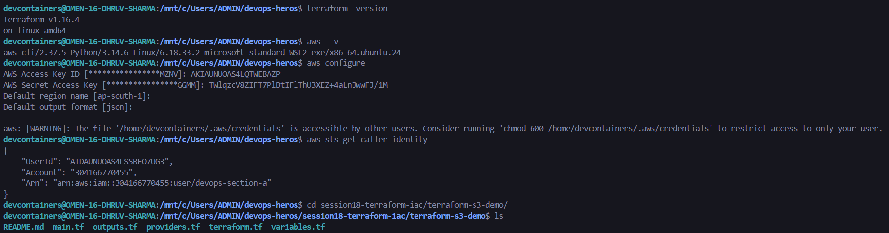

> [!NOTE]
> **[RELEVANT EXTRA INFO]**: `aws sts get-caller-identity` is the single best pre-flight check in cloud engineering. It queries the AWS Security Token Service (STS) to confirm valid credentials without performing any billable or state-altering API call.

---

#### Step 2: Initialization, Code Formatting & Validation
- **Commands:**
  ```bash
  terraform init
  terraform fmt
  terraform validate
  ```
- **Explanation:**
  - `terraform init`: Reads root configuration, downloads the AWS provider plugin (`hashicorp/aws v6.66.0`), and writes cryptographic checksums to `.terraform.lock.hcl`.
  - `terraform fmt`: Automatically reformats all `.tf` files to follow HashiCorp canonical styling conventions.
  - `terraform validate`: Verifies syntax, attribute names, variable types, and internal consistency without reaching out to cloud APIs.

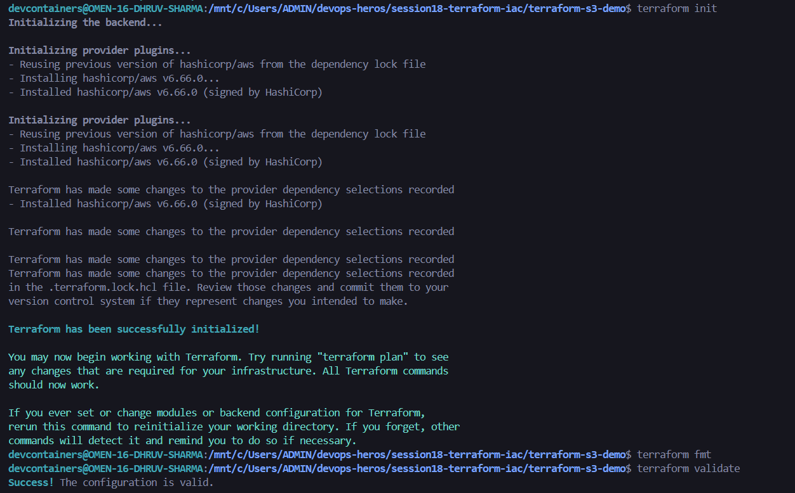

> [!TIP]
> **[CLI EXPLANATION]**: Run `terraform validate` inside your pre-commit hooks and CI/CD pipelines. It catches misspellings, undeclared variables, and syntax errors in milliseconds.

---

#### Step 3: Terraform Execution Plan
- **Command:**
  ```bash
  terraform plan
  ```
- **Explanation:**
  - Compares the desired state described in `.tf` files against the current state (empty at this point).
  - Determines the exact deltas needed: `aws_s3_bucket.spirits5510` will be created with `bucket = "spirits5510"`, `force_destroy = true`, and appropriate tags.
  - Output summary: `Plan: 1 to add, 0 to change, 0 to destroy.`

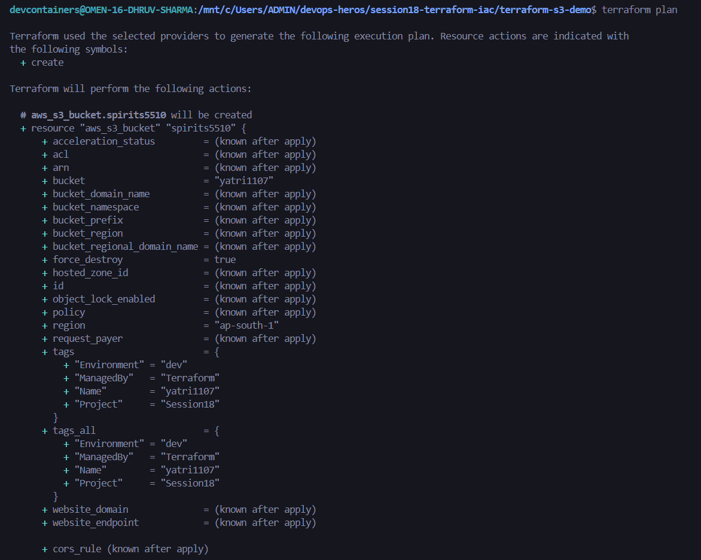
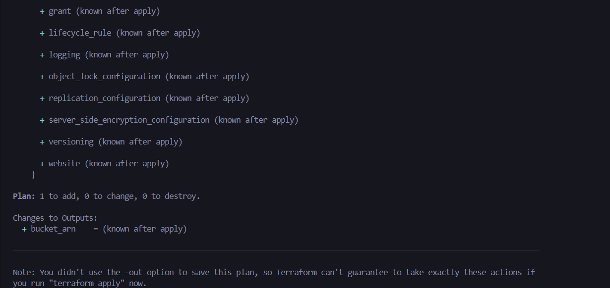

---

#### Step 4: Infrastructure Provisioning (Apply)
- **Command:**
  ```bash
  terraform apply
  ```
- **Explanation:**
  - Requests confirmation: `Do you want to perform these actions? Only 'yes' will be accepted to approve.`
  - Upon typing `yes`, Terraform makes authenticated REST API calls to the AWS S3 endpoint (`s3:CreateBucket`, `s3:PutBucketTagging`).
  - Result: `aws_s3_bucket.spirits5510: Creation complete after 4s [id=spirits5510]`.
  - The outputs (`bucket_arn`, `bucket_name`, `bucket_region`) are rendered in terminal.

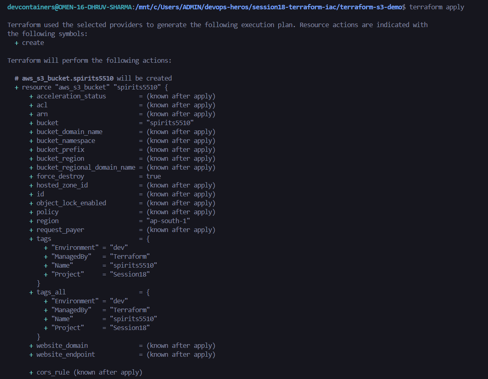
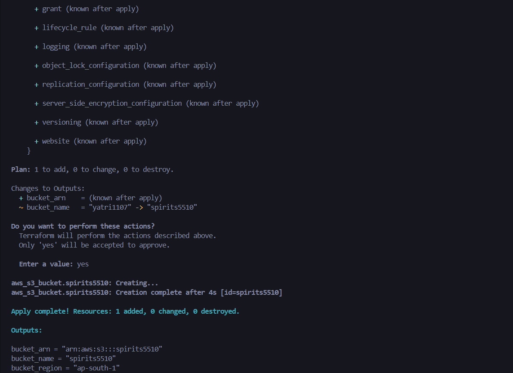

---

#### Step 5: Terraform State Inspection & Outputs
- **Commands:**
  ```bash
  terraform state list
  terraform state show aws_s3_bucket.spirits5510
  terraform output
  ```
- **Explanation:**
  - `terraform state list`: Lists managed resources stored in `terraform.tfstate`.
  - `terraform state show`: Displays every tracked attribute (ARN: `arn:aws:s3:::spirits5510`, domain name: `spirits5510.s3.amazonaws.com`, region: `ap-south-1`, hosted zone ID, encryption algorithms).
  - `terraform output`: Reads output variables directly from state without querying AWS APIs.

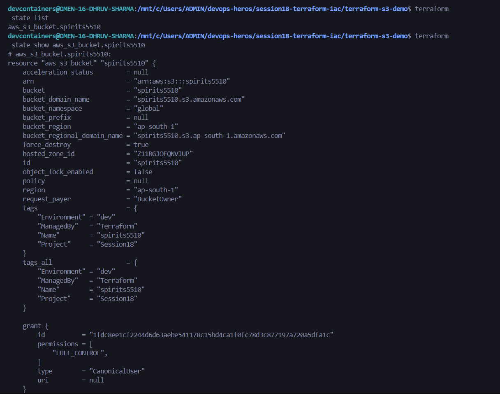
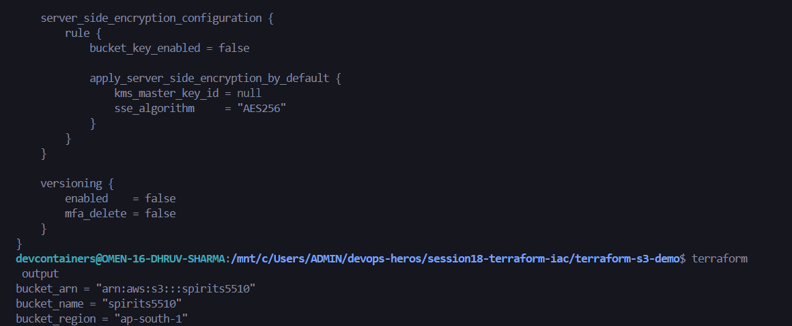

> [!IMPORTANT]
> **[PRODUCTION REAL-WORLD GOTCHA]**: Never edit `terraform.tfstate` by hand. Always use `terraform state` commands (`show`, `mv`, `rm`) to safely query and modify state metadata without causing state corruption.

---

#### Step 6: Live Cloud Verification via AWS CLI
- **Command:**
  ```bash
  aws s3 ls
  ```
- **Explanation:**
  - Directly queries the AWS S3 control plane to confirm the bucket was created in the cloud.
  - The bucket `spirits5510` appears in the list alongside other active buckets in the account.

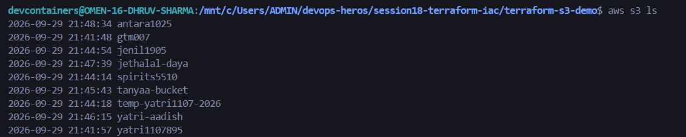

---

#### Step 7: Pre-Destruction Planning
- **Command:**
  ```bash
  terraform plan -destroy
  ```
- **Explanation:**
  - Generates a speculative destruction plan showing exactly which resources will be purged.
  - Output summary: `Plan: 0 to add, 0 to change, 1 to destroy.`


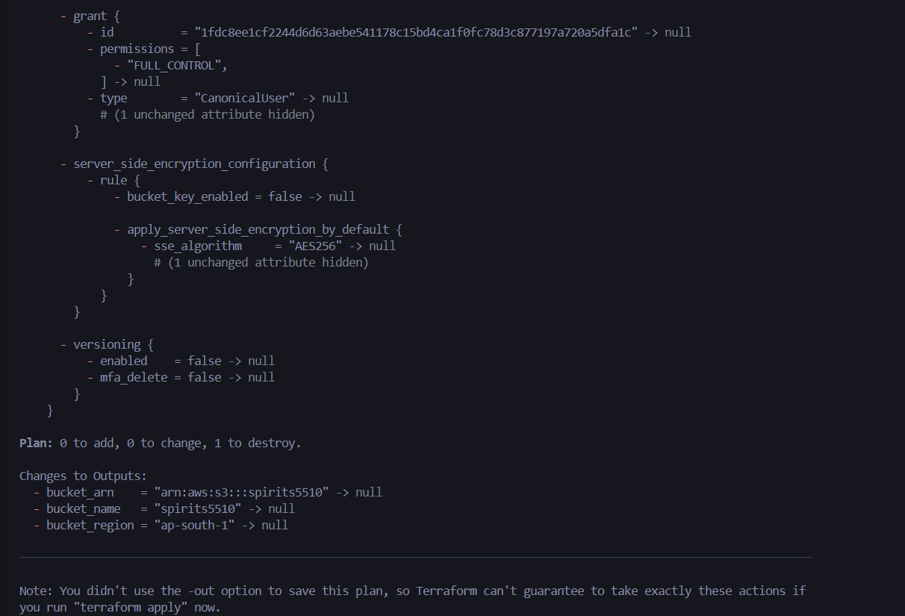

---

#### Step 8: Infrastructure Teardown & Destruction
- **Command:**
  ```bash
  terraform destroy
  ```
- **Explanation:**
  - Interactive safety confirmation: `Do you really want to destroy all resources? There is no undo. Only 'yes' will be accepted to confirm.`
  - Upon entering `yes`, Terraform calls the AWS S3 deletion APIs: `aws_s3_bucket.spirits5510: Destroying...` -> `Destruction complete after 1s`.
  - Result: `Destroy complete! Resources: 1 destroyed.`
  - State file is cleanly updated to reflect 0 active resources.

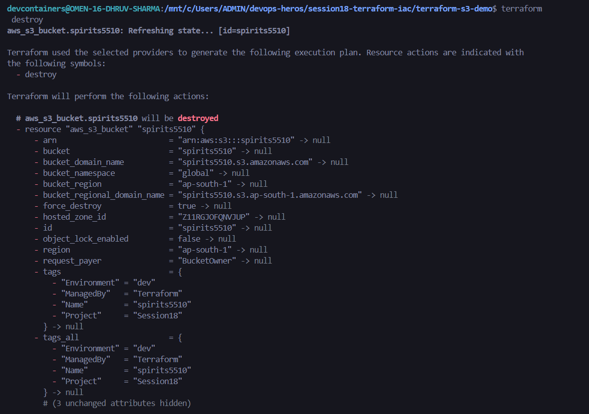
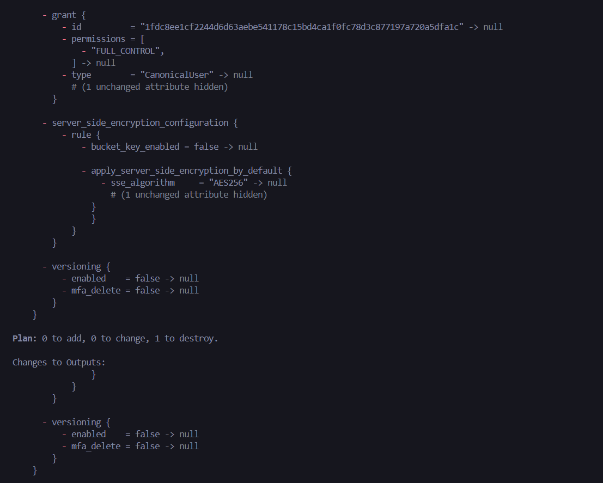
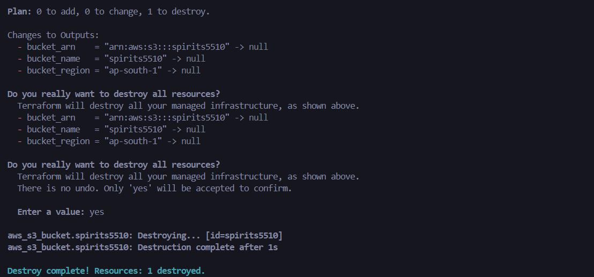

---

### 2.4 Terraform Lifecycle Flow & State Management

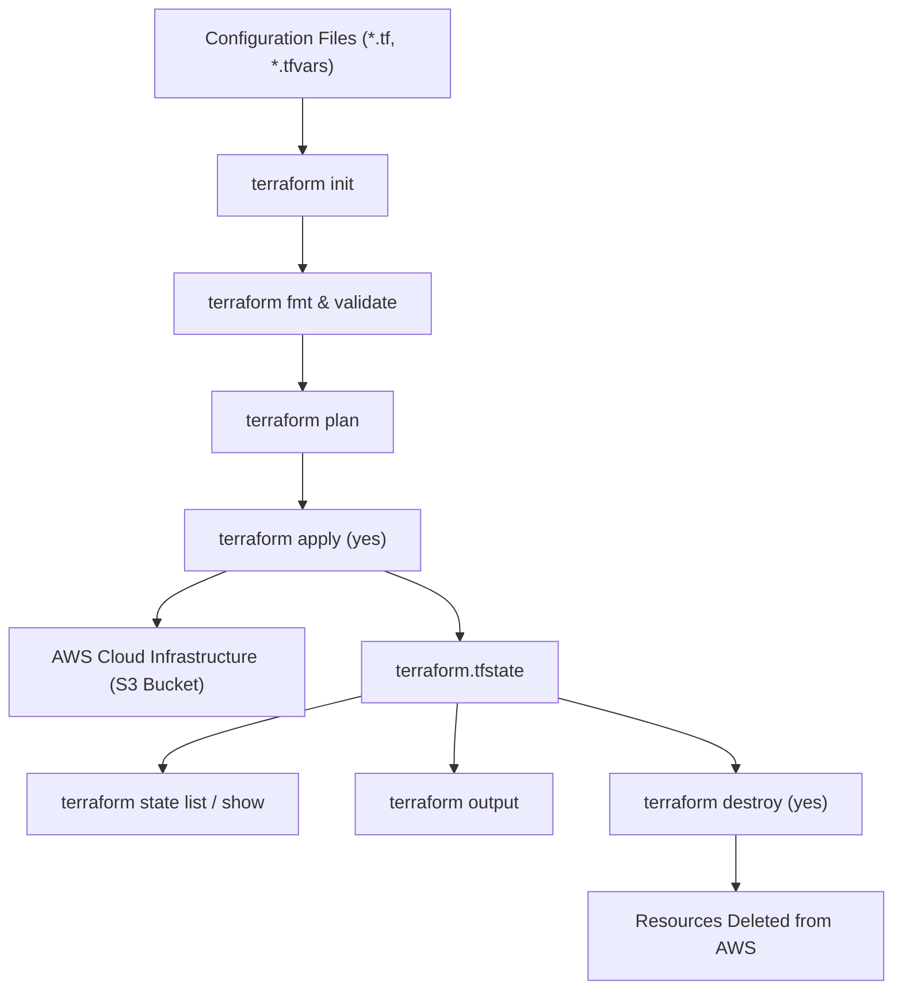

#### What is `terraform.tfstate`?
Terraform stores state about your managed infrastructure and configuration in a JSON file named `terraform.tfstate`.
- **Purpose**: Maps real-world cloud resources to your configuration files, tracks resource metadata, and caches attributes to improve performance.
- **Production Best Practice**: In production, never keep `terraform.tfstate` on a developer workstation. Use an **S3 Remote Backend** with server-side encryption and an **AWS DynamoDB table** for distributed state locking to prevent concurrent runs from overwriting state.

---

## Task 2: Comprehensive AWS Core Services Research

As required by the assignment guidelines, detailed standalone reference guides have been authored for each core AWS domain under the `aws-services/` directory:

| Service | Category | Dedicated Guide Link | Key Concepts Covered |
| :--- | :--- | :--- | :--- |
| **IAM** | Governance & Identity | [aws-services/01-iam/README.md](file:///c:/Users/ADMIN/devops-heros/session18-terraform-iac/aws-services/01-iam/README.md) | Users, Groups, Roles, Policies, Principle of Least Privilege, MFA, STS |
| **EC2** | Elastic Compute | [aws-services/02-ec2/README.md](file:///c:/Users/ADMIN/devops-heros/session18-terraform-iac/aws-services/02-ec2/README.md) | AMIs, Instance Types, Key Pairs, Security Groups, EBS, Public/Private IPs, Lifecycle |
| **S3** | Object Storage | [aws-services/03-s3/README.md](file:///c:/Users/ADMIN/devops-heros/session18-terraform-iac/aws-services/03-s3/README.md) | Buckets, Objects, Storage Classes, Versioning, Lifecycle Policies, SSE-S3/KMS Encryption, Bucket Policies |
| **VPC** | Cloud Networking | [aws-services/04-vpc/README.md](file:///c:/Users/ADMIN/devops-heros/session18-terraform-iac/aws-services/04-vpc/README.md) | CIDR blocks, Public/Private Subnets, Route Tables, Internet Gateway, NAT Gateway, NACLs vs SGs |
| **DynamoDB & RDS** | Cloud Databases | [aws-services/05-dynamodb-rds/README.md](file:///c:/Users/ADMIN/devops-heros/session18-terraform-iac/aws-services/05-dynamodb-rds/README.md) | NoSQL vs RDBMS, Tables/Items, Partition/Sort Keys, Multi-AZ, Read Replicas, Point-In-Time Recovery |

---

### 3.1 IAM - Governance & Identity Security
**AWS Identity and Access Management (IAM)** is a global web service that controls authentication and authorization across all AWS API endpoints.

```text
                  +--------------------------------+
                  |         IAM Principal          |
                  | (User / Role / Federated / OIDC)|
                  +--------------------------------+
                                  |
                                  v
                  +--------------------------------+
                  |    Policy Evaluation Engine    |
                  |  Explicit Deny > Explicit Allow |
                  +--------------------------------+
                                  |
                   +--------------+--------------+
                   |                             |
                   v                             v
           [ Allow Access ]               [ Deny Access ]
           (e.g., s3:PutObject)           (Default Deny)
```

- **Users**: Represents an individual person or dedicated service requiring permanent credentials (console password or CLI access key).
- **Groups**: A logical collection of users used to attach policies en masse (groups cannot be nested).
- **Roles**: An identity with temporary credentials generated on-demand by AWS STS (used by EC2 instance profiles, Lambda execution, and GitHub Actions OIDC).
- **Policies**: JSON documents defining permissions. Contains statements with `Effect`, `Principal`, `Action`, `Resource`, and optional `Condition`.
- **Principle of Least Privilege**: Granting only the bare minimum actions and resources required to accomplish a given task.
- **IAM Best Practices**:
  1. Enforce MFA across all interactive users.
  2. Rotate access keys every 90 days.
  3. Never attach policies directly to individual users; attach to groups or use roles.
  4. Lock down the root user; delete root access keys immediately.

> [!TIP]
> **[CLI EXPLANATION]**:
> Check current identity: `aws sts get-caller-identity`
> List attached policies: `aws iam list-attached-user-policies --user-name devops-engineer`

---

### 3.2 EC2 - Elastic Compute Cloud
**Amazon EC2** delivers scalable, on-demand virtual compute servers in the AWS cloud.

- **Amazon Machine Image (AMI)**: Pre-packaged template containing the operating system, packages, and configurations (e.g., Ubuntu 24.04 LTS).
- **Instance Types**: Sized by CPU, memory, storage, and networking capacity:
  - `T/M`: General Purpose (`t3.micro`, `m6i.large`)
  - `C`: Compute Optimized (`c6i.xlarge`)
  - `R`: Memory Optimized (`r6i.2xlarge`)
  - `I/D`: Storage Optimized (`i3.large`)
- **Key Pairs**: Asymmetric public/private key pairs for secure SSH access (`chmod 400 key.pem && ssh -i key.pem ubuntu@<IP>`).
- **Security Groups**: Stateful virtual firewall guarding the instance network interface. Return traffic is automatically allowed.
- **Elastic Block Store (EBS)**: Network-attached, persistent block storage tied to an Availability Zone (volume types: `gp3`, `io2`, `st1`).
- **Public vs Private IPs**:
  - *Public IP*: Dynamically allocated from AWS public pool; lost upon stop/start unless an Elastic IP (EIP) is associated.
  - *Private IP*: Assigned from the VPC subnet CIDR; retained across reboots and instance stop/start cycles.
- **Lifecycle**: `Pending` -> `Running` -> `Stopping` -> `Stopped` -> `Terminated`.

---

### 3.3 S3 - Simple Storage Service
**Amazon S3** is an object storage service engineered for 99.999999999% (11 9's) durability.

- **Buckets**: Top-level containers with globally unique DNS names created in specific regions.
- **Objects**: Flat files comprising a unique Key, binary Value (up to 5TB), Version ID, and metadata.
- **Storage Classes**:
  - `S3 Standard`: High throughput, frequent access.
  - `S3 Intelligent-Tiering`: Auto-moves objects between tiers based on changing access patterns.
  - `S3 Standard-IA / One Zone-IA`: Lower storage cost, per-GB retrieval fees for infrequent access.
  - `S3 Glacier (Instant, Flexible, Deep Archive)`: Ultra low-cost long-term archival storage.
- **Versioning**: Preserves past versions of objects; protects against accidental deletion using Delete Markers.
- **Lifecycle Policies**: Automates transitions between storage tiers (e.g., transition to Glacier after 90 days) and automated expirations.
- **Encryption**:
  - *SSE-S3*: Default AES-256 managed keys.
  - *SSE-KMS*: Customer-managed keys in AWS KMS with CloudTrail audit trails.
  - *SSE-C*: Client-provided encryption keys.
- **Bucket Policies**: Resource-based JSON policies attached to the bucket to restrict access by IP, enforce HTTPS (TLS), or grant cross-account access.

---

### 3.4 VPC - Virtual Private Cloud Networking
**Amazon VPC** is a logically isolated virtual network dedicated to your AWS account.

- **CIDR Blocks**: Classless Inter-Domain Routing range (e.g., `10.0.0.0/16` provides 65,536 private IPs).
- **Subnets**: Subdivisions of the VPC allocated to specific Availability Zones:
  - *Public Subnet*: Route table directs `0.0.0.0/0` to an **Internet Gateway (IGW)**.
  - *Private Subnet*: No route to an IGW. Outbound internet access goes through a **NAT Gateway** in a public subnet.
- **Route Tables**: Routing rules directing network packets to local VPC endpoints, IGWs, NAT Gateways, or peering connections.
- **Security Groups vs Network ACLs**:
  - *Security Group*: Stateful, instance level, allow rules only.
  - *NACL*: Stateless, subnet boundary level, sequential allow and deny rules.

```text
+--------------------------------------------------------------------------+
| VPC: 10.0.0.0/16                                                         |
|  +-----------------------------+       +------------------------------+  |
|  | Public Subnet (10.0.1.0/24) |       | Private Subnet (10.0.2.0/24) |  |
|  | [Internet Gateway Route]    |       | [NAT Gateway Route]          |  |
|  |   - ALB / Bastion           |       |   - App Servers / RDS DB     |  |
|  +-----------------------------+       +------------------------------+  |
+--------------------------------------------------------------------------+
```

---

### 3.5 DynamoDB & RDS - Cloud Database Services

```text
+------------------------------------+------------------------------------+
|       Amazon DynamoDB (NoSQL)      |          Amazon RDS (SQL)          |
+------------------------------------+------------------------------------+
| - Key-Value & Document model       | - Relational (MySQL, Postgres, etc)|
| - Schemaless items up to 400KB     | - Rigid table schema & foreign keys|
| - Horizontal auto-partitioning     | - Vertical scaling + Read Replicas |
| - Single-digit ms latency at scale | - Complex JOINs & ACID transactions|
| - Primary Key: HASH or HASH+RANGE  | - Primary Key: Relational indexing |
| - Ideal for state locks & sessions | - Ideal for ERP, CRM & e-commerce  |
+------------------------------------+------------------------------------+
```

- **Amazon DynamoDB**:
  - Fully managed serverless NoSQL database.
  - Primary keys: *Partition Key* (determines physical storage partition) or *Composite Key* (Partition Key + Sort Key).
  - Secondary Indexes: *GSI* (Global Secondary Index) and *LSI* (Local Secondary Index).
  - Frequently utilized in DevOps for **Terraform State Locking**.
- **Amazon RDS**:
  - Managed RDBMS supporting PostgreSQL, MySQL, MariaDB, Oracle, SQL Server, and Amazon Aurora.
  - *Multi-AZ*: Synchronous replication to a standby instance in another AZ with automatic failover (High Availability).
  - *Read Replicas*: Asynchronous read-only instances offloading heavy read traffic.
  - *Backups*: Continuous automated snapshots with Point-in-Time Recovery (PITR) down to the second.

---

## Deliverables Verification Checklist

| Requirement | Artifact / Path | Status |
| :--- | :--- | :---: |
| Terraform S3 Project Root | [terraform-s3-demo/](file:///c:/Users/ADMIN/devops-heros/session18-terraform-iac/terraform-s3-demo) | Verified |
| Terraform Manifests | `main.tf`, `variables.tf`, `outputs.tf`, `providers.tf`, `provider.tf`, `terraform.tf`, `terraform.tfvars` | Verified |
| Terraform Complete Workflow README | [terraform-s3-demo/README.md](file:///c:/Users/ADMIN/devops-heros/session18-terraform-iac/terraform-s3-demo/README.md) | Verified |
| AWS Setup & Identity Verification Screenshot | `screenshots/terraform_aws_installation_&_configuration.png` | Verified |
| Terraform Init, Fmt, Validate Screenshot | `screenshots/terraform_init_fmt_validate.png` | Verified |
| Terraform Plan Screenshots | `screenshots/terraform_plan_1.png`, `screenshots/terraform_plan_2.png` | Verified |
| Terraform Apply Screenshots | `screenshots/terraform_apply_1.png`, `screenshots/terraform_apply_2.png` | Verified |
| Terraform State Inspection Screenshots | `screenshots/terraform_state_list_&_show.png`, `screenshots/terraform_state_show-2_&_output.png` | Verified |
| Live AWS S3 Cloud Verification Screenshot | `screenshots/aws_s3_ls.png` | Verified |
| Terraform Plan-Destroy Screenshots | `screenshots/terraform_plan-destroy_1.png`, `screenshots/terraform_plan-destroy_2.png` | Verified |
| Terraform Destroy Screenshots | `screenshots/terraform_destroy_1.png`, `screenshots/terraform_destroy_2.png`, `screenshots/terraform_destroy_3.png` | Verified |
| AWS IAM Research Deliverable | [aws-services/01-iam/README.md](file:///c:/Users/ADMIN/devops-heros/session18-terraform-iac/aws-services/01-iam/README.md) | Verified |
| AWS EC2 Research Deliverable | [aws-services/02-ec2/README.md](file:///c:/Users/ADMIN/devops-heros/session18-terraform-iac/aws-services/02-ec2/README.md) | Verified |
| AWS S3 Research Deliverable | [aws-services/03-s3/README.md](file:///c:/Users/ADMIN/devops-heros/session18-terraform-iac/aws-services/03-s3/README.md) | Verified |
| AWS VPC Research Deliverable | [aws-services/04-vpc/README.md](file:///c:/Users/ADMIN/devops-heros/session18-terraform-iac/aws-services/04-vpc/README.md) | Verified |
| AWS DynamoDB & RDS Research Deliverable | [aws-services/05-dynamodb-rds/README.md](file:///c:/Users/ADMIN/devops-heros/session18-terraform-iac/aws-services/05-dynamodb-rds/README.md) | Verified |
