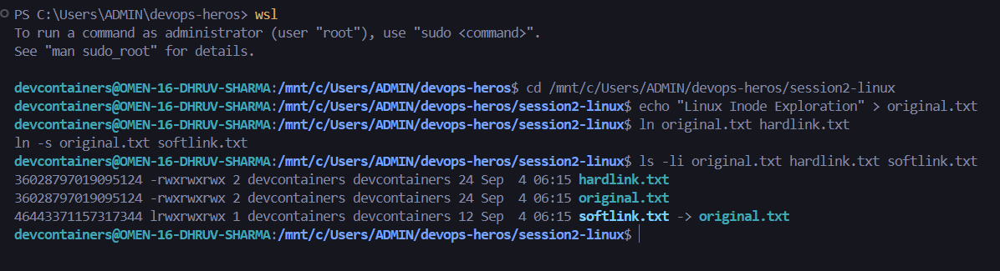
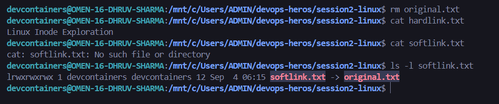
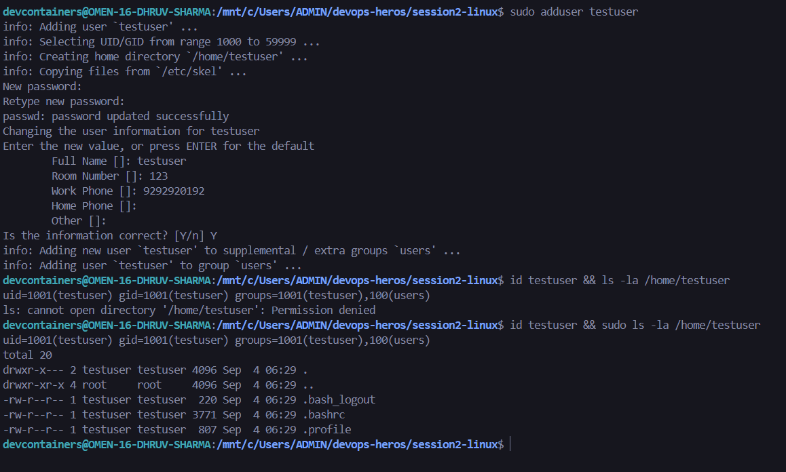
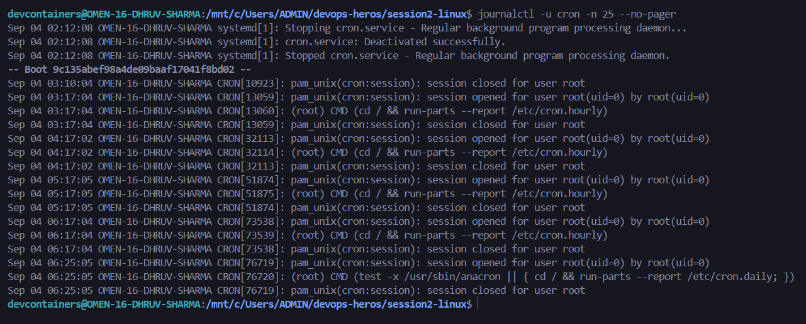

# Session 2: Linux Fundamentals & Administration Homework

## Student Information
- **Name:** Dhruv Sharma
- **Enrollment Number (Roll No):** 24BCS10294

---

## Task 1: Soft Link (Symbolic Link) vs Hard Link

### Concept & Comparison
In Linux, every file is identified by an **Inode** (Index Node), which holds file metadata and disk block pointers.

| Feature | Hard Link (`ln file link`) | Soft Link (`ln -s file link`) |
| :--- | :--- | :--- |
| **Inode Number** | Same inode number as target | Unique, distinct inode number |
| **What it is** | Direct pointer to the inode/data blocks | Shortcut pointer to the target's file path |
| **Cross-Filesystem** | Not supported (same partition only) | Supported (can cross partitions/filesystems) |
| **Link to Directories** | Not allowed | Supported |
| **If Original is Deleted** | Data remains intact via hard link | Link breaks (dangling pointer) |

### 1. Link Creation & Inode Inspection (`ls -li`)

### 2. Behavior Upon Deleting Original File

---

## Task 2: `adduser` vs `useradd`

### Concept & Comparison
| Feature | `useradd` | `adduser` |
| :--- | :--- | :--- |
| **Type** | Native low-level C binary (`/usr/sbin/useradd`) | High-level interactive Perl wrapper (`/usr/sbin/adduser`) |
| **Home Directory** | Does not create `/home/user` by default (requires `-m`) | Automatically creates home directory and sets ownership |
| **Skeleton Files** | Does not copy `/etc/skel` files by default | Automatically copies default profile files (`.bashrc`, etc.) |
| **Default Shell** | Defaults to `/bin/sh` or system default | Sets default login shell to `/bin/bash` |
| **User Interaction** | Non-interactive (script-friendly) | Interactive prompt for password, user info, confirmation |
| **Best Use Case** | Automation scripts & Dockerfiles | System administration on Ubuntu/Debian |

> **Why `adduser` is preferred on Ubuntu:** It automates safe defaults (home directory setup, permissions, skeleton configuration, and password prompts) preventing broken or inaccessible user accounts.

### 3. Creating a Test User with `adduser`

---

## Task 3: System Logging with `journalctl`

### Concept
`journalctl` is the command-line utility for querying logs generated by `systemd-journald`. Unlike traditional flat syslog files (`/var/log/messages`), the systemd journal stores logs in an indexed, binary format, allowing fast filtering by service, boot, time range, and severity level.

### Key Query Commands
- `journalctl -n 20`: View the last 20 log entries.
- `journalctl -u <service>`: View logs for a specific service unit (e.g., `cron`, `ssh`).
- `journalctl -f`: Follow new log entries in real time.
- `journalctl -p err`: Filter logs by severity (Emergency, Alert, Critical, Error).
- `journalctl -b`: View logs since the current system boot.

### 4. Viewing Specific Service Logs (`journalctl -u <service>`)

---

## Task 4: Linux Command Cheat Sheet

> **Course Materials Reference:** For comprehensive deep-dive sheets, refer to [`basic-linux.pdf`](basic-linux.pdf), [`ad-linux.pdf`](ad-linux.pdf), and [`Linux Networking Cheat Sheet.pdf`](Linux%20Networking%20Cheat%20Sheet.pdf).

### Essential Command Matrix

#### 1. File & Directory Navigation
| Command | Purpose | Example |
| :--- | :--- | :--- |
| `ls -lah` | List files with permissions, hidden files, human sizes | `ls -lah /var/log` |
| `mkdir -p` | Create nested directory hierarchy | `mkdir -p /app/logs/prod` |
| `touch` | Create empty file or update timestamp | `touch server.log` |
| `rm -rf` | Recursively and forcefully remove files/folders | `rm -rf ./temp_data` |
| `cp -r` | Recursively copy directories | `cp -r src/ backup/` |
| `mv` | Move or rename files | `mv old.txt new.txt` |
| `ln -s` | Create symbolic link | `ln -s /etc/nginx/nginx.conf nginx.conf` |

#### 2. File Inspection & Searching
| Command | Purpose | Example |
| :--- | :--- | :--- |
| `cat` | Output entire file content to terminal | `cat /etc/os-release` |
| `head` / `tail` | View first or last N lines | `tail -n 50 /var/log/syslog` |
| `tail -f` | Stream file changes in real time | `tail -f app.log` |
| `grep -rn` | Recursively search pattern with line numbers | `grep -rn "ERROR" /var/log/` |
| `find` | Search files by name, type, or size | `find . -name "*.sh" -type f` |

#### 3. Permissions & User Management
| Command | Purpose | Example |
| :--- | :--- | :--- |
| `chmod` | Change file read/write/execute permissions | `chmod 755 script.sh` |
| `chown` | Change file owner and group | `chown -R www-data:www-data /var/www` |
| `adduser` | Interactively create new user with home folder | `sudo adduser devops_user` |
| `passwd` | Update user password | `sudo passwd devops_user` |
| `id` / `whoami`| Display current user ID, group IDs, username | `id` |

#### 4. System Monitoring & Processes
| Command | Purpose | Example |
| :--- | :--- | :--- |
| `df -h` | Display disk partition usage in human units | `df -h` |
| `du -sh` | Display total size of a specific directory | `du -sh /var/log` |
| `free -h` | Display total, used, and free RAM/swap | `free -h` |
| `top` / `htop` | Interactive process & resource monitor | `top` |
| `ps aux` | List all running processes across the system | `ps aux \| grep python` |
| `kill -9` | Forcefully kill process by PID | `kill -9 1234` |

#### 5. Networking & Connectivity
| Command | Purpose | Example |
| :--- | :--- | :--- |
| `ip a` | Display network interfaces and IP addresses | `ip a` |
| `ping -c 4` | Test reachability to an IP or domain | `ping -c 4 google.com` |
| `ss -tulpn` | Display active listening ports and sockets | `ss -tulpn` |
| `curl -I` | Fetch HTTP headers from a web endpoint | `curl -I http://localhost:8080` |
