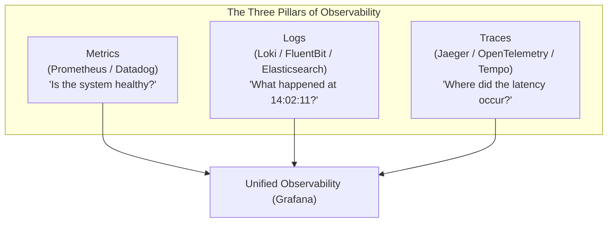
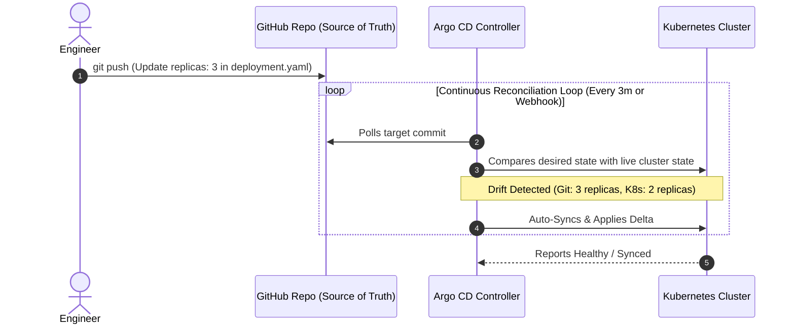
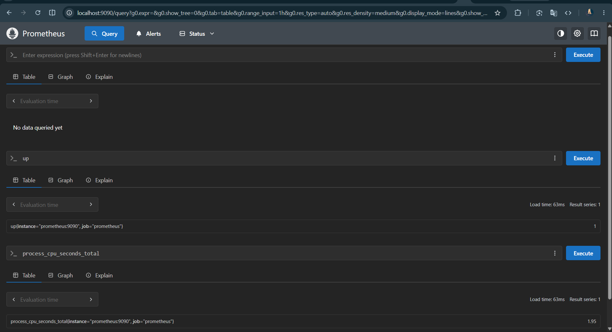
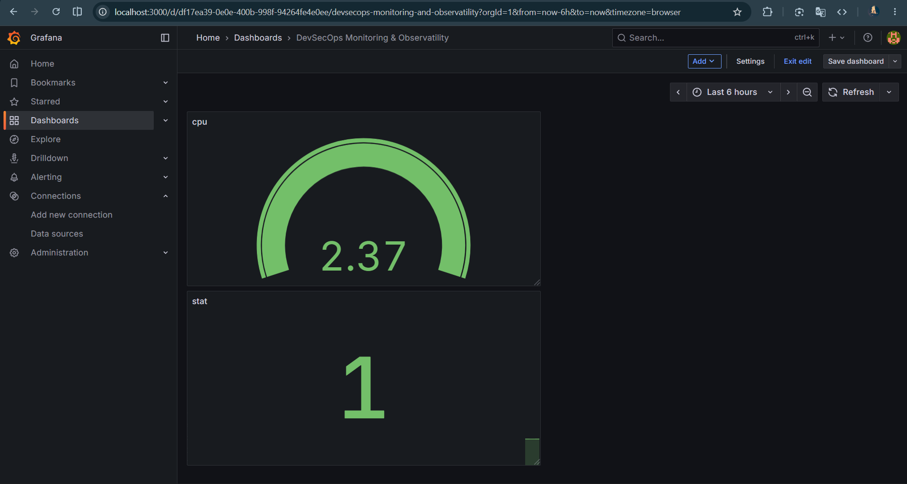
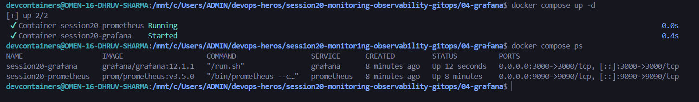

# Session 20: Monitoring, Observability & GitOps - Assignment

## Student Information
- **Name:** Dhruv Sharma
- **Enrollment Number (Roll No):** 24BCS10294
- **Session:** Session 20 - Cloud Native Monitoring, Observability & GitOps Delivery
- **Repository:** `devops-heros/session20-monitoring-observability-gitops`

---

## Table of Contents
1. [Overview & Objectives](#overview--objectives)
2. [Task 1: System & Cluster Monitoring](#task-1-system--cluster-monitoring)
   - [1.1 Core Monitoring Metrics & Alerts](#11-core-monitoring-metrics--alerts)
   - [1.2 Resource Utilization Diagnostics (`kubectl top`)](#12-resource-utilization-diagnostics-kubectl-top)
   - [1.3 Application Health Checking](#13-application-health-checking)
3. [Task 2: Observability & The Three Pillars](#task-2-observability--the-three-pillars)
   - [2.1 The Three Pillars: Metrics, Logs & Traces](#21-the-three-pillars-metrics-logs--traces)
   - [2.2 Why Observability is Essential in Cloud-Native Systems](#22-why-observability-is-essential-in-cloud-native-systems)
   - [2.3 Industry Standard Tooling Ecosystem](#23-industry-standard-tooling-ecosystem)
   - [2.4 Kubernetes Observability Architecture](#24-kubernetes-observability-architecture)
4. [Task 3: GitOps with Argo CD](#task-3-gitops-with-argo-cd)
   - [3.1 What is GitOps?](#31-what-is-gitops)
   - [3.2 Core Principles (Git as Source of Truth & Reconciliation)](#32-core-principles-git-as-source-of-truth--reconciliation)
   - [3.3 Hands-On GitOps Project Implementation (`08-mini-project`)](#33-hands-on-gitops-project-implementation-08-mini-project)
5. [Screenshot Placeholders & Deliverables Checklist](#screenshot-placeholders--deliverables-checklist)

---

## Overview & Objectives
This session bridges infrastructure deployment and Day-2 operations:
1. **Cluster Monitoring**: Measuring CPU, memory, and disk health, with automated threshold alerting.
2. **Full-Stack Observability**: Combining time-series metrics, structured centralized logs, and distributed tracing across microservices.
3. **Continuous Reconciliation with GitOps**: Eliminating configuration drift by deploying Argo CD to automatically synchronize Kubernetes state with Git repositories.

---

## Task 1: System & Cluster Monitoring

### 1.1 Core Monitoring Metrics & Alerts
- **Metrics**: Quantifiable numerical time-series measurements captured at regular intervals (e.g., node CPU percentage, pod memory RSS, HTTP 5xx request rates).
- **Logs**: Discrete timestamped event messages emitted by processes providing granular context during exceptions.
- **Alerts**: Automated notification rules triggered when a metric breaches an operational threshold (e.g., CPU > 85% for 5 minutes triggers a PagerDuty or Slack notification).

### 1.2 Resource Utilization Diagnostics (`kubectl top`)
```bash
# Check node CPU and memory consumption
kubectl top nodes

# Check pod resource consumption across all namespaces
kubectl top pods -A --sort-by=cpu
```

Example Output:
```text
$ kubectl top nodes
NAME                   CPU(cores)   CPU%   MEMORY(bytes)   MEMORY%
devops-control-plane   185m         9%     1420Mi          24%
devops-worker          450m         22%    2310Mi          38%

$ kubectl top pods -n default
NAME                        CPU(cores)   MEMORY(bytes)
web-deploy-6bf4894459-7jkl  25m          48Mi
web-deploy-6bf4894459-m9qp  24m          46Mi
```

---

## Task 2: Observability & The Three Pillars

### 2.1 The Three Pillars: Metrics, Logs & Traces



1. **Metrics**: Aggregated numerical data over time. Low storage overhead; ideal for trend detection and alerting.
2. **Logs**: Detailed text records of events. Essential for post-mortem debugging.
3. **Traces**: Follow a request's end-to-end journey across multiple microservice boundaries, measuring latency spans per service.

### 2.2 Why Observability is Essential
While traditional monitoring asks *"Is the server up?"*, observability asks *"Why did checkout fail for users with coupon codes in region eu-central-1?"*. In ephemeral, dynamic container clusters, observability allows engineers to reconstruct complex cross-service failures without direct SSH access to nodes.

### 2.3 Industry Standard Tooling Ecosystem
- **Metrics**: Prometheus, InfluxDB, VictoriaMetrics.
- **Visualization**: Grafana Dashboards.
- **Log Aggregation**: Promtail + Grafana Loki, Fluent Bit + OpenSearch.
- **Distributed Tracing**: OpenTelemetry (OTel), Jaeger, Grafana Tempo.

---

## Task 3: GitOps with Argo CD

### 3.1 What is GitOps?
**GitOps** is an operating model for cloud-native applications where Git repositories serve as the **single source of truth** for declarative infrastructure and application definitions.

### 3.2 Core Principles
1. **Declarative**: All system state is described declaratively in YAML.
2. **Version Controlled & Immutable**: Every change is committed to Git (`git log` provides an immutable audit trail).
3. **Automatically Pulled**: Software agents pull state from Git; no human or CI runner executes imperative `kubectl apply` commands against the production cluster.
4. **Continuously Reconciled**: Software agents continuously check that the running cluster state matches the target commit. If someone manually edits or deletes a Pod, the agent automatically heals the cluster back to match Git.



---

### 3.3 Hands-On GitOps Project Implementation (`08-mini-project`)
Located in [08-mini-project/](file:///c:/Users/ADMIN/devops-heros/session20-monitoring-observability-gitops/08-mini-project).

#### Argo CD Application Definition (`app/argocd-application.yaml`):
```yaml
apiVersion: argoproj.io/v1alpha1
kind: Application
metadata:
  name: session20-gitops-app
  namespace: argocd
spec:
  project: default
  source:
    repoURL: https://github.com/Spiritsfuse/devops-heros.git
    targetRevision: HEAD
    path: session20-monitoring-observability-gitops/08-mini-project/app
  destination:
    server: https://kubernetes.default.svc
    namespace: session20-app
  syncPolicy:
    automated:
      prune: true
      selfHeal: true
```

#### Hands-On Workflow:
1. **Install Argo CD**:
   ```bash
   kubectl create namespace argocd
   kubectl apply -n argocd -f https://raw.githubusercontent.com/argoproj/argo-cd/stable/manifests/install.yaml
   ```
2. **Deploy Application via GitOps**:
   ```bash
   kubectl apply -f 08-mini-project/app/argocd-application.yaml
   ```
3. **Test Self-Healing / Auto-Reconciliation**:
   ```bash
   # Imperatively delete a pod
   kubectl delete pod -n session20-app -l app=session20-demo
   # Observe Argo CD detecting drift and immediately restoring the pod to maintain desired state
   ```

---

## Screenshot Placeholders & Deliverables Checklist

### Screenshots & Evidences:
1. **Prometheus Query & Metrics Collection**:
   

2. **Grafana Monitoring Dashboard**:
   

3. **Docker Compose Monitoring Stack (`docker compose ps`)**:
   

4. **Argo CD Controller Installation & Cluster Status**:
   
   *(Screenshot showing `kubectl get pods -n argocd` or Argo CD UI)*

5. **Argo CD Application Synced & Healthy**:
   
   *(Screenshot of Argo CD UI showing application in Synced and Healthy state)*

| Deliverable | Location | Status |
| :--- | :--- | :---: |
| Monitoring & Diagnostics Reference | Task 1 | Verified |
| Observability 3 Pillars Research | Task 2 | Verified |
| GitOps Conceptual & Architectural Guide | Task 3 | Verified |
| Argo CD Application Manifests | [08-mini-project/app/](file:///c:/Users/ADMIN/devops-heros/session20-monitoring-observability-gitops/08-mini-project/app) | Verified |
| Screenshot Placeholders | `screenshots/` | Verified |
