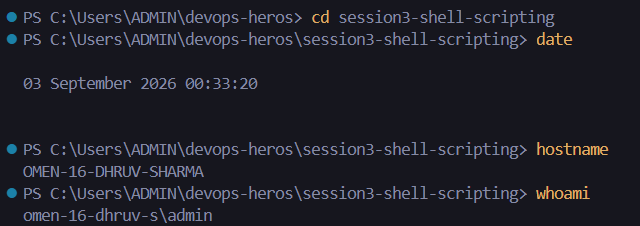
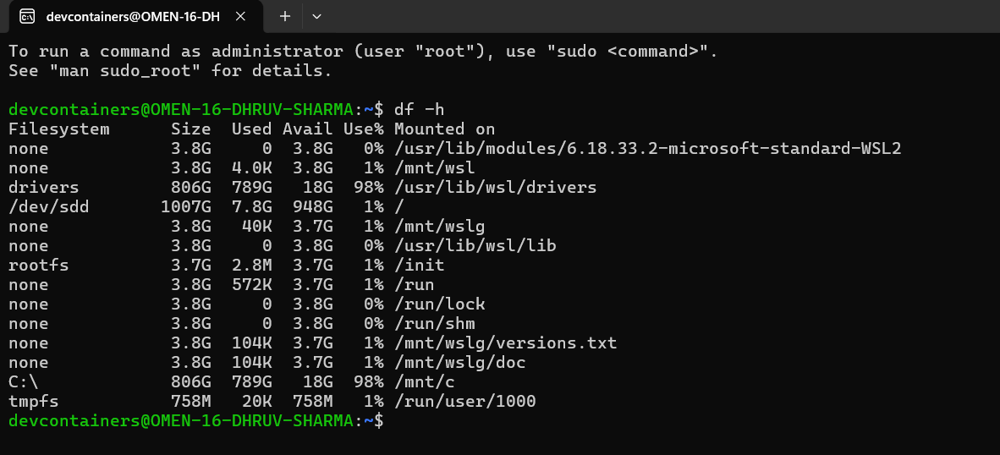
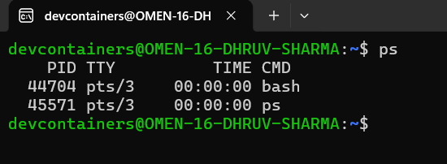
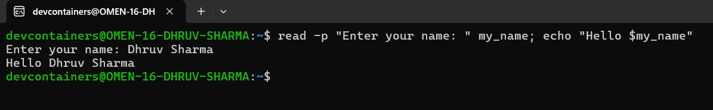
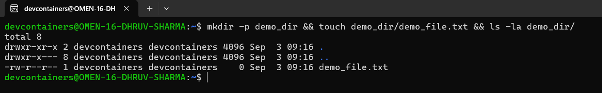
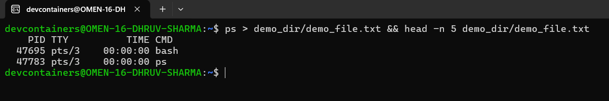
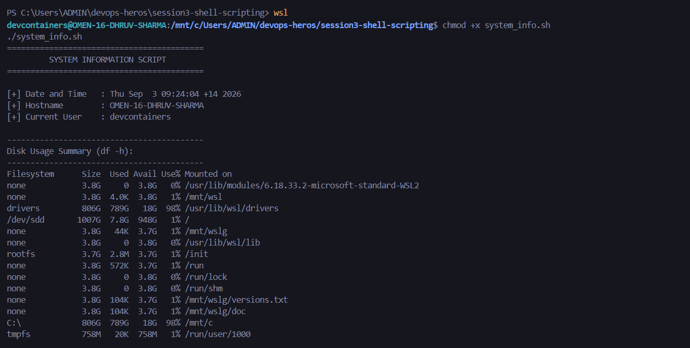
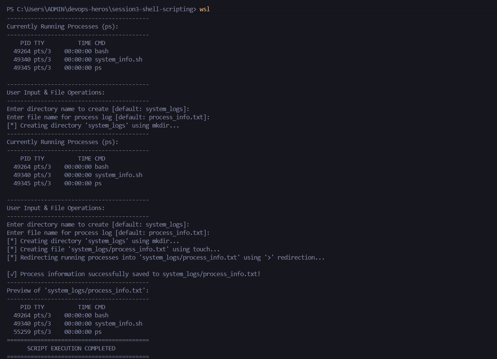

# Session 3 - Shell Scripting: System Information Script

## Task Overview
A shell script designed to collect system metrics, prompt for user input, perform file/directory management, and store running processes using output redirection.

- **Script File:** [`system_info.sh`](system_info.sh)

---

## Command Outputs & Execution

### 1. Print Current Date (`date`), Hostname (`hostname`) and Current User (`whoami`)

### 2. Print Disk Usage (`df -h`)

### 3. Print Running Processes (`ps`)

### 4. User Input (`read -p`) & Variables

### 5. Directory & File Creation (`mkdir` & `touch`)

### 6. Output Redirection (`>`) - Storing Process Info

### 7. Complete Script Execution (`./system_info.sh`)

