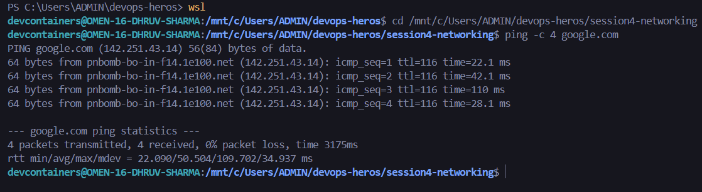
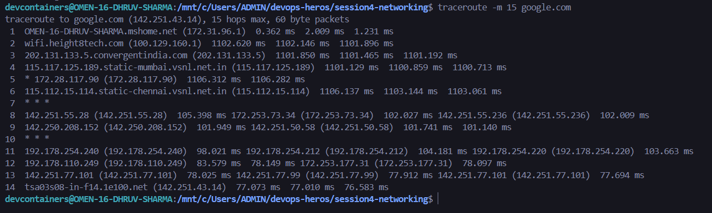
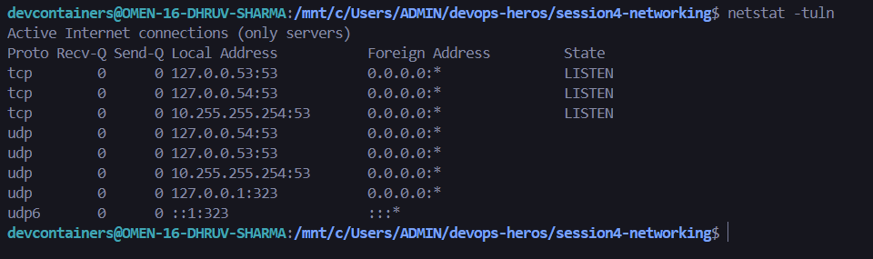
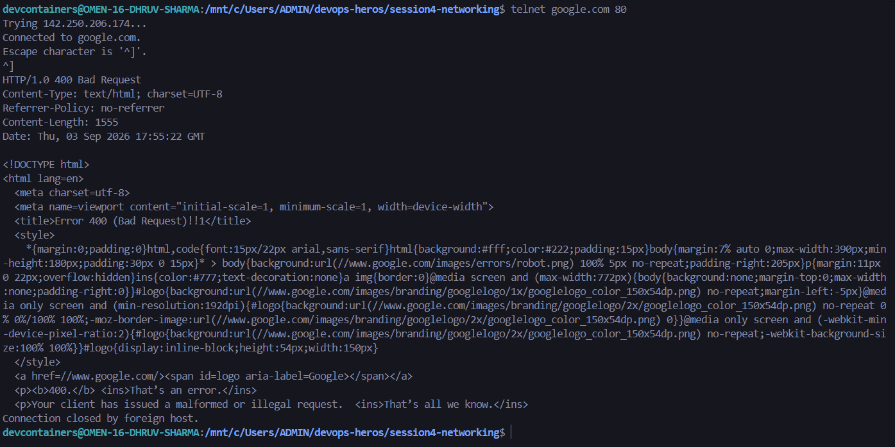
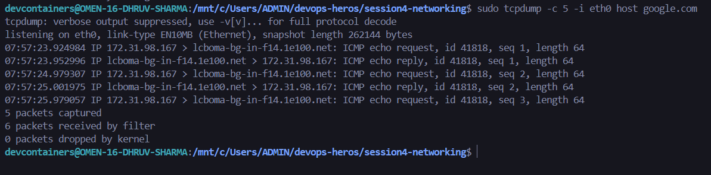
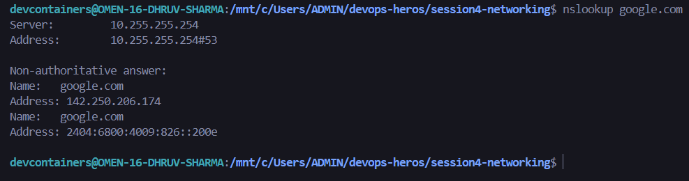
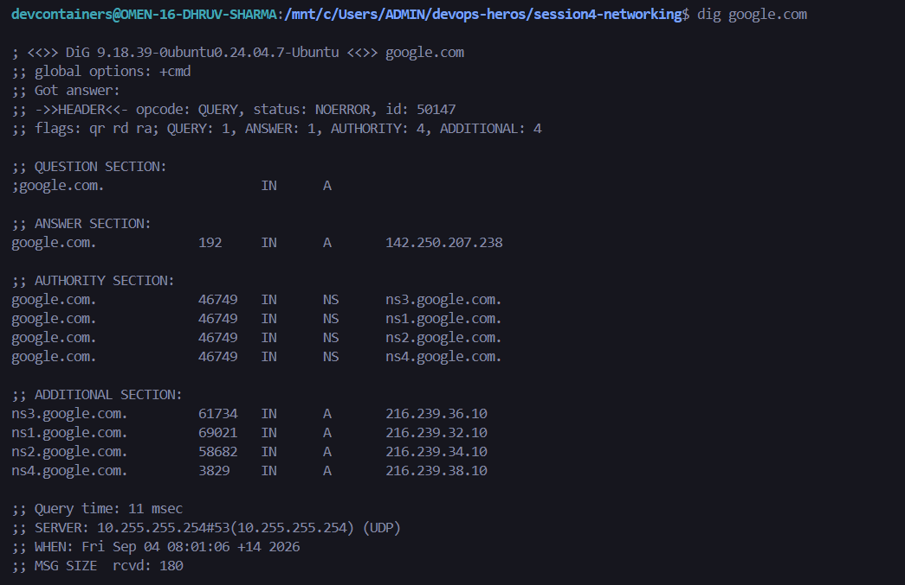
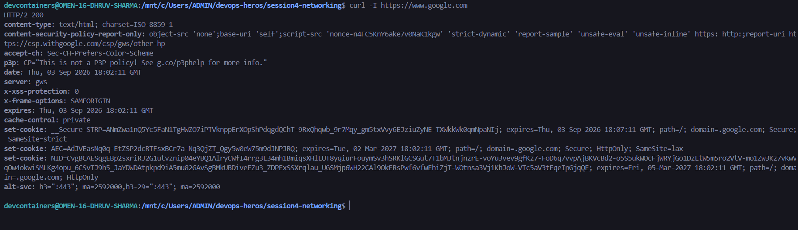
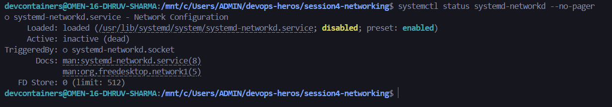

# Session 4: Linux Network Troubleshooting & Diagnostics

## Student Information
- **Name:** Dhruv Sharma
- **Enrollment Number (Roll No):** 24BCS10294

---

## Task Overview
This assignment covers hands-on network diagnosis, routing discovery, DNS resolution, socket inspection, packet analysis, and service status verification using core Linux networking utilities based on the `Network-Troubleshooting` repository.

### Summary Matrix of Troubleshooting Tools

| Tool | Primary Purpose | OSI Layer | Common Scenario |
| :--- | :--- | :---: | :--- |
| `ping` | Test ICMP reachability and round-trip latency | Layer 3 (Network) | Check if target host or gateway is alive |
| `traceroute` | Trace packet routing hops and identify latency bottlenecks | Layer 3 (Network) | Pinpoint failing intermediary router or ISP issue |
| `netstat` | Inspect active network connections and listening ports | Layer 4 (Transport) | Verify local ports and services |
| `telnet` | Test TCP connection to a specific remote port | Layer 4 (Transport) | Check if remote firewall or port is open |
| `tcpdump` | Capture and inspect raw network packets in real time | Layer 2 - 7 | Deep-dive protocol analysis and packet loss |
| `nslookup` | Query DNS records to map domain names to IP addresses | Layer 7 (Application) | Quick DNS resolution checks |
| `dig` | Comprehensive DNS lookup tool with authoritative records | Layer 7 (Application) | Debug DNS TTL, nameservers, and query paths |
| `curl` | Transfer data and inspect HTTP/HTTPS response headers | Layer 7 (Application) | Test web server reachability and status codes |
| `arp` | View and manage Address Resolution Protocol table | Layer 2 (Data Link) | Check local network IP-to-MAC address mapping |
| `systemctl` | Verify status of system networking daemons | System Service | Ensure NetworkManager or networking is active |

---

## Diagnostic Commands Execution & Outputs

### 1. `ping`
**Purpose:** Verifies basic ICMP end-to-end reachability to `google.com` and measures round-trip latency in milliseconds.

```bash
ping -c 4 google.com
```



---

### 2. `traceroute`
**Purpose:** Maps the sequence of network hops that packets traverse between the local machine and `google.com`, helping identify intermediary routing delays or packet drops.

```bash
traceroute -m 15 google.com
```



---

### 3. `netstat`
**Purpose:** Displays active TCP/UDP sockets, listening daemon ports, and established network connections on the local machine.

```bash
netstat -tuln
```



---

### 4. `telnet`
**Purpose:** Establishes a raw TCP handshake to test whether a specific port (e.g., port 80 for HTTP) is open and accepting traffic on the remote server.

```bash
telnet google.com 80
```



---

### 5. `tcpdump`
**Purpose:** Intercepts and captures live packet headers flowing through the network interface to analyze packet arrival, sequence numbers, and handshake flags.

```bash
sudo tcpdump -c 5 -i eth0 host google.com
```



---

### 6. `nslookup`
**Purpose:** Queries the local or upstream recursive DNS resolver to resolve `google.com` into its corresponding IPv4 and IPv6 addresses.

```bash
nslookup google.com
```



---

### 7. `dig` (Domain Information Groper)
**Purpose:** Performs detailed DNS lookups displaying query times, authoritative flags, answer sections, and TTL (Time-To-Live) records.

```bash
dig google.com
```



---

### 8. `curl`
**Purpose:** Tests application-layer HTTP/HTTPS connectivity to `google.com` by retrieving and validating server response headers (`HTTP/2 200 OK`).

```bash
curl -I https://www.google.com
```



---

### 9. `arp`
**Purpose:** Inspects the local Address Resolution Protocol cache mapping neighboring IPv4 addresses to their physical hardware MAC addresses.

```bash
arp -a
```


---

### 10. `systemctl`
**Purpose:** Validates the operational health and active state of core system networking services.

```bash
systemctl status systemd-networkd --no-pager
```


