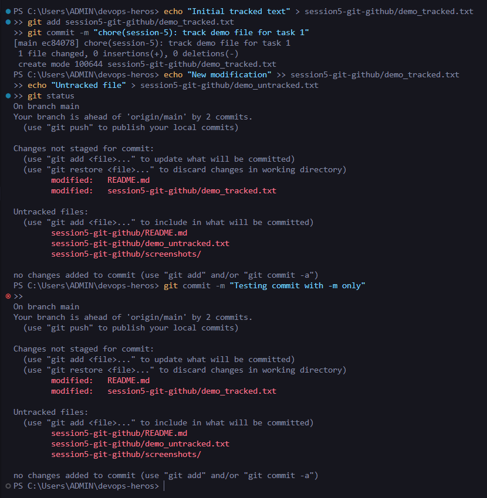
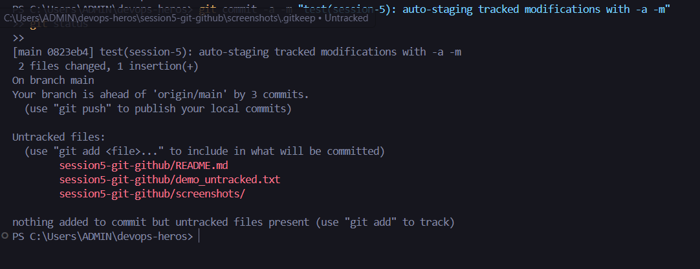
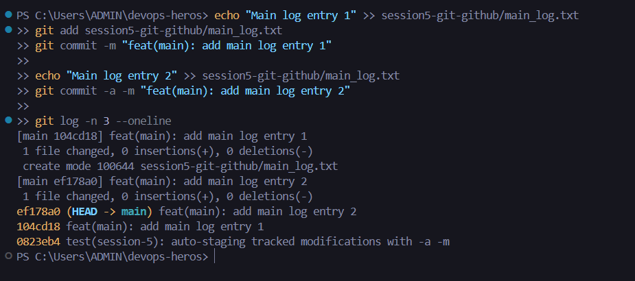
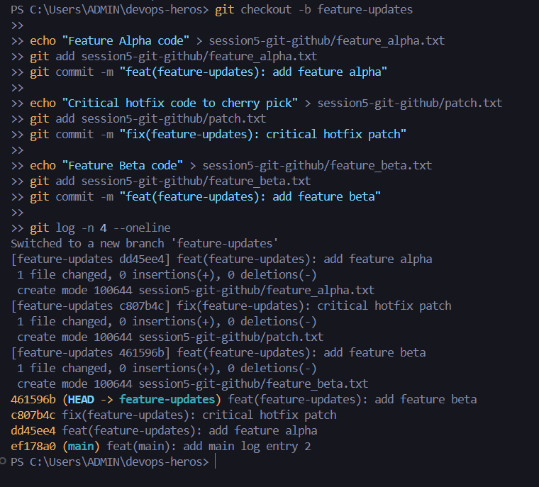
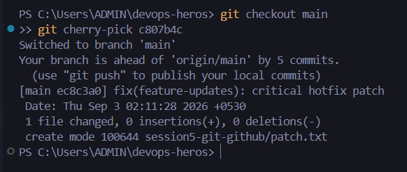
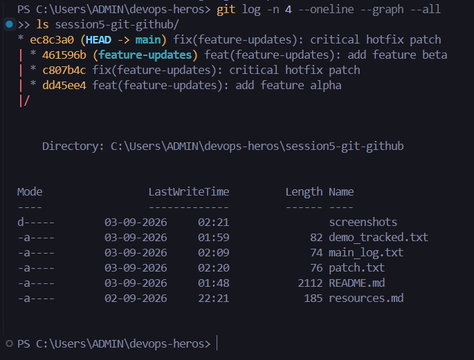

# Session 5 - Git & GitHub Homework Tasks

## Task Overview
This assignment covers advanced day-to-day Git operations divided into two primary tasks:
1. **Task 1: `git commit -a -m` vs `git commit -m`**: Understanding staging mechanics and the distinction between standard commits and auto-staging tracked modifications.
2. **Task 2: Git Cherry-Pick**: Managing cross-branch changes by picking and applying specific commits from a feature branch into the `main` branch.

---

## Task 1: `git commit -a -m` vs `git commit -m`

### Key Differences
| Command | Behavior | What Gets Committed | Handles Untracked Files? |
| :--- | :--- | :--- | :--- |
| `git commit -m` | Commits only files currently staged in the index | Files explicitly staged via `git add` | No |
| `git commit -a -m` | Automatically stages and commits modified/deleted tracked files | All tracked modifications + staged files | No (untracked files require `git add`) |

### 1. Testing `git commit -m` on Unstaged Changes

### 2. Testing `git commit -a -m` (Auto-Staging Tracked Changes)

---

## Task 2: Git Cherry-Pick

### Workflow Summary
- Created commits on the `main` branch and inspected history with `git log`.
- Branched off into a feature branch (`feature-updates`) and created independent commits.
- Identified the target commit hash using `git log --oneline`.
- Cherry-picked the selected commit into `main` using `git cherry-pick <commit-hash>`.
- Verified the commit application on `main` using `git log --oneline --graph --all`.

### 3. Commits on `main` Branch (`git log`)

### 4. Commits on Feature Branch (`git log`)

### 5. Executing `git cherry-pick <commit-hash>` on `main`

### 6. Verification of Cherry-Picked Commit in `main`

