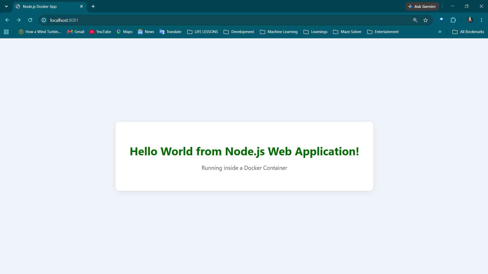
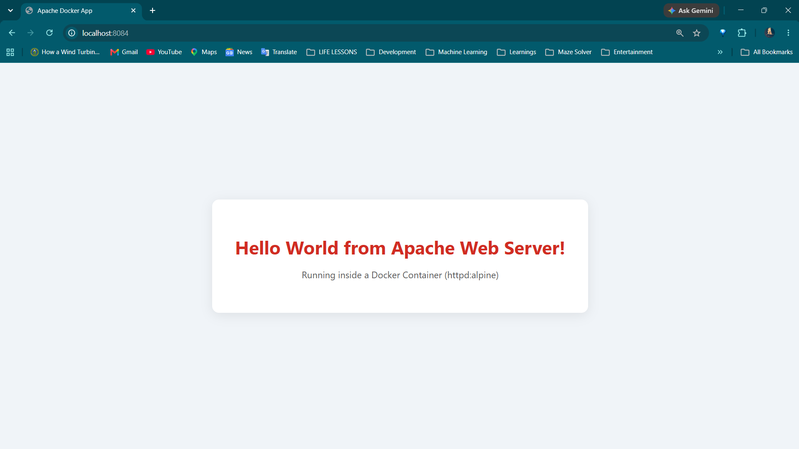
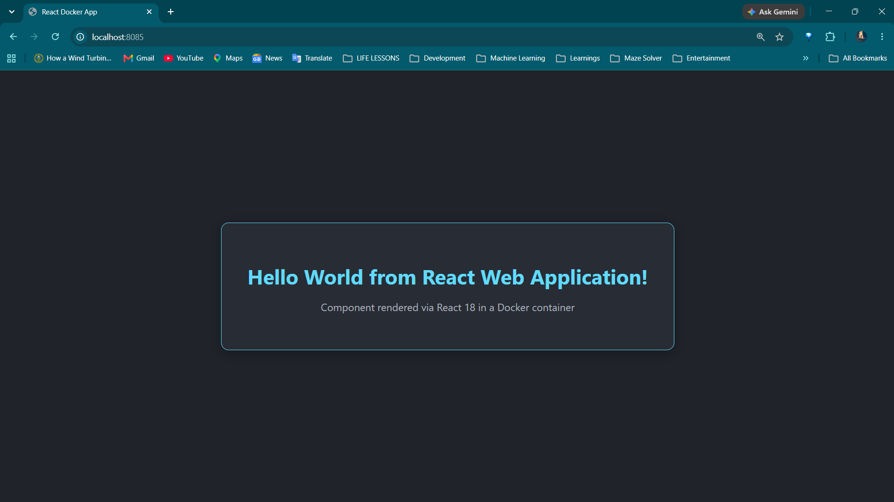
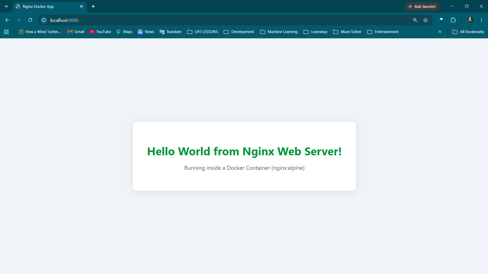

# Session 6: Docker Fundamentals - Hello World Web Applications

## Task Overview
This project demonstrates containerizing web applications across multiple programming languages, runtimes, and web servers using Docker. Each application is isolated with its own `Dockerfile`, built into a lightweight Docker image, and run as a container serving a "Hello World" webpage.

### Applications Summary

| # | Application | Type / Technology | Container Port | Host Port | Folder |
| :-: | :--- | :--- | :-: | :-: | :--- |
| **1** | **Node.js** | JavaScript / Express Web Server | `3000` | `8081` | [`nodejs-app/`](nodejs-app/) |
| **2** | **Python** | Python 3 HTTP Server | `5000` | `8082` | [`python-app/`](python-app/) |
| **3** | **Java** | Java 17 Embedded HTTP Server | `8080` | `8083` | [`java-app/`](java-app/) |
| **4** | **Apache** | Apache HTTP Server (`httpd:alpine`) | `80` | `8084` | [`Apache-app/`](Apache-app/) |
| **5** | **React** | React 18 SPA via Nginx | `80` | `8085` | [`React-app/`](React-app/) |
| **6** | **Nginx** | Nginx High-Performance Web Server | `80` | `8086` | [`nginx-app/`](nginx-app/) |

> **Classwork Reference:** Additional exercises such as multi-stage builds and compose configs are available in [`multi-stage-dockerfile/`](multi-stage-dockerfile/), [`docker-compose-app/`](docker-compose-app/), [`node-app/`](node-app/), and [`nginx-web/`](nginx-web/).

---

## Webpage Verification Screenshots

### 1. Node.js Application (`http://localhost:8081`)

### 2. Python Application (`http://localhost:8082`)

### 3. Java Application (`http://localhost:8083`)

### 4. Apache Web Server (`http://localhost:8084`)

### 5. React Application (`http://localhost:8085`)

### 6. Nginx Web Server (`http://localhost:8086`)

