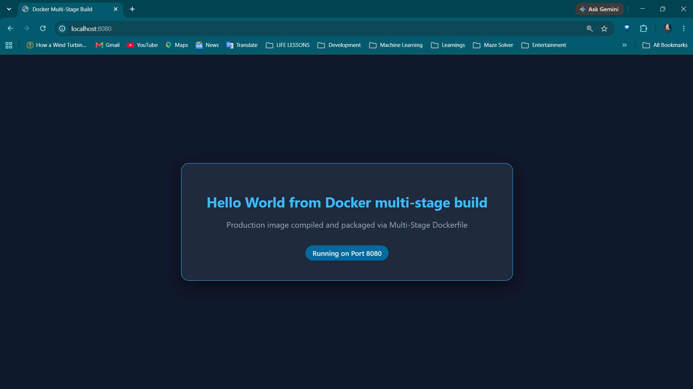
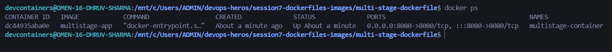
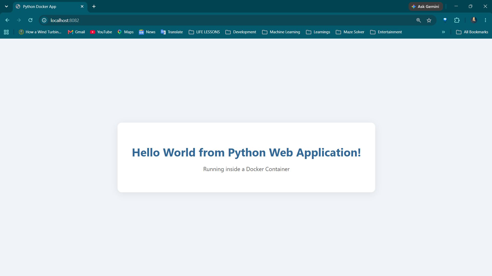
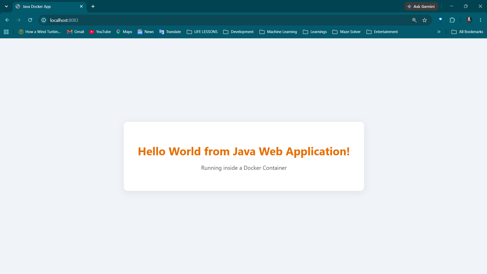

# Session 7: Docker Multi-Stage Build & Application Deployments

## Student Information
- **Name:** Dhruv Sharma
- **Enrollment Number (Roll No):** 24BCS10294

---

## Task 1 & 2: Multi-Stage Dockerfile Execution & Verification

### Overview
A multi-stage Docker build was created to optimize image size and security by separating the build-time environment from the minimal runtime environment.

- **Source Directory:** [`multi-stage-dockerfile/`](multi-stage-dockerfile/)
- **Application Port:** `8080`
- **Output Message:** `Hello World from Docker multi-stage build`

### 1. Application Running in Browser (`http://localhost:8080`)

### 2. `docker ps` Output (Container Running on Port 8080)

---

## Task 3: Docker Application Deployment (3 Different App Types)

### Overview
Deploying applications with Docker involves packaging individual language runtimes, compiling dependencies, binding host ports, and serving live HTTP traffic. Three distinct application architectures were deployed:

| Application Type | Technology Stack | Container Port | Host Port | Source Reference |
| :--- | :--- | :---: | :---: | :--- |
| **Node.js** | Node.js 18 + Express Web Server | `3000` | `8081` | [`../session6-docker-fundamentals/nodejs-app/`](../session6-docker-fundamentals/nodejs-app/) |
| **Python** | Python 3.10 HTTP Server | `5000` | `8082` | [`../session6-docker-fundamentals/python-app/`](../session6-docker-fundamentals/python-app/) |
| **Java** | Java 17 Embedded HTTP Server | `8080` | `8083` | [`../session6-docker-fundamentals/java-app/`](../session6-docker-fundamentals/java-app/) |

### 3. Node.js Application Deployment (`http://localhost:8081`)

### 4. Python Application Deployment (`http://localhost:8082`)

### 5. Java Application Deployment (`http://localhost:8083`)

