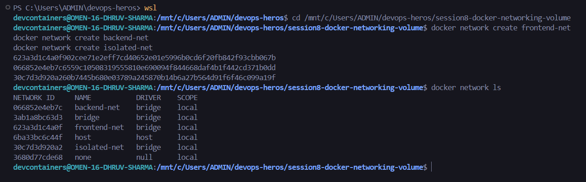
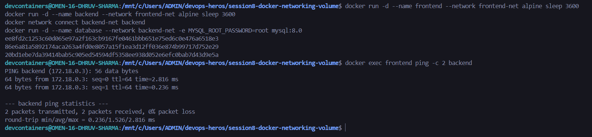
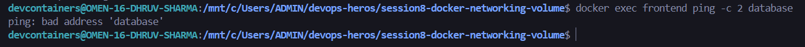
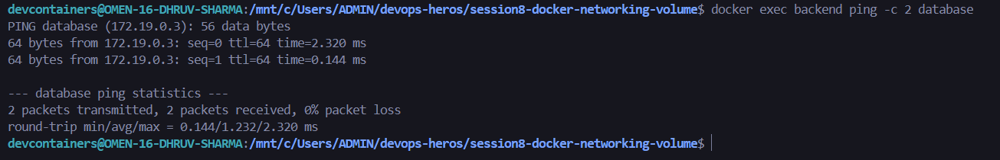
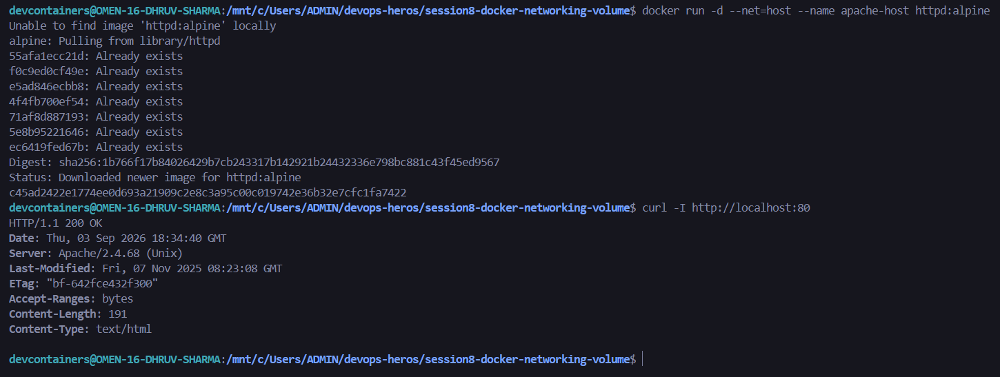
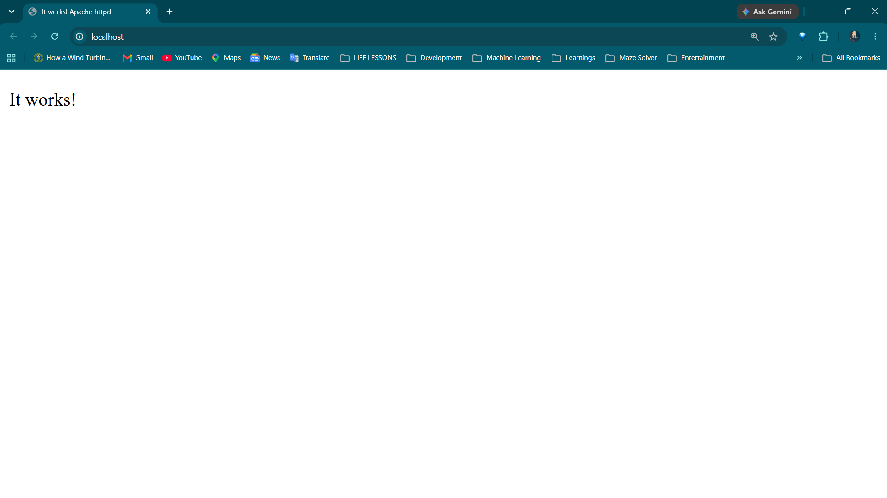
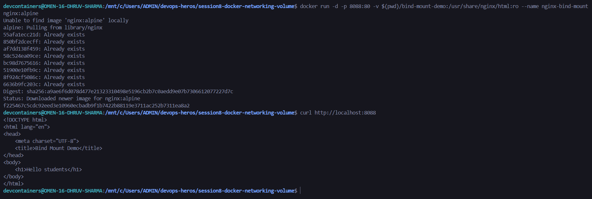
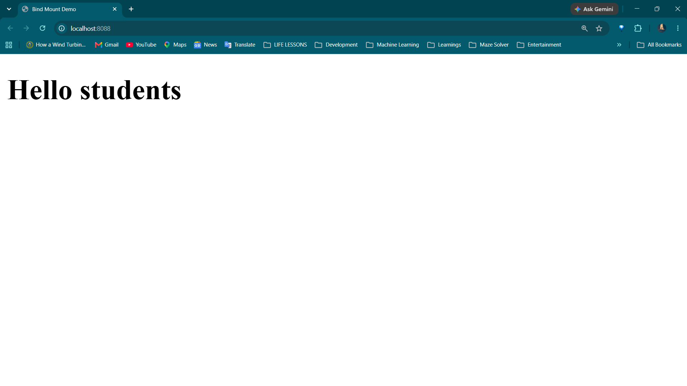
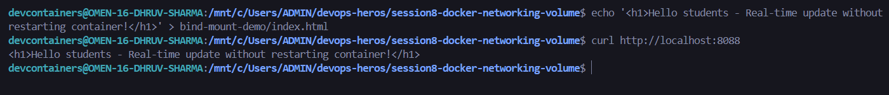
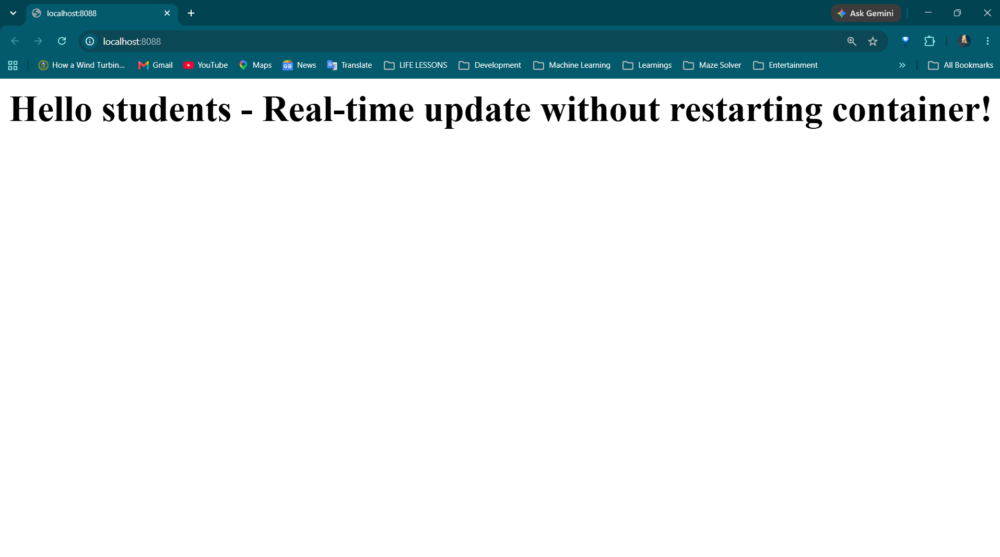

# Session 8: Docker Networking and Volumes - Assignment

## Student Information
- **Name:** Dhruv Sharma
- **Enrollment Number (Roll No):** 24BCS10294
- **Session:** Session 8 - Docker Container Networking and Volumes
- **Repository:** `devops-heros/session8-docker-networking-volume`

---

## Table of Contents
1. [Overview and Objectives](#overview-and-objectives)
2. [Task 1: Docker Container Networking (3-Tier Isolation)](#task-1-docker-container-networking-3-tier-isolation)
   - [1.1 Network Architecture and Topology](#11-network-architecture-and-topology)
   - [1.2 Step-by-Step Commands and Execution](#12-step-by-step-commands-and-execution)
   - [1.3 Connectivity and Isolation Verification](#13-connectivity-and-isolation-verification)
3. [Task 2: Host Network Mode](#task-2-host-network-mode)
   - [2.1 Concept and Architecture](#21-concept-and-architecture)
   - [2.2 Apache on Host Network (Port 80)](#22-apache-on-host-network-port-80)
4. [Task 3: Bind Mounts and Live File Synchronization](#task-3-bind-mounts-and-live-file-synchronization)
   - [3.1 Bind Mount Mechanics](#31-bind-mount-mechanics)
   - [3.2 Real-Time Code Editing Without Container Restart](#32-real-time-code-editing-without-container-restart)
5. [Task 4: Docker Overlay Networks (Research and Theory)](#task-4-docker-overlay-networks-research-and-theory)
   - [4.1 Architecture and Multi-Host Communication](#41-architecture-and-multi-host-communication)
   - [4.2 Core Use Cases and VXLAN Encapsulation](#42-core-use-cases-and-vxlan-encapsulation)
6. [Summary and Deliverables Checklist](#summary-and-deliverables-checklist)

---

## Overview and Objectives
In this session, we practiced core Docker networking paradigms, inter-container communication, network isolation boundaries, host networking, and persistent storage using bind mounts. 

Key learnings include:
1. Creating custom Docker bridge networks for segmented application tiers.
2. Demonstrating network isolation where containers on different networks cannot communicate.
3. Attaching a container to multiple networks to act as a secure gateway/broker.
4. Using host network mode to bypass Docker network namespace overhead.
5. Implementing bind mounts for real-time file updates inside running containers.
6. Researching overlay networks for distributed multi-host container orchestration.

---

## Task 1: Docker Container Networking (3-Tier Isolation)

### 1.1 Network Architecture and Topology
To demonstrate secure multi-tier networking and inter-container isolation:
- **Networks Created:**
  1. `frontend-net` (Bridge network for web tier)
  2. `backend-net` (Bridge network for internal business logic and database)
  3. `isolated-net` (Dedicated auxiliary network)
- **Container Assignments:**
  - `frontend` (Alpine): Attached only to `frontend-net`.
  - `backend` (Alpine): Attached to both `frontend-net` and `backend-net` (acts as the secure routing intermediary).
  - `database` (MySQL 8.0): Attached only to `backend-net`.

### Network Connectivity Matrix

| Source Container | Target Container | Expected Result | Reason |
| :--- | :--- | :---: | :--- |
| `frontend` | `backend` | Connected | Both share `frontend-net` |
| `frontend` | `database` | Blocked / Unreachable | Strict network isolation (no common bridge) |
| `backend` | `database` | Connected | Both share `backend-net` |

### 1.2 Step-by-Step Commands and Execution
```bash
# 1. Create the Docker networks
docker network create --driver bridge frontend-net
docker network create --driver bridge backend-net
docker network create --driver bridge isolated-net

# 2. Launch the database container on backend-net
docker run -d --name database --network backend-net -e MYSQL_ROOT_PASSWORD=secret mysql:8.0

# 3. Launch the backend container on backend-net and connect it to frontend-net
docker run -d --name backend --network backend-net alpine sleep 3600
docker network connect frontend-net backend

# 4. Launch the frontend container on frontend-net
docker run -d --name frontend --network frontend-net alpine sleep 3600
```

### 1.3 Connectivity and Isolation Verification

#### 1. Verification of Created Docker Networks (`docker network ls`)


#### 2. Frontend to Backend Connectivity (`frontend` -> `backend`)
```bash
docker exec -it frontend ping -c 3 backend
```


#### 3. Frontend to Database Isolation (`frontend` -x-> `database`)
```bash
docker exec -it frontend ping -c 3 database
```


#### 4. Backend to Database Connectivity (`backend` -> `database`)
```bash
docker exec -it backend ping -c 3 database
```


---

## Task 2: Host Network Mode

### 2.1 Concept and Architecture
When running a container with `--net=host` (or `--network host`), Docker disables network namespace isolation for that container. The container shares the host machine's network stack directly:
- No `-p` (port publishing) is required or used.
- The container binds directly to the host's network interfaces and ports (e.g., port 80).

### 2.2 Apache on Host Network (Port 80)
```bash
# Pull and run Apache in host network mode
docker pull httpd:latest
docker run -d --name apache-host --network host httpd:latest

# Verify connection locally
curl http://localhost:80
```

#### Apache Running in Host Network Mode (Port 80)



---

## Task 3: Bind Mounts and Live File Synchronization

### 3.1 Bind Mount Mechanics
A **Bind Mount** maps an exact folder or file from the host filesystem directly into the container's virtual filesystem (`-v /host/path:/container/path`). Unlike Docker Volumes which are managed inside Docker's internal storage directory, Bind Mounts allow immediate bi-directional synchronization. Editing files on the host reflects instantly inside the container without rebuilding the image or restarting the service.

### 3.2 Real-Time Code Editing Without Container Restart
```bash
# Create local folder and index.html
mkdir -p ./html
echo "Hello students" > ./html/index.html

# Run Nginx with bind mount
docker run -d --name nginx-bind -p 8080:80 -v "$(pwd)/html:/usr/share/nginx/html:ro" nginx:alpine

# Verify initial page
curl http://localhost:8080

# Modify local index.html on host
echo "Hello DevOps Heroes - Live Update Verified!" > ./html/index.html

# Verify updated content immediately without restarting container
curl http://localhost:8080
```

#### Initial Webpage ("Hello students")



#### Real-Time Modification Without Container Restart



---

## Task 4: Docker Overlay Networks (Research and Theory)

### 4.1 Architecture and Multi-Host Communication
An **Overlay Network** is a distributed software-defined network (SDN) that enables seamless communication between containers running across **multiple physically separated Docker hosts**. While a standard `bridge` network only works within a single host, an overlay network creates a flat virtual subnet that spans the entire cluster.

### 4.2 Core Use Cases and VXLAN Encapsulation
- **Multi-Host Swarm Clusters:** Allows microservices running on Host A to talk directly to databases on Host B using container names (DNS), without exposing host ports to the public internet.
- **Microservices Segmentation:** Encrypted multi-tier communication across cloud instances (AWS EC2, GCP Compute Engine).
- **Zero Host Port Clashes:** Multiple containers on different hosts can listen on internal port 80 or 443 without colliding with the host machine's external ports.
- **VXLAN Encapsulation (Virtual Extensible LAN):** The Linux kernel wraps standard Layer 2 Ethernet frames inside Layer 4 UDP packets (default UDP port `4789`).
- **Data Path:** When Container A on Host 1 sends a packet to Container B on Host 2, the host's VXLAN tunnel endpoint (VTEP) captures the frame, encapsulates it with an outer IP/UDP header, and routes it across the physical network to Host 2. Host 2 strips the outer header and delivers the original frame directly into Container B's network namespace.
- **Control Plane Gossip:** Docker Swarm uses the Gossip protocol on TCP/UDP port `7946` to share node discovery, IP allocations, and internal DNS mappings automatically.
- **Built-in Encryption:** Overlay networks support native IPsec encryption using the `--opt encrypted` flag for secure intra-cluster traffic.

---

## Summary and Deliverables Checklist

| Deliverable | Requirement | Status |
| :--- | :--- | :---: |
| Task 1: 3 Containers & 3 Networks | Frontend, Backend, Database isolated and verified | Completed |
| Task 2: Host Network Apache | Apache running on host port 80 | Completed |
| Task 3: Bind Mount Live Updates | Host file edits reflected without restarting container | Completed |
| Task 4: Overlay Network Documentation | Research on multi-host networking and VXLAN | Completed |
| Screenshots | All 10 screenshots formatted and verified | Completed |
| Identification | Name: Dhruv Sharma, Roll No: 24BCS10294 | Included |
