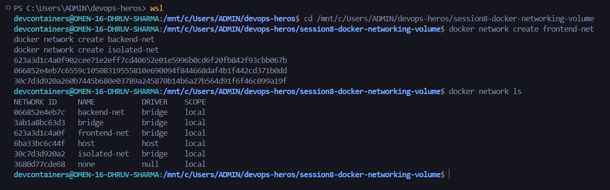
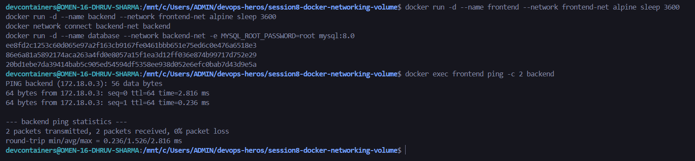
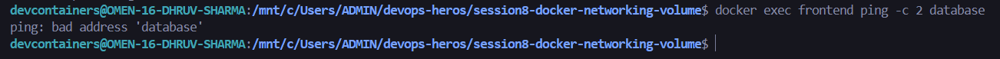
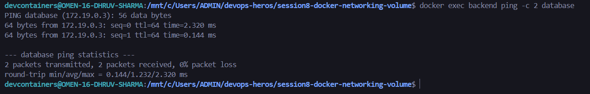
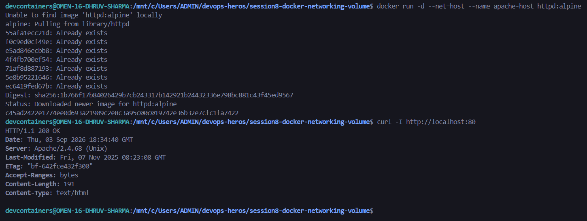
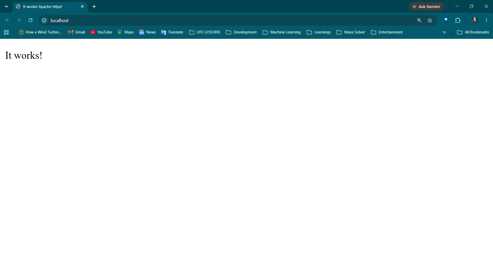
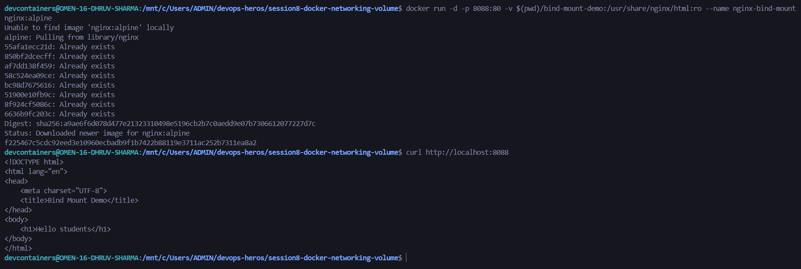
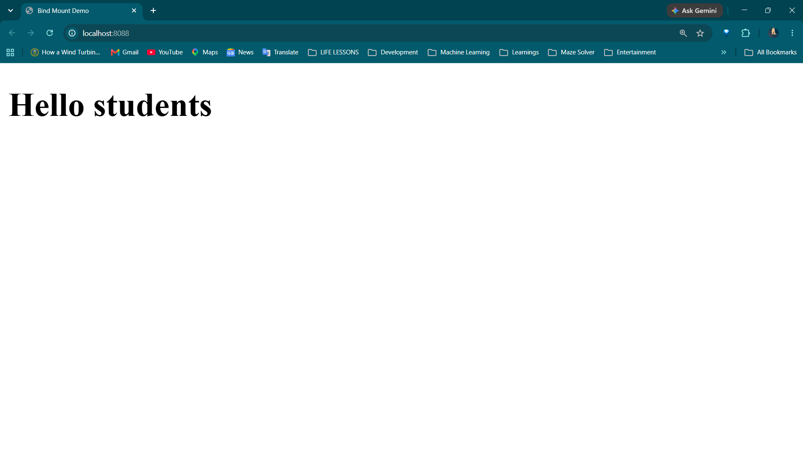
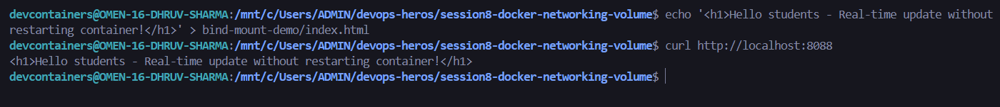
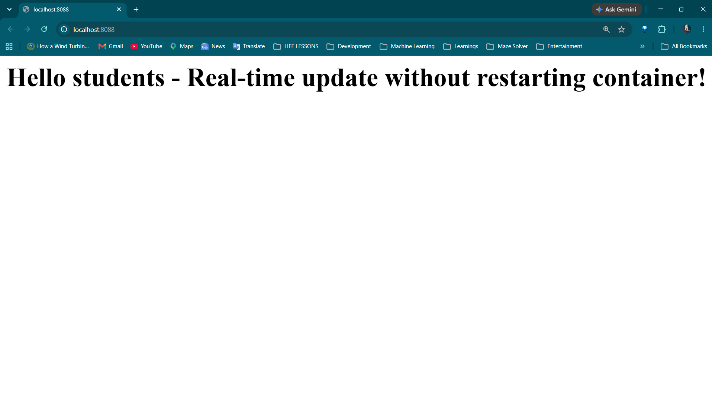

# Session 8: Docker Networking & Volumes Homework

## Student Information
- **Name:** Dhruv Sharma
- **Enrollment Number (Roll No):** 24BCS10294

---

## Task 1: Docker Container Networking (3-Tier Isolation)

### Architecture & Network Topology
To demonstrate secure multi-tier networking and inter-container isolation:
- **Networks Created:**
  1. `frontend-net` (Bridge network for web tier)
  2. `backend-net` (Bridge network for internal business logic & database)
  3. `isolated-net` (Dedicated auxiliary network)
- **Container Assignments:**
  - `frontend` (Alpine): Attached only to `frontend-net`.
  - `backend` (Alpine): Attached to both `frontend-net` and `backend-net` (acts as the secure routing intermediary).
  - `database` (MySQL 8.0): Attached only to `backend-net`.

### Network Connectivity Matrix

| Source Container | Target Container | Expected Result | Reason |
| :--- | :--- | :---: | :--- |
| `frontend` | `backend` | Connected | Both share `frontend-net` |
| `frontend` | `database` | Blocked / Unreachable | Strict network isolation (no common bridge) |
| `backend` | `database` | Connected | Both share `backend-net` |

### 1. Verification of Created Docker Networks (`docker network ls`)

### 2. Frontend to Backend Connectivity (`frontend` -> `backend`)

### 3. Frontend to Database Isolation (`frontend` -x-> `database`)

### 4. Backend to Database Connectivity (`backend` -> `database`)

---

## Task 2: Host Network Mode

### Concept
When running a container with `--net=host` (or `--network host`), Docker disables network namespace isolation for that container. The container shares the host machine's network stack directly:
- No `-p` (port publishing) is required or used.
- The container binds directly to the host's network interfaces and ports (e.g., port 80).

### 5. Apache Running in Host Network Mode (Port 80)

---

## Task 3: Bind Mounts & Live File Synchronization

### Concept
A **Bind Mount** maps an exact folder or file from the host filesystem directly into the container's virtual filesystem (`-v /host/path:/container/path`). Unlike Docker Volumes which are managed inside Docker's internal storage directory, Bind Mounts allow immediate bi-directional synchronization. Editing files on the host reflects instantly inside the container without rebuilding the image or restarting the service.

### 6. Initial Webpage ("Hello students")

### 7. Real-Time Modification Without Container Restart

---

## Task 4: Docker Overlay Networks (Research & Architecture)

### 1. What is an Overlay Network?
An **Overlay Network** is a distributed software-defined network (SDN) that enables seamless communication between containers running across **multiple physically separated Docker hosts**. While a standard `bridge` network only works within a single host, an overlay network creates a flat virtual subnet that spans the entire cluster.

### 2. Core Use Cases
- **Multi-Host Swarm Clusters:** Allows microservices running on Server A to talk directly to databases on Server B using container names (DNS), without exposing host ports to the public internet.
- **Microservices Segmentation:** Encrypted multi-tier communication across cloud instances (AWS EC2, GCP Compute Engine).
- **Zero Host Port Clashes:** Multiple containers on different hosts can listen on internal port 80 or 443 without colliding with the host machine's external ports.

### 3. How Overlay Networks Work Under the Hood
- **VXLAN Encapsulation (Virtual Extensible LAN):** The Linux kernel wraps standard Layer 2 Ethernet frames inside Layer 4 UDP packets (default UDP port `4789`).
- **Data Path:** When Container A on Host 1 sends a packet to Container B on Host 2, the host's VXLAN tunnel endpoint (VTEP) captures the frame, encapsulates it with an outer IP/UDP header, and routes it across the physical network to Host 2. Host 2 strips the outer header and delivers the original frame directly into Container B's network namespace.
- **Control Plane Gossip:** Docker Swarm uses the Gossip protocol on TCP/UDP port `7946` to share node discovery, IP allocations, and internal DNS mappings automatically.
- **Built-in Encryption:** Overlay networks support native IPsec encryption using the `--opt encrypted` flag for secure intra-cluster traffic.
