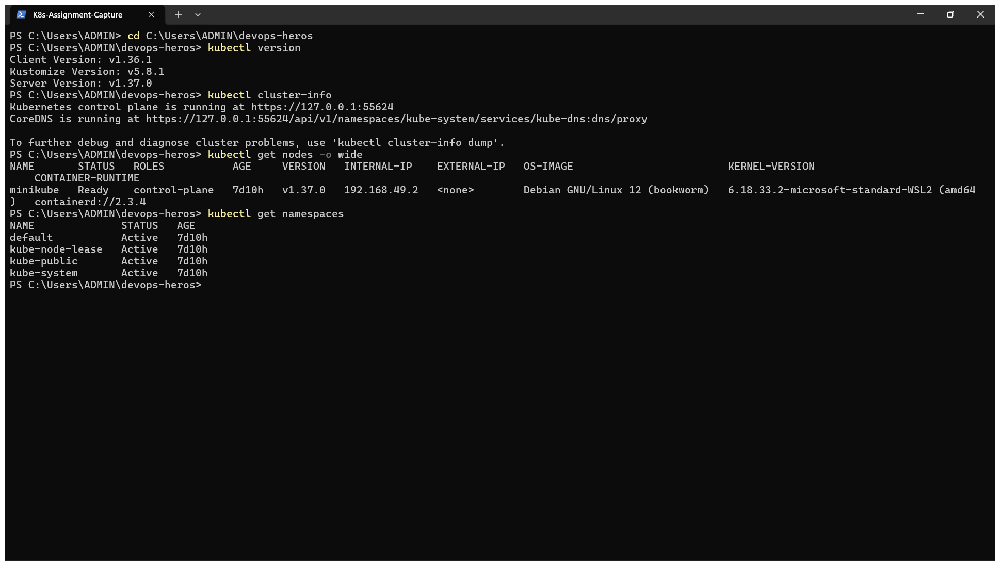
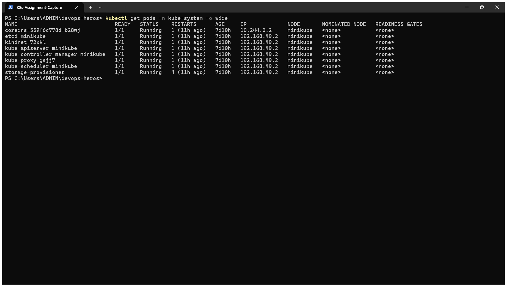
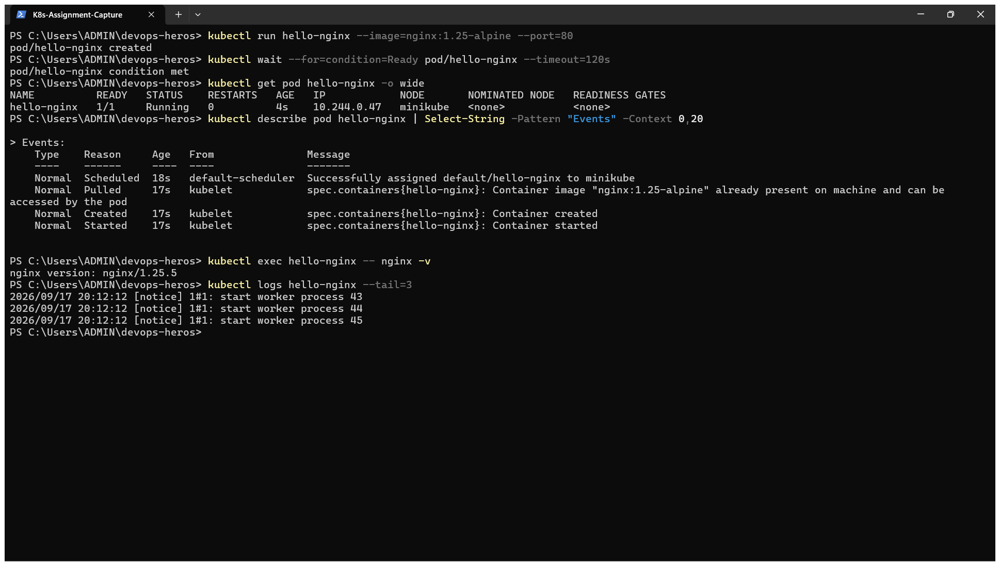
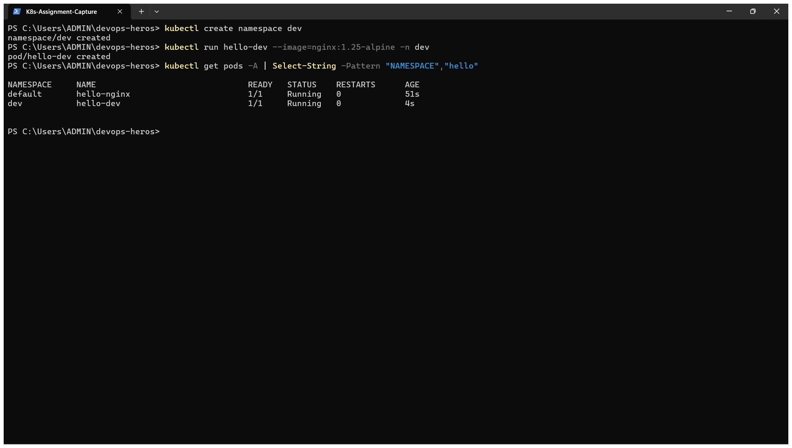

# Kubernetes Fundamentals – Homework

**Name:** Dhruv Sharma
**Roll No:** 24BCS10294

I practised the basics on a local 2-node Kubernetes cluster (1 control-plane + 1 worker) created with **kind** (Kubernetes in Docker). Minikube would work the same way. All outputs are copied from my terminal.

Cluster config: [kind-cluster.yaml](kind-cluster.yaml)

```bash
kind create cluster --config kind-cluster.yaml
```

---

## 1. Kubernetes architecture in short

| Component | Runs on | Job |
|---|---|---|
| `kube-apiserver` | Control plane | The only entry point. `kubectl` and every other component talk to it |
| `etcd` | Control plane | Key-value database that stores the whole cluster state |
| `kube-scheduler` | Control plane | Decides which node a new Pod should run on |
| `kube-controller-manager` | Control plane | Control loops that keep actual state equal to desired state |
| `kubelet` | Every node | Agent that starts and watches the containers of the Pods on its node |
| `kube-proxy` | Every node | Programs the network rules that make Services work |
| Container runtime (`containerd`) | Every node | Actually runs the containers |
| `CoreDNS` | Add-on | DNS for Services and Pods inside the cluster |

Kubernetes is **declarative**: I describe the desired state in YAML, and the controllers keep working until the real state matches it.

## 2. Cluster information

```text
$ kubectl version
Client Version: v1.34.1
Kustomize Version: v5.7.1
Server Version: v1.37.0
Warning: version difference between client (1.34) and server (1.37) exceeds the supported minor version skew of +/-1

$ kubectl cluster-info
Kubernetes control plane is running at https://127.0.0.1:54141
CoreDNS is running at https://127.0.0.1:54141/api/v1/namespaces/kube-system/services/kube-dns:dns/proxy

To further debug and diagnose cluster problems, use 'kubectl cluster-info dump'.

$ kubectl get nodes -o wide
NAME                      STATUS   ROLES           AGE     VERSION   INTERNAL-IP   EXTERNAL-IP   OS-IMAGE                       KERNEL-VERSION             CONTAINER-RUNTIME
devops-hw-control-plane   Ready    control-plane   7m48s   v1.37.0   172.18.0.3    <none>        Debian GNU/Linux 13 (trixie)   6.12.76-linuxkit (arm64)   containerd://2.3.4
devops-hw-worker          Ready    <none>          7m34s   v1.37.0   172.18.0.2    <none>        Debian GNU/Linux 13 (trixie)   6.12.76-linuxkit (arm64)   containerd://2.3.4

$ kubectl get namespaces
NAME                 STATUS   AGE
default              Active   7m48s
kube-node-lease      Active   7m48s
kube-public          Active   7m48s
kube-system          Active   7m48s
local-path-storage   Active   7m45s
```

**What I understood:** the server runs v1.37 and both nodes are `Ready`. The control-plane node hosts the API server, and the worker node runs my applications. Default namespaces: `default` (my objects), `kube-system` (cluster components), `kube-public`, `kube-node-lease` (node heartbeats).

## 3. The architecture components are real Pods

```text
$ kubectl get pods -n kube-system -o wide
NAME                                              READY   STATUS    RESTARTS   AGE     IP           NODE                      NOMINATED NODE   READINESS GATES
coredns-559f6c778d-24m6v                          1/1     Running   0          7m38s   10.244.0.3   devops-hw-control-plane   <none>           <none>
coredns-559f6c778d-bvm4l                          1/1     Running   0          7m38s   10.244.0.2   devops-hw-control-plane   <none>           <none>
etcd-devops-hw-control-plane                      1/1     Running   0          7m46s   172.18.0.3   devops-hw-control-plane   <none>           <none>
kindnet-9fvmb                                     1/1     Running   0          7m34s   172.18.0.2   devops-hw-worker          <none>           <none>
kindnet-x6c44                                     1/1     Running   0          7m38s   172.18.0.3   devops-hw-control-plane   <none>           <none>
kube-apiserver-devops-hw-control-plane            1/1     Running   0          7m46s   172.18.0.3   devops-hw-control-plane   <none>           <none>
kube-controller-manager-devops-hw-control-plane   1/1     Running   0          7m46s   172.18.0.3   devops-hw-control-plane   <none>           <none>
kube-proxy-qjkzx                                  1/1     Running   0          7m34s   172.18.0.2   devops-hw-worker          <none>           <none>
kube-proxy-zgbzd                                  1/1     Running   0          7m38s   172.18.0.3   devops-hw-control-plane   <none>           <none>
kube-scheduler-devops-hw-control-plane            1/1     Running   0          7m46s   172.18.0.3   devops-hw-control-plane   <none>           <none>
```

**What I understood:** every component from the table above is visible here: `etcd`, `kube-apiserver`, `kube-controller-manager`, `kube-scheduler` on the control-plane node, and one `kube-proxy` plus one `kindnet` (the CNI network plugin) **per node**. `coredns` runs with 2 replicas.

## 4. Node capacity and API resources

```text
$ kubectl describe node devops-hw-worker | sed -n "/^Capacity/,/^System Info/p"
Capacity:
  cpu:                15
  ephemeral-storage:  977848209408
  hugepages-1Gi:      0
  hugepages-2Mi:      0
  hugepages-32Mi:     0
  hugepages-64Ki:     0
  memory:             12234256Ki
  pods:               110
Allocatable:
  cpu:                15
  ephemeral-storage:  977848209408
  hugepages-1Gi:      0
  hugepages-2Mi:      0
  hugepages-32Mi:     0
  hugepages-64Ki:     0
  memory:             12234256Ki
  pods:               110
System Info:

$ kubectl api-resources | head -12
NAME                                SHORTNAMES   APIVERSION                        NAMESPACED   KIND
bindings                                         v1                                true         Binding
componentstatuses                   cs           v1                                false        ComponentStatus
configmaps                          cm           v1                                true         ConfigMap
endpoints                           ep           v1                                true         Endpoints
events                              ev           v1                                true         Event
limitranges                         limits       v1                                true         LimitRange
namespaces                          ns           v1                                false        Namespace
nodes                               no           v1                                false        Node
persistentvolumeclaims              pvc          v1                                true         PersistentVolumeClaim
persistentvolumes                   pv           v1                                false        PersistentVolume
pods                                po           v1                                true         Pod
```

**What I understood:** `Allocatable` is what the scheduler can hand out to Pods on that node (max 110 Pods). `kubectl api-resources` lists every object type with its short name (`po`, `cm`, `ns`), API version, and whether it is namespaced.

## 5. My first Pod

```text
$ kubectl run hello-nginx --image=nginx:1.25-alpine --port=80
pod/hello-nginx created

$ kubectl wait --for=condition=Ready pod/hello-nginx --timeout=120s
pod/hello-nginx condition met

$ kubectl get pod hello-nginx -o wide
NAME          READY   STATUS    RESTARTS   AGE   IP           NODE               NOMINATED NODE   READINESS GATES
hello-nginx   1/1     Running   0          9s    10.244.1.2   devops-hw-worker   <none>           <none>

$ kubectl describe pod hello-nginx | sed -n "/^Events/,\$p"
Events:
  Type    Reason     Age   From               Message
  ----    ------     ----  ----               -------
  Normal  Scheduled  9s    default-scheduler  Successfully assigned default/hello-nginx to devops-hw-worker
  Normal  Pulling    9s    kubelet            Pulling image "nginx:1.25-alpine"
  Normal  Pulled     0s    kubelet            Successfully pulled image "nginx:1.25-alpine" in 8.758s (8.758s including waiting). Image size: 20193659 bytes.
  Normal  Created    0s    kubelet            Container created
  Normal  Started    0s    kubelet            Container started

$ kubectl exec hello-nginx -- nginx -v
nginx version: nginx/1.25.5

$ kubectl logs hello-nginx | tail -3
2026/09/17 13:36:25 [notice] 1#1: start worker process 46
2026/09/17 13:36:25 [notice] 1#1: start worker process 47
2026/09/17 13:36:25 [notice] 1#1: start worker process 48
```

**What I understood:** the `Events` section shows the life of a Pod step by step: **Scheduled** (scheduler picked `devops-hw-worker`) → **Pulling / Pulled** (kubelet asked containerd for the image) → **Created** → **Started**. The Pod got its own IP `10.244.1.2` from the Pod network. `kubectl exec` runs a command inside the container and `kubectl logs` shows its stdout.

## 6. Namespaces

```text
$ kubectl create namespace dev
namespace/dev created

$ kubectl run hello-dev --image=nginx:1.25-alpine -n dev
pod/hello-dev created

$ kubectl get pods -A | grep -E "NAMESPACE|hello"
NAMESPACE            NAME                                              READY   STATUS              RESTARTS   AGE
default              hello-nginx                                       1/1     Running             0          9s
dev                  hello-dev                                         0/1     ContainerCreating   0          0s
```

**What I understood:** namespaces are virtual clusters inside one cluster, used to separate teams or environments. `-n dev` targets a namespace and `-A` lists all of them. Two Pods with the same name can exist if they are in different namespaces.

## 7. Generating YAML and reading documentation from the CLI

```text
$ kubectl run dry --image=nginx --dry-run=client -o yaml
apiVersion: v1
kind: Pod
metadata:
  labels:
    run: dry
  name: dry
spec:
  containers:
  - image: nginx
    name: dry
    resources: {}
  dnsPolicy: ClusterFirst
  restartPolicy: Always
status: {}

$ kubectl explain pod.spec.containers.image
KIND:       Pod
VERSION:    v1

FIELD: image <string>

DESCRIPTION:
    Container image name. More info:
    https://kubernetes.io/docs/concepts/containers/images This field is optional
    to allow higher level config management to default or override container
    images in workload controllers like Deployments and StatefulSets.
```

**What I understood:** `--dry-run=client -o yaml` prints the manifest without creating anything. It is the fastest way to get a starting YAML. `kubectl explain` is built-in documentation for every field.

## 8. Clean up

```text
$ kubectl delete pod hello-nginx --wait=false
pod "hello-nginx" deleted from default namespace

$ kubectl delete namespace dev --wait=false
namespace "dev" deleted
```

Deleting a namespace deletes everything inside it.

## 9. Minikube: install, lifecycle, and Control Plane vs Worker Node architecture

The class demo standardized on **Minikube** (the `kind` cluster above is an equivalent local cluster used for the rest of this README). Minikube and `kubectl` are already installed here; the same version/lifecycle checks the assignment asks for:

```text
$ minikube version
minikube version: v1.39.0
commit: 7a9f6a841470a207de8cf4bafcccee0969d8ba10

$ kubectl version --client
Client Version: v1.36.1
Kustomize Version: v5.8.1

$ minikube start
😄  minikube v1.39.0 on Microsoft Windows
✨  Using the docker driver based on existing profile
👍  Starting "minikube" primary control-plane node in "minikube" cluster
🏄  Done! kubectl is now configured to use "minikube" cluster and "default" namespace by default

$ minikube status
minikube
type: Control Plane
host: Running
kubelet: Running
apiserver: Running
kubeconfig: Configured

$ kubectl get nodes -o wide
NAME       STATUS   ROLES           AGE    VERSION   INTERNAL-IP    EXTERNAL-IP   OS-IMAGE                         KERNEL-VERSION                              CONTAINER-RUNTIME
minikube   Ready    control-plane   7d9h   v1.37.0   192.168.49.2   <none>        Debian GNU/Linux 12 (bookworm)   6.18.33.2-microsoft-standard-WSL2 (amd64)   containerd://2.3.4

$ kubectl cluster-info
Kubernetes control plane is running at https://127.0.0.1:55624
CoreDNS is running at https://127.0.0.1:55624/api/v1/namespaces/kube-system/services/kube-dns:dns/proxy
```

`minikube stop` was skipped against this cluster in this submission because it is a shared, long-running local instance also used for other work — stopping it is a one-line command (`minikube stop`, then `minikube status` shows `host: Stopped`) but not something to do against a cluster mid-use.

### Control Plane vs. Worker Node — architecture in one diagram

```text
+-------------------------------------------------------------------------------+
|                               CONTROL PLANE (MASTER)                          |
|                                                                                 |
|   +-------------------+       +--------------------+       +--------------+   |
|   |       etcd        |<----->|  kube-apiserver    |<----->|kube-scheduler|   |
|   | (State Database)  |       |    (Front Door)    |       +--------------+   |
|   +-------------------+       +---------+----------+                          |
|                                         |                                     |
|                                         v                                     |
|                             +------------------------+                        |
|                             | kube-controller-manager|                        |
|                             +------------------------+                        |
+-----------------------------------------+-------------------------------------+
                                          |
                                          v
                              +------------------------------------+
                              |             WORKER NODE             |
                              |                                     |
                              |   +------------+  +------------+    |
                              |   |  kubelet   |  | kube-proxy |    |
                              |   +-----+------+  +-----+------+    |
                              |         |               |           |
                              |         v               v           |
                              |   +----------------------------+    |
                              |   | Container Runtime (CRI)    |    |
                              |   +----------------------------+    |
                              |         |                           |
                              |         v                           |
                              |   +------------+  +------------+    |
                              |   |   Pod 1    |  |   Pod 2    |    |
                              |   +------------+  +------------+    |
                              +------------------------------------+
```

**Control Plane (Master) components:**

- **`kube-apiserver`** – the single front door for every read/write to the cluster. `kubectl`, controllers and the scheduler all talk to it over the REST API; nothing else touches `etcd` directly.
- **`etcd`** – a distributed, consistent key-value store holding the entire desired-state of the cluster (every object's spec, plus most status).
- **`kube-scheduler`** – watches for Pods with no assigned node, scores every candidate node on CPU/memory fit, affinity/anti-affinity and taints/tolerations, and binds the Pod to the best one.
- **`kube-controller-manager`** – runs the reconciliation loops (Node controller, ReplicaSet controller, Endpoint/EndpointSlice controller, …) that continuously drive **current state → desired state**.

**Worker Node components:**

- **`kubelet`** – the agent on every node; takes PodSpecs from the API server, tells the container runtime to pull images and start containers, and reports node/Pod health back.
- **`kube-proxy`** – programs the node's network rules (`iptables`/IPVS) so a Service's virtual IP actually reaches the right Pod.
- **Container runtime (`containerd`)** – the CRI implementation that actually pulls images and runs containers; `kubelet` talks to it, not to Docker directly.
- **Pod** – the smallest deployable unit: one or more containers sharing one network namespace (IP) and storage volumes.

---

## kubectl cheat sheet

| Command | Purpose |
|---|---|
| `kubectl get <type> [-o wide] [-n ns] [-A]` | List objects |
| `kubectl describe <type> <name>` | Details and events, first stop for debugging |
| `kubectl logs <pod> [-f] [--previous]` | Container logs |
| `kubectl exec -it <pod> -- sh` | Shell inside a container |
| `kubectl apply -f file.yaml` | Create or update from a manifest (declarative) |
| `kubectl delete -f file.yaml` | Delete what the manifest created |
| `kubectl run` / `kubectl create` | Quick imperative creation |
| `kubectl explain <type.field>` | Field documentation |
| `kubectl config get-contexts` | Which cluster am I talking to |

---

## Assignment Guidelines

*Exact grading guidelines are yet to be shared by the instructor; the checklist below is reconstructed from class notes and is what this submission targets.*

1. Read through the official Kubernetes architecture documentation (`kubernetes.io/docs/concepts/architecture/`) and cross-check it against class notes — official docs are the primary source of truth, ahead of any third-party tutorial site.
2. Install **Minikube** (or an equivalent local cluster tool such as `kind`, used here).
3. Confirm the cluster actually works: run `minikube start` (or `kind create cluster`), then check status, and walk through a "Hello Minikube"-style deployment to sanity-check the setup end-to-end.
4. Optional: skim the "Learn Kubernetes Basics" tutorial (`kubernetes.io/docs/tutorials/kubernetes-basics/`), specifically the "Deploy an App" module, to preview next session's hands-on work.
5. Write a Pod manifest **by hand** (not copy-pasted) — this repetition is what builds fluency with the four mandatory fields and the container spec structure.
6. Run through the full command sequence: `kubectl version`, `kubectl cluster-info`, `kubectl get pods`, `kubectl get nodes`.
7. Deploy the hand-written Pod with `kubectl apply -f pod.yaml`, confirm it reaches `Running` / `1/1` status via `kubectl get pods`.
8. Deliberately test the `apply` vs. `create` difference: run `kubectl create -f pod.yaml` a second time against an already-applied Pod and observe the error; then make a small change to the file and re-run `kubectl apply -f pod.yaml` to see the update take effect cleanly.
9. Optional/extra-credit: read through `core-objects.md` in the class Kubernetes repo now, even though ReplicaSet/Deployment/Service aren't taught hands-on until next session — this previews what's coming.

---

## Screenshots

These screenshots were taken in a second run of the same labs, so Pod names, IPs and ages differ from the text output above.

**Cluster info, nodes and namespaces**



**Control-plane components running as Pods in `kube-system`**



**First Pod: run, wait, inspect events, exec**



**Namespaces**



